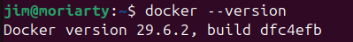
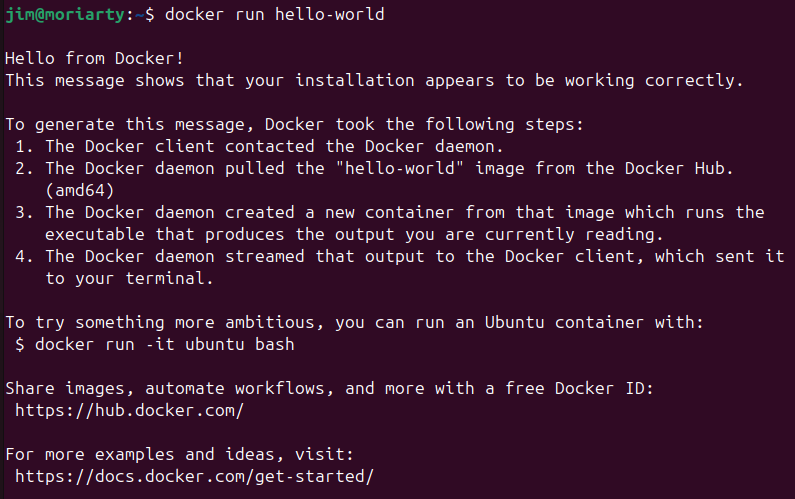
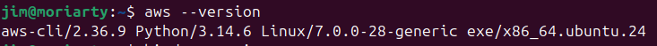
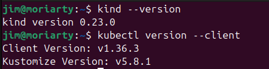
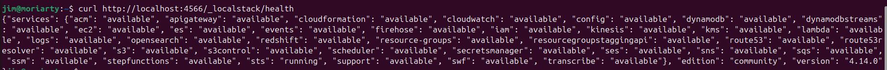
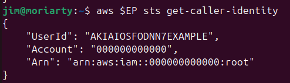
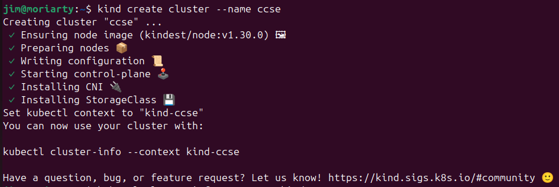

# IKB42603 Cloud Computing Security Essentials
## Lab 0: Environment Setup Report

**Name:** Jim Moriarty

This report documents the local environment setup for the Cloud Computing Security Essentials labs, ensuring all necessary tools (Docker, AWS CLI, Kubernetes, and helper tools) are installed and configured.

### 1. Install Docker
Docker is required to run containers and the LocalStack cloud simulator.
- Installed Docker on the system.
- Verified the installation by checking the version and running the `hello-world` container.

### 2. Install AWS CLI v2
AWS CLI v2 is used to send AWS commands to the LocalStack environment locally.
- Installed AWS CLI v2.
- Verified the installation by checking the version (`aws --version`).

### 3. Install kind & kubectl
`kind` is used to run a local Kubernetes cluster inside Docker, and `kubectl` is the command-line tool to control the cluster.
- Installed `kind` and `kubectl`.
- Verified the installations by checking their respective versions (`kind --version` and `kubectl version --client`).

### 4. Helper Tools (OpenSSL, oathtool, Trivy)
These helper tools are required for various lab tasks such as encryption, MFA/TOTP code generation, and vulnerability scanning.
- Installed/Verified OpenSSL and oathtool. (Trivy is run via Docker).

### 5. Start & Stop the Lab Environment
The lab environment consists of LocalStack and a local Kubernetes cluster.
- Started LocalStack on port 4566 and checked its health status.
- Created a Kubernetes cluster named `ccse` using `kind`.
- Verified the cluster was up using `kubectl cluster-info` and `kubectl get nodes`.

### 6. One-Time AWS CLI Configuration
Set up dummy credentials for the AWS CLI so that it can interact with LocalStack without prompting for configuration.
- Configured dummy `aws_access_key_id` and `aws_secret_access_key`.
- Set the default region to `us-east-1`.
- Tested the connection to LocalStack using the `--endpoint-url` flag to get caller identity.

