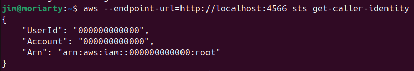
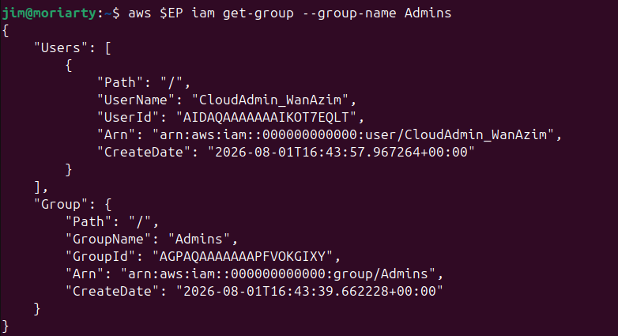
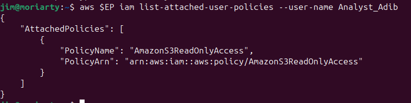
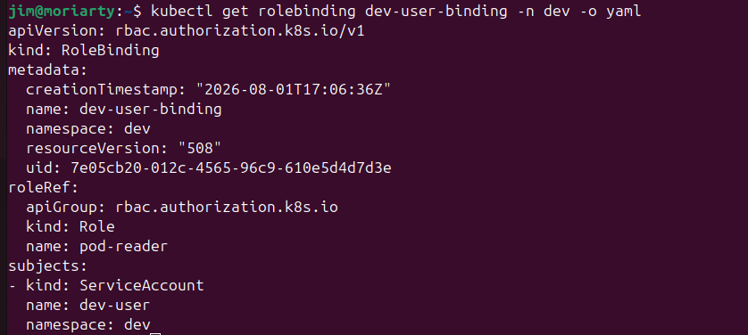

# Lab 1: Account Security and IAM Report

**Name:** Jim Moriarty

## 1. Screenshots

### Task 1: Operating Identity
Output of `sts get-caller-identity` showing the operating identity.

### Task 2: Admin Group Membership
Output of `get-group Admins` showing the CloudAdmin user as a member.

### Task 3: Analyst Read-Only Policy
Output of `list-attached-user-policies` for the Analyst showing only the read-only policy.

### Task 4 & 5: Credential Hygiene and Namespaces
Output demonstrating access keys rotation and/or Kubernetes namespace creation.

### Task 6 & 7: Kubernetes RBAC Enforcement
The three `kubectl auth can-i` results (YES / NO / NO) and RoleBinding verification.

---

## 2. Short-Answer Questions

**Q1. Why is attaching policies to groups better than attaching them directly to users?**  
Attaching policies to groups is better because it allows for scalable, manageable, and auditable access control. Instead of manually updating policies for every individual user, you can manage permissions at the group level. When a user's role changes, you simply add or remove them from a group, and any policy changes applied to the group automatically take effect for all its members.

**Q2. What is the difference between an IAM User and an IAM Role?**  
An **IAM User** is a permanent identity with long-term credentials (such as a password or access keys) that represents a specific person or application. An **IAM Role**, on the other hand, is a temporary identity with short-lived credentials that can be assumed by users, applications, or services when they need specific permissions, without having permanent credentials attached to them.

**Q3. Explain least privilege using the Analyst account, and how it reduces blast radius if compromised.**  
The principle of least privilege ensures that an identity is only given the minimum permissions necessary to perform its intended tasks. The Analyst account was explicitly granted a scoped, read-only policy (`AmazonS3ReadOnlyAccess`). If this account's credentials were stolen, the "blast radius" (the extent of the damage an attacker can cause) is severely limited. The attacker could only read S3 data but would be unable to delete data, create new resources, or escalate privileges, unlike a compromised administrative account.

**Q4. In Kubernetes, what is the difference between a Role and a RoleBinding?**  
A **Role** defines a set of rules or permissions (e.g., getting, listing, or watching pods) within a specific namespace. A **RoleBinding** is what actually grants those permissions by binding the Role to a specific subject (such as a user, group, or service account). In short, the Role dictates *what* can be done, while the RoleBinding dictates *who* can do it.

**Q5. Why did the developer service account fail to access prod, and which security principle does that demonstrate?**  
The developer service account failed to access the `prod` namespace because its Role and RoleBinding were explicitly scoped to the `dev` namespace. It had no permissions granted for `prod`. This demonstrates the **Principle of Least Privilege** (and environment separation/segmentation), ensuring that the developer can only access the resources they explicitly need, preventing unauthorized cross-environment access.

---

## 3. Verification Command

*Note: The output for `kubectl get rolebinding dev-user-binding -n dev -o yaml` is included in the screenshots above, verifying the RBAC setup in the cluster.*
