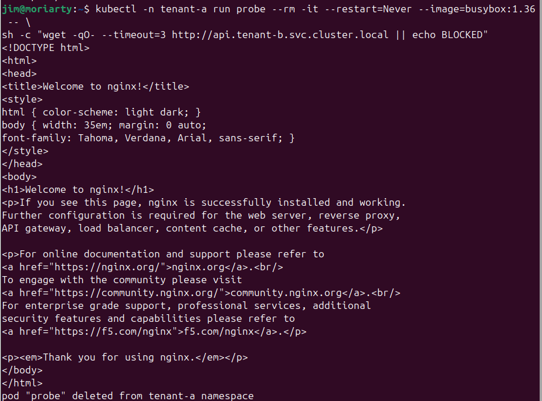
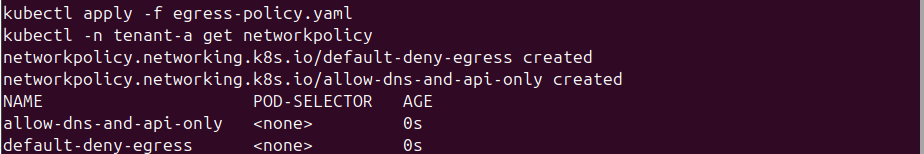
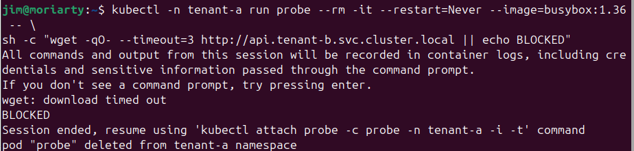
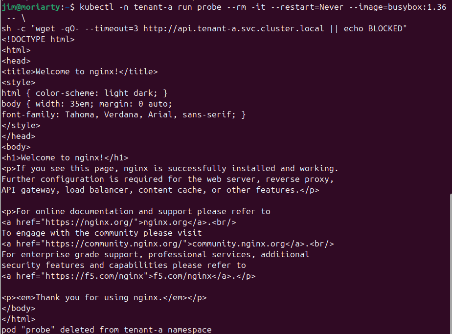
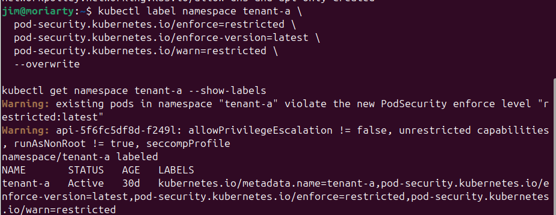
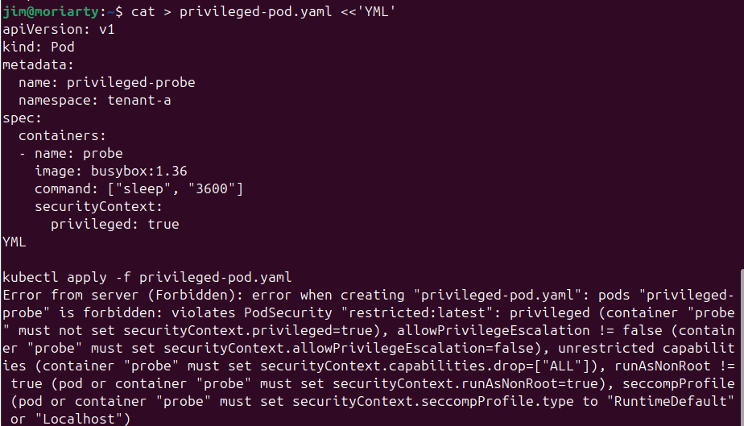
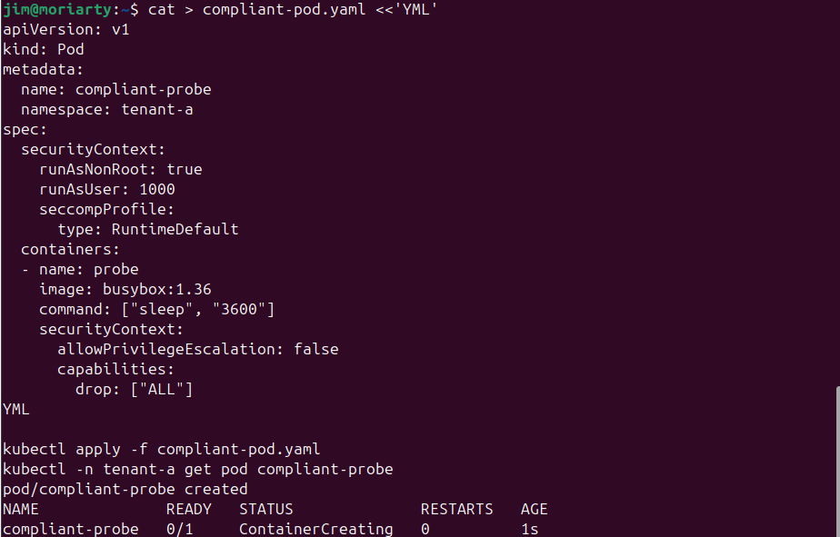
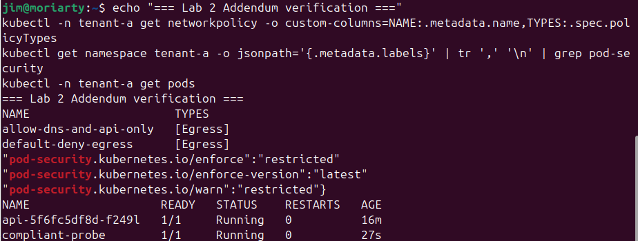

# Lab 2.1 - Zero Trust: Micro-Segmentation and Admission Control
**Course:** IKB42603 Cloud Computing Security Essentials
**Lab:** Lab 2 Addendum - Core Tasks Z1 and Z2
**Instructor:** Prof. Dr. Shahrulniza Musa, UniKL MIIT

---

## Objective

This lab extends Lab 2's namespace isolation by applying two core Zero Trust properties to a Kubernetes multi-tenant cluster. Task Z1 adds egress default-deny network policies so that a compromised pod inside the cluster cannot exfiltrate data or call back to an attacker. Task Z2 enforces Pod Security Standards at the admission controller level to prevent privileged containers from ever running, closing the kernel-sharing attack path that defeats namespace boundaries entirely.

---

## Learning Outcomes

By completing this lab, students are able to:

- Implement egress default-deny network policies on a Kubernetes namespace and verify cross-tenant traffic is blocked while permitted in-namespace traffic still works
- Explain why DNS must be explicitly allowed even in a default-deny-egress environment, and diagnose the difference between "no route" and "no name resolution"
- Apply the restricted Pod Security Standard to a namespace and verify that a privileged pod is rejected at admission before it ever runs
- Deploy a policy-compliant pod and confirm that the control is scoped rather than a blanket block
- Answer short-answer questions that map to CLO2 (Construct secure cloud operations) and CSA CCSK v5 Domain 7 and Domain 12

---

## Environment

| Component | Details |
|---|---|
| Platform | Kubernetes via kind (local cluster) |
| Shell | Bash on Linux (user: jim@moriarty) |
| Namespaces | `tenant-a`, `tenant-b` |
| Services | `api` service in each namespace (nginx image) |
| Tools | `kubectl`, `busybox:1.36` ephemeral probe pods |
| Policy Resources | `NetworkPolicy` (egress), `PodSecurityAdmission` labels |
| Lab Addendum | Folded into Lab 2 report, assessed under evidence quality and conceptual understanding criteria |

---

## Step-by-Step Implementation

### Task Z1 - Egress Default-Deny Network Policy

**Step 1: Verify baseline cross-tenant reachability**

Before any egress policy was applied, a probe pod launched in `tenant-a` was used to reach the `api` service in `tenant-b`. The wget request returned the full nginx HTML page, confirming the services were reachable across namespace boundaries.

```bash
kubectl -n tenant-a run probe --rm -it --restart=Never --image=busybox:1.36 -- \
  sh -c "wget -qO- --timeout=3 http://api.tenant-b.svc.cluster.local || echo BLOCKED"
```

The output showed the full nginx welcome page, meaning cross-tenant traffic was reachable and uncontrolled at this stage.

**Step 2: Apply egress policies**

Two NetworkPolicy manifests were written and applied together. The first (`default-deny-egress`) drops all outgoing traffic from every pod in `tenant-a`. The second (`allow-dns-and-api-only`) adds two explicit allows: DNS on UDP/TCP port 53 to the kube-system namespace and HTTP port 80 to pods labeled `app: api` within the same namespace.

```bash
cat > egress-policy.yaml <<'YML'
apiVersion: networking.k8s.io/v1
kind: NetworkPolicy
metadata:
  name: default-deny-egress
  namespace: tenant-a
spec:
  podSelector: {}
  policyTypes:
  - Egress
---
apiVersion: networking.k8s.io/v1
kind: NetworkPolicy
metadata:
  name: allow-dns-and-api-only
  namespace: tenant-a
spec:
  podSelector: {}
  policyTypes:
  - Egress
  egress:
  - to:
    - namespaceSelector:
        matchLabels:
          kubernetes.io/metadata.name: kube-system
      podSelector:
        matchLabels:
          k8s-app: kube-dns
    ports:
    - protocol: UDP
      port: 53
    - protocol: TCP
      port: 53
  - to:
    - podSelector:
        matchLabels:
          app: api
    ports:
    - protocol: TCP
      port: 80
YML
kubectl apply -f egress-policy.yaml
kubectl -n tenant-a get networkpolicy
```

**Step 3: Re-test cross-tenant egress (expect BLOCKED)**

With the policy in place, the same probe targeting `tenant-b` was re-run. The wget timed out and the probe printed BLOCKED.

```bash
kubectl -n tenant-a run probe --rm -it --restart=Never --image=busybox:1.36 -- \
  sh -c "wget -qO- --timeout=3 http://api.tenant-b.svc.cluster.local || echo BLOCKED"
```

**Step 4: Verify in-namespace traffic still works**

The same probe was pointed at the `api` service within `tenant-a`. The nginx welcome page was returned successfully, proving the policy permits only what it should.

```bash
kubectl -n tenant-a run probe --rm -it --restart=Never --image=busybox:1.36 -- \
  sh -c "wget -qO- --timeout=3 http://api.tenant-a.svc.cluster.local || echo BLOCKED"
```

**Step 5: Remove the DNS rule and observe name-resolution failure**

The `allow-dns-and-api-only` policy was temporarily deleted to show that hostname resolution fails independently of routing.

```bash
kubectl -n tenant-a delete networkpolicy allow-dns-and-api-only
kubectl -n tenant-a run probe --rm -it --restart=Never --image=busybox:1.36 -- \
  sh -c "wget -qO- --timeout=3 http://api.tenant-a.svc.cluster.local || echo BLOCKED"
```

The probe printed "wget: bad address 'api.tenant-a.svc.cluster.local'" followed by BLOCKED. This is a DNS failure, not a routing failure. The cluster could not resolve the name at all because port 53 was blocked. The policy was then restored.

```bash
kubectl apply -f egress-policy.yaml
```

---

### Task Z2 - Admission Control with Pod Security Standards

**Step 6: Label namespace with restricted Pod Security Standard**

The `tenant-a` namespace was labeled to enforce the `restricted` Pod Security Standard. Any pod that violates the restricted profile is rejected before it is ever scheduled.

```bash
kubectl label namespace tenant-a \
  pod-security.kubernetes.io/enforce=restricted \
  pod-security.kubernetes.io/enforce-version=latest \
  pod-security.kubernetes.io/warn=restricted \
  --overwrite
kubectl get namespace tenant-a --show-labels
```

The output showed warnings about existing pods that already violated the restricted profile (specifically `allowPrivilegeEscalation != false` and missing `seccompProfile`), along with the full label set on the namespace.

**Step 7: Attempt to deploy a privileged pod (expect rejection)**

A pod manifest requesting `privileged: true` was submitted. The admission controller rejected it immediately.

```bash
cat > privileged-pod.yaml <<'YML'
apiVersion: v1
kind: Pod
metadata:
  name: privileged-probe
  namespace: tenant-a
spec:
  containers:
  - name: probe
    image: busybox:1.36
    command: ["sleep", "3600"]
    securityContext:
      privileged: true
YML
kubectl apply -f privileged-pod.yaml
```

The error message named all five restricted violations: `privileged`, `allowPrivilegeEscalation != false`, `unrestricted capabilities`, `runAsNonRoot != true`, and missing `seccompProfile`.

**Step 8: Deploy a compliant pod (expect success)**

A compliant pod manifest was applied to prove the policy does not block everything.

```bash
cat > compliant-pod.yaml <<'YML'
apiVersion: v1
kind: Pod
metadata:
  name: compliant-probe
  namespace: tenant-a
spec:
  securityContext:
    runAsNonRoot: true
    runAsUser: 1000
    seccompProfile:
      type: RuntimeDefault
  containers:
  - name: probe
    image: busybox:1.36
    command: ["sleep", "3600"]
    securityContext:
      allowPrivilegeEscalation: false
      capabilities:
        drop: ["ALL"]
YML
kubectl apply -f compliant-pod.yaml
kubectl -n tenant-a get pod compliant-probe
```

The pod was created and showed `ContainerCreating` then `Running`, confirming the admission control is scoped and not a blanket block.

**Step 9: Run verification command**

```bash
echo "=== Lab 2 Addendum verification ==="
kubectl -n tenant-a get networkpolicy -o custom-columns=NAME:.metadata.name,TYPES:.spec.policyTypes
kubectl get namespace tenant-a -o jsonpath='{.metadata.labels}' | tr ',' '\n' | grep pod-security
kubectl -n tenant-a get pods
```

---

## Commands Used

```bash
# Baseline cross-tenant probe (before policy)
kubectl -n tenant-a run probe --rm -it --restart=Never --image=busybox:1.36 -- \
  sh -c "wget -qO- --timeout=3 http://api.tenant-b.svc.cluster.local || echo BLOCKED"

# Apply egress policies
kubectl apply -f egress-policy.yaml

# List network policies
kubectl -n tenant-a get networkpolicy

# Cross-tenant probe after policy (should BLOCK)
kubectl -n tenant-a run probe --rm -it --restart=Never --image=busybox:1.36 -- \
  sh -c "wget -qO- --timeout=3 http://api.tenant-b.svc.cluster.local || echo BLOCKED"

# In-namespace probe (should succeed)
kubectl -n tenant-a run probe --rm -it --restart=Never --image=busybox:1.36 -- \
  sh -c "wget -qO- --timeout=3 http://api.tenant-a.svc.cluster.local || echo BLOCKED"

# Remove DNS rule to demonstrate name-resolution failure
kubectl -n tenant-a delete networkpolicy allow-dns-and-api-only

# Restore egress policies
kubectl apply -f egress-policy.yaml

# Label namespace with restricted Pod Security Standard
kubectl label namespace tenant-a \
  pod-security.kubernetes.io/enforce=restricted \
  pod-security.kubernetes.io/enforce-version=latest \
  pod-security.kubernetes.io/warn=restricted \
  --overwrite
kubectl get namespace tenant-a --show-labels

# Attempt privileged pod (should be rejected)
kubectl apply -f privileged-pod.yaml

# Deploy compliant pod (should succeed)
kubectl apply -f compliant-pod.yaml
kubectl -n tenant-a get pod compliant-probe

# Verification command
echo "=== Lab 2 Addendum verification ==="
kubectl -n tenant-a get networkpolicy -o custom-columns=NAME:.metadata.name,TYPES:.spec.policyTypes
kubectl get namespace tenant-a -o jsonpath='{.metadata.labels}' | tr ',' '\n' | grep pod-security
kubectl -n tenant-a get pods
```

---

## Screenshots

**Screenshot 1 - Baseline: cross-tenant probe succeeds before egress policy (nginx page returned from tenant-b):**



Before any network policy was applied, the probe running in `tenant-a` successfully fetched the nginx welcome page from `api.tenant-b.svc.cluster.local`. This confirms that without egress restrictions, a compromised pod can freely reach workloads in other tenants.

---

**Screenshot 2 - Egress policies applied, both policies visible in kubectl output:**



After running `kubectl apply -f egress-policy.yaml`, both `default-deny-egress` and `allow-dns-and-api-only` were created in the `tenant-a` namespace with policy type `[Egress]`. This confirms the policies are active.

---

**Screenshot 3 - Cross-tenant probe is BLOCKED after egress policy; DNS removed shows bad-address failure:**



The first probe targeting `tenant-b` printed "wget: download timed out" then BLOCKED, confirming cross-tenant egress is denied. After removing the DNS rule and running the in-namespace probe, the output changed to "wget: bad address 'api.tenant-a.svc.cluster.local'", which is a DNS resolution failure rather than a routing block. This captures the DNS-rule-removed failure as required by the deliverables.

---

**Screenshot 4 - In-namespace probe succeeds; egress policy restored:**



With the DNS rule restored, the probe targeting `api.tenant-a.svc.cluster.local` returned the full nginx HTML page. This proves the policy permits in-namespace traffic as intended. The screenshot also shows `kubectl apply -f egress-policy.yaml` confirming the `allow-dns-and-api-only` policy was re-created.

---

**Screenshot 5 - Namespace labeled with enforce=restricted; warnings on existing pods:**



The `kubectl label namespace` command applied the `enforce=restricted` label with `enforce-version=latest`. The API server immediately issued warnings about the existing api pod violating the new policy. The subsequent `kubectl get namespace tenant-a --show-labels` showed all three Pod Security labels in the label set.

---

**Screenshot 6 - Privileged pod rejected at admission with all five violation reasons named:**



The `kubectl apply -f privileged-pod.yaml` command was immediately rejected by the admission controller. The error message from the server named all five restricted violations: `privileged`, `allowPrivilegeEscalation != false`, `unrestricted capabilities`, `runAsNonRoot != true`, and missing `seccompProfile`. The pod never ran.

---

**Screenshot 7 - Compliant pod admitted and running:**



The compliant pod manifest satisfied all restricted requirements (non-root user 1000, seccompProfile RuntimeDefault, allowPrivilegeEscalation false, capabilities dropped). The `kubectl apply -f compliant-pod.yaml` succeeded and `kubectl -n tenant-a get pod compliant-probe` showed the pod in `ContainerCreating` state, transitioning to Running.

---

**Screenshot 8 - Verification output showing both egress policies, pod-security labels, and running pods:**



The verification command output shows both `allow-dns-and-api-only` and `default-deny-egress` with type `[Egress]`, the three pod-security labels on the namespace (`enforce: restricted`, `enforce-version: latest`, `warn: restricted`), and both the `api` pod and `compliant-probe` in Running state.

---

## Short-Answer Questions

**1. Lab 2 gave you default-deny ingress. Explain why default-deny egress is the control an attacker actually cares about, and name two specific things they can no longer do once it is in place.**

Default-deny ingress stops traffic from reaching a pod. An attacker who has already compromised a pod is already inside the ingress boundary, so that control stops helping. Egress is the direction the attacker travels next. Once egress is denied by default, two things become impossible: the attacker cannot call back to a command-and-control server to receive instructions, and they cannot exfiltrate data out of the cluster to an external destination. The compromised pod becomes isolated from both its handlers and its intended victims.

**2. Your first egress policy broke every hostname lookup in the namespace. Explain why at the protocol level, and state what this implies about testing a deny-by-default control before shipping it to production.**

DNS resolution is a separate UDP/TCP transaction to port 53 on the kube-dns pods in the kube-system namespace. A default-deny-egress policy blocks all outgoing packets, including those DNS queries. When the probe tried to resolve `api.tenant-a.svc.cluster.local`, the query never reached the DNS server, so the operating system returned "bad address" before even attempting a TCP connection to port 80. This implies that a deny-by-default control must be tested end-to-end, not just for the specific traffic it is meant to block. Every hidden dependency, including name resolution, NTP, and certificate revocation checks, will surface as a break. Shipping without that test risks silently breaking unrelated services.

**3. Pod Security Standards rejected the privileged pod at admission. Contrast that with detecting a privileged pod after it has started: what does the preventative control give you that the detective one cannot?**

A detective control that finds a privileged pod after it has started is racing against the attacker. In the time between the pod starting and the alert being acted on, the attacker can use the shared kernel access to read secrets from other namespaces, load a kernel module, or pivot to the underlying host. The preventative control gives a guarantee that the bad state never exists. There is nothing to detect, contain, or remediate because the pod was never created. The rejection message also names the exact violations, which means the developer gets immediate actionable feedback rather than a security finding hours later.

**4. Namespaces gave you isolation in Lab 2. Explain why a privileged container defeats that isolation, and identify what the two workloads are actually sharing.**

Namespaces provide isolation at the Linux kernel level using features like network namespaces, PID namespaces, and cgroup boundaries. A privileged container sets `CAP_SYS_ADMIN` and disables the seccomp filter, giving it unrestricted access to Linux kernel system calls. Through those calls it can access `/proc/1/ns` to read the host's namespace, mount the host filesystem, or load a kernel module that affects every process on the node. The two workloads sharing the physical node are therefore sharing the kernel itself. Namespace isolation assumes the kernel is a trustworthy boundary; a privileged container removes that assumption.

**5. Zero Trust is often summarised as "never trust, always verify". Using one example each from Z1 and Z2, state what is being verified and what assumption is being refused.**

In Z1, what is being verified is the destination of each outgoing packet: only DNS to kube-dns and HTTP to pods labeled `app: api` within the same namespace are permitted. The assumption being refused is that a pod inside the cluster deserves outbound access by default because of its location. In Z2, what is being verified is the security posture of the workload manifest before it is admitted: the admission controller checks that the pod meets the restricted profile. The assumption being refused is that a workload written by a developer inside the organisation can be trusted to have declared itself correctly without an independent gate checking it.

**Most severe restricted violation in a multi-tenant cluster:**

The most severe of the five restricted violations in a multi-tenant cluster is `privileged: true`. The other violations (allowPrivilegeEscalation, runAsNonRoot, capabilities, seccompProfile) limit what an attacker can do within a container, but a privileged container gives the attacker direct kernel access via unrestricted system calls. From there they can read the memory of other containers on the same node, escape to the host filesystem, and access secrets belonging to workloads in completely unrelated namespaces. A single privileged container therefore breaks multi-tenancy at the hardware boundary, which none of the other violations alone can do.

---

## Challenges Encountered

- **DNS dependency was not obvious at first.** The first attempt at writing the egress policy included only the in-namespace API allow rule and forgot DNS. The probe returned "bad address" instead of "BLOCKED", which looked like a routing failure. Diagnosing this required understanding that name resolution is a separate network call and that deny-all-egress blocks it just like any other traffic.
- **Existing pod warnings on namespace labeling.** When the `enforce=restricted` label was applied, the API server issued warnings about the existing `api` pod already in the namespace violating the restricted profile. These warnings did not block the label operation but required careful reading to distinguish warnings from errors.
- **Distinguishing admission rejection from runtime detection.** It was initially unclear why the admission controller error listed all five violations at once. The reason is that the admission controller validates the entire manifest in a single pass, not line by line, so all policy violations are reported together in one rejection.

---

## Lessons Learned

- Egress default-deny is the control that matters from an attacker's perspective. An attacker who is already inside a namespace is past ingress controls. Without egress restrictions, they can exfiltrate data, contact a command-and-control server, and move laterally. Egress policy is what stops them from leaving with anything useful.
- DNS is not free. Every default-deny-egress policy must include an explicit allow for UDP and TCP port 53 to the cluster DNS pods. This is the most commonly missed dependency and the most disruptive omission, because it silently breaks every hostname-based connection in the namespace.
- The difference between "no route" and "no name resolution" is operationally significant. "wget: download timed out" means the connection was refused or dropped at the network layer. "wget: bad address" means DNS never responded. Being able to distinguish these two failure modes is essential for diagnosing policy issues in production.
- Admission control is a preventative control, not a detective one. A privileged pod rejected at admission never runs, never touches the kernel, and never creates a security incident. The detective alternative, finding a running privileged pod through a runtime scan, always involves a window of exposure.
- The restricted Pod Security Standard is not a blanket block. The compliant pod deployment proved that well-written, security-conscious workloads are admitted without issue. The standard enforces specific, documented requirements, which means developers get clear guidance on what to fix rather than a vague "denied" error.

---

## References

- Kubernetes Network Policies (egress): https://kubernetes.io/docs/concepts/services-networking/network-policies/
- Kubernetes Pod Security Standards: https://kubernetes.io/docs/concepts/security/pod-security-standards/
- NIST SP 800-207, Zero Trust Architecture: https://csrc.nist.gov/publications/detail/sp/800-207/final
- CSA Security Guidance v5, Domain 7 (Infrastructure and Networking) and Domain 12 (Zero Trust): https://cloudsecurityalliance.org/research/guidance
- Course Lectures: Week 3 (Secure Isolation of Physical and Logical Infrastructure), Week 9 (Security Design Patterns II)
- IKB42603 Lab 2.1 Manual: Zero Trust Micro-Segmentation and Admission Control (IKB42603_Lab2.1_Zero_Trust_Segmentation.pdf)
