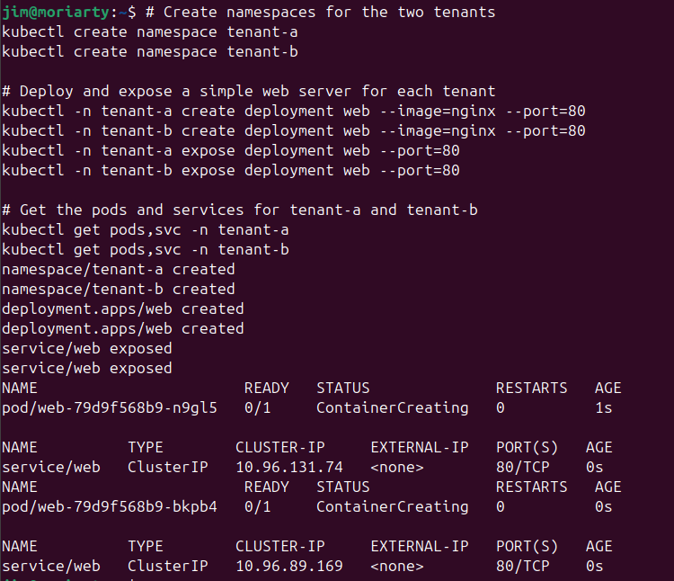
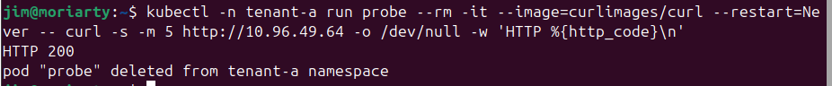
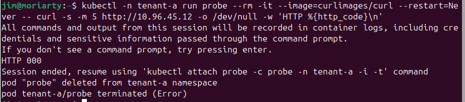
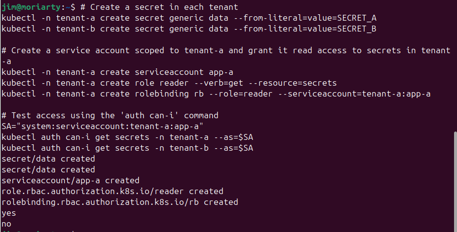
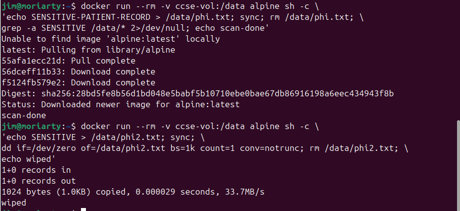

# IKB42603 Cloud Computing Security Essentials
## Lab 2: Secure Isolation & Multi-Tenancy

**Name:** Jim Moriarty

## 1. Objective

This lab demonstrates how to securely isolate multiple tenants on a shared Kubernetes cluster. The core goal is to move from a default-open, shared infrastructure (which exposes cross-tenant risk) to a hardened, properly segmented environment using Kubernetes namespaces, NetworkPolicies, RBAC-enforced secret isolation, and secure data deletion techniques.

---

## 2. Learning Outcomes

By the end of this lab, I am able to:

1. **Demonstrate compute isolation** by separating tenants into containers and Kubernetes namespaces.
2. **Observe the default-open behaviour** of shared infrastructure and explain why it is a security risk.
3. **Implement network isolation** with a default-deny `NetworkPolicy` and prove that cross-tenant traffic is blocked.
4. **Enforce storage isolation** so one tenant cannot read another tenant's data or secrets.
5. **Explain data remanence** and demonstrate secure deletion using `dd` overwrite within a Docker volume.

---

## 3. Environment

| Component         | Detail                                           |
|-------------------|--------------------------------------------------|
| OS                | Linux (Ubuntu)                                   |
| Container Runtime | Docker Engine                                    |
| Cluster Tool      | `kind` (Kubernetes IN Docker) — cluster name: `ccse-lab2` |
| CNI Plugin        | Calico v3.27.0 (required to enforce NetworkPolicy) |
| CLI Tools         | `kubectl`, `docker`                              |
| Network Plugin    | Default kind CNI **disabled**; Calico installed manually |
| Pod Subnet        | `192.168.0.0/16`                                 |
| Session A Focus   | Compute isolation (Tasks 1–3)                    |
| Session B Focus   | Network & storage isolation (Tasks 4–6)          |

> **Why Calico?** The default `kind` network driver does **not** enforce `NetworkPolicy` rules. Calico must be installed as the CNI to make isolation policies take actual effect.

---

## 4. Step-by-Step Implementation

### Session A (Week 3) — Compute Isolation & the Default-Open Risk

#### Setup — Cluster with Policy Enforcement

A `kind` cluster was created with the default CNI disabled so that Calico could be installed as the enforcing CNI plugin.

```bash
# Create cluster with default CNI disabled
cat <<EOF | kind create cluster --name ccse-lab2 --config=-
kind: Cluster
apiVersion: kind.x-k8s.io/v1alpha4
networking:
  disableDefaultCNI: true
  podSubnet: 192.168.0.0/16
EOF

# Install Calico as the CNI
kubectl apply -f https://raw.githubusercontent.com/projectcalico/calico/v3.27.0/manifests/calico.yaml

# Wait for Calico to be ready
kubectl -n kube-system rollout status daemonset/calico-node --timeout=180s
```

---

#### Task 1 — Two Tenants on One Cluster

Two Kubernetes namespaces were created to model two separate cloud tenants (`tenant-a` and `tenant-b`). An `nginx` web server deployment and ClusterIP service were created for each tenant to simulate a real workload.

```bash
# Create namespaces
kubectl create namespace tenant-a
kubectl create namespace tenant-b

# Deploy a web server for each tenant
kubectl -n tenant-a create deployment web --image=nginx
kubectl -n tenant-b create deployment web --image=nginx

# Expose each deployment on port 80
kubectl -n tenant-a expose deployment web --port=80
kubectl -n tenant-b expose deployment web --port=80

# Verify pods and services
kubectl get pods,svc -n tenant-a
kubectl get pods,svc -n tenant-b
```

**Result:** Both namespaces had their nginx pods starting (`ContainerCreating`) and their respective `ClusterIP` services assigned — `10.96.131.74` for `tenant-a` and `10.96.89.169` for `tenant-b`.

---

#### Task 2 — Observe the Default-Open Risk

A temporary `curl` probe pod was launched inside `tenant-a` and directed to `tenant-b`'s service ClusterIP. This test demonstrates that **by default, there is no network isolation** between namespaces on a Kubernetes cluster.

```bash
# Get tenant-b's ClusterIP
kubectl get svc web -n tenant-b -o jsonpath='{.spec.clusterIP}'; echo

# Launch a probe from tenant-a targeting tenant-b's IP
kubectl -n tenant-a run probe --rm -it --image=curlimages/curl --restart=Never \
  -- curl -s -m 5 http://10.96.49.64 -o /dev/null -w 'HTTP %{http_code}\n'
```

**Result:** `HTTP 200` — `tenant-a` successfully reached `tenant-b`'s web server with no restrictions. This is the **multi-tenancy risk**: without explicit isolation controls, any pod can reach any other pod across namespace boundaries.

---

#### Task 3 — Contain the Noisy Neighbour (Resource Quotas)

A `ResourceQuota` was applied to `tenant-a` to ensure it cannot monopolise the shared cluster's CPU, memory, or pod capacity.

```bash
cat <<EOF | kubectl apply -f -
apiVersion: v1
kind: ResourceQuota
metadata:
  name: tenant-a-quota
  namespace: tenant-a
spec:
  hard:
    requests.cpu: "1"
    requests.memory: 512Mi
    pods: "5"
EOF

# Verify the quota
kubectl describe resourcequota tenant-a-quota -n tenant-a
```

**Result:** The quota was applied, capping `tenant-a` to a maximum of 5 pods, 1 CPU core, and 512 MiB of memory. This addresses the **noisy-neighbour** problem in multi-tenant environments.

---

### Session B (Week 4) — Network & Storage Isolation

#### Task 4 — Default-Deny Network Isolation

A `NetworkPolicy` of type `default-deny-ingress` was applied to `tenant-b`. This policy selects **all pods** in the namespace and denies all incoming traffic by default — implementing the **deny-by-default, permit-by-exception** principle.

```bash
# Apply default-deny ingress policy to tenant-b
cat <<EOF | kubectl apply -f -
apiVersion: networking.k8s.io/v1
kind: NetworkPolicy
metadata:
  name: default-deny-ingress
  namespace: tenant-b
spec:
  podSelector: {}
  policyTypes: [Ingress]
EOF

# Re-run the SAME probe from Task 2
kubectl -n tenant-a run probe --rm -it --image=curlimages/curl --restart=Never \
  -- curl -s -m 5 http://10.96.45.12 -o /dev/null -w 'HTTP %{http_code}\n'
```

**Result:** `HTTP 000` — the connection timed out and returned no HTTP response. The probe pod also terminated with an `Error` status, confirming the network path was now fully blocked by the policy.

---

#### Task 5 — Storage & Secret Isolation

Per-tenant Kubernetes `Secret` objects were created. A `ServiceAccount`, `Role`, and `RoleBinding` were configured to scope `tenant-a`'s application identity strictly to its own namespace. The `kubectl auth can-i` command was used to verify that cross-namespace secret access is denied.

```bash
# Create a secret in each tenant namespace
kubectl -n tenant-a create secret generic data --from-literal=value=SECRET_A
kubectl -n tenant-b create secret generic data --from-literal=value=SECRET_B

# Create a service account and RBAC role scoped to tenant-a only
kubectl -n tenant-a create serviceaccount app-a
kubectl -n tenant-a create role reader --verb=get --resource=secrets
kubectl -n tenant-a create rolebinding rb --role=reader --serviceaccount=tenant-a:app-a

# Test authorization
SA="system:serviceaccount:tenant-a:app-a"
kubectl auth can-i get secrets -n tenant-a --as=$SA   # Expected: yes
kubectl auth can-i get secrets -n tenant-b --as=$SA   # Expected: no
```

**Result:**
- `kubectl auth can-i get secrets -n tenant-a --as=$SA` → **`yes`**
- `kubectl auth can-i get secrets -n tenant-b --as=$SA` → **`no`**

Storage isolation was confirmed. The `Role` and `RoleBinding` are **namespace-scoped**, so `app-a`'s permissions do not extend beyond `tenant-a`.

---

#### Task 6 — Data Remanence & Secure Deletion

A Docker volume (`ccse-vol`) was used to demonstrate that simply deleting a file with `rm` does not guarantee the data is unrecoverable. A `grep` scan after deletion was used to check for remnant bytes. A second pass used `dd` to overwrite the file with zeros before deletion — a simple form of secure erasure.

```bash
# Step 1: Write, delete normally, then scan for remnant data
docker run --rm -v ccse-vol:/data alpine sh -c \
  'echo SENSITIVE-PATIENT-RECORD > /data/phi.txt; sync; rm /data/phi.txt; \
  grep -a SENSITIVE /data/* 2>/dev/null; echo scan-done'

# Step 2: Write, overwrite with zeros, then delete (secure wipe)
docker run --rm -v ccse-vol:/data alpine sh -c \
  'echo SENSITIVE > /data/phi2.txt; sync; \
  dd if=/dev/zero of=/data/phi2.txt bs=1k count=1 conv=notrunc; rm /data/phi2.txt; \
  echo wiped'
```

**Result:**
- After normal `rm`, the scan completed with `scan-done` (no recoverable bytes found at the filesystem layer in this run, though physical media remanence remains a concern at lower layers).
- After `dd` overwrite, the output confirmed `1+0 records in`, `1+0 records out`, `1024 bytes (1.0kB) copied` at 33.7 MB/s, followed by `wiped`. This demonstrates that overwriting before deletion is the correct mitigation.

---

## 5. Commands Used

| Command | Task | Purpose |
|---------|------|---------|
| `kind create cluster --name ccse-lab2 --config=-` | Setup | Create kind cluster with Calico CNI |
| `kubectl apply -f <calico.yaml>` | Setup | Install Calico as CNI plugin |
| `kubectl create namespace tenant-a/b` | Task 1 | Create tenant namespaces |
| `kubectl -n <ns> create deployment web --image=nginx` | Task 1 | Deploy nginx per tenant |
| `kubectl -n <ns> expose deployment web --port=80` | Task 1 | Expose web service |
| `kubectl get pods,svc -n <ns>` | Task 1 | Verify pods and services |
| `kubectl get svc web -n tenant-b -o jsonpath='{.spec.clusterIP}'` | Task 2 | Get tenant-b's ClusterIP |
| `kubectl -n tenant-a run probe --rm -it --image=curlimages/curl` | Task 2 & 4 | Run cross-tenant HTTP probe |
| `kubectl apply -f <ResourceQuota YAML>` | Task 3 | Apply resource quota |
| `kubectl describe resourcequota tenant-a-quota -n tenant-a` | Task 3 | Verify quota |
| `kubectl apply -f <NetworkPolicy YAML>` | Task 4 | Apply default-deny ingress policy |
| `kubectl get networkpolicy -A` | Task 4 | Verify all network policies |
| `kubectl -n <ns> create secret generic data --from-literal=...` | Task 5 | Create tenant secrets |
| `kubectl -n tenant-a create serviceaccount app-a` | Task 5 | Create scoped service account |
| `kubectl -n tenant-a create role reader --verb=get --resource=secrets` | Task 5 | Create RBAC role |
| `kubectl -n tenant-a create rolebinding rb --role=reader ...` | Task 5 | Bind role to service account |
| `kubectl auth can-i get secrets -n <ns> --as=$SA` | Task 5 | Verify RBAC enforcement |
| `docker run --rm -v ccse-vol:/data alpine sh -c '...'` | Task 6 | Data remanence & secure wipe |
| `kind delete cluster --name ccse-lab2` | Cleanup | Tear down the cluster |
| `docker volume rm ccse-vol` | Cleanup | Remove Docker volume |

---

## 6. Screenshots

### Screenshot 1 — Task 1: Two Tenants on One Cluster
*Namespaces created, nginx deployments and services deployed for `tenant-a` and `tenant-b`.*



Both pods were in `ContainerCreating` state immediately after deployment. `tenant-a`'s service was assigned `ClusterIP 10.96.131.74` and `tenant-b`'s was assigned `10.96.89.169`, confirming both tenants share the same cluster infrastructure.

---

### Screenshot 2 — Task 2: Default-Open Risk (Before NetworkPolicy)
*Cross-tenant HTTP probe returning `HTTP 200` — isolation is NOT automatic.*



The probe launched from `tenant-a` successfully connected to `tenant-b`'s nginx service at `10.96.49.64` and received `HTTP 200`. This proves that the default Kubernetes configuration does **not** isolate namespace traffic, representing a critical multi-tenancy vulnerability.

---

### Screenshot 3 — Task 4: Network Isolation Enforced (After NetworkPolicy)
*Cross-tenant probe now returns `HTTP 000` — default-deny policy is working.*



After applying the `default-deny-ingress` NetworkPolicy to `tenant-b`, the identical probe returned `HTTP 000` and the connection timed out after 5 seconds. The pod also terminated with an `Error` status. This before-vs-after comparison (HTTP 200 → HTTP 000) is the definitive proof of enforced network isolation.

---

### Screenshot 4 — Task 5: Storage & Secret Isolation (RBAC)
*`auth can-i` confirms `yes` for own namespace, `no` for cross-namespace access.*



The service account `app-a`, scoped to `tenant-a`, was granted `get` access to secrets only within `tenant-a`. The `kubectl auth can-i` dry-run confirmed:
- Access to `tenant-a` secrets: **`yes`**
- Access to `tenant-b` secrets: **`no`**

This confirms that Kubernetes RBAC's namespace-scoped `Role` and `RoleBinding` enforce cross-tenant storage isolation.

---

### Screenshot 5 — Task 6: Data Remanence & Secure Wipe
*Remanence scan (`scan-done`) and secure overwrite with `dd` (`wiped`).*



The first Docker run wrote `SENSITIVE-PATIENT-RECORD` to a file, deleted it with `rm`, and scanned for remnant content — returning `scan-done`. The second run demonstrated secure deletion: `dd` overwrote the file with 1 KB of zeros (1024 bytes at 33.7 MB/s) before `rm` was called, confirming the data was zeroed before removal.

---

## 7. Short-Answer Questions

**Q1. Why can containers in different namespaces reach each other by default, and why is that dangerous in multi-tenant cloud?**

Kubernetes namespaces are a **logical boundary only** — they provide organisational separation (names, RBAC scoping) but do **not** enforce network isolation by default. All pods, regardless of namespace, share the same flat pod network and can route to any ClusterIP. In a multi-tenant cloud environment, this means one customer's workload can directly reach another customer's service, exfiltrate data, or perform lateral movement attacks. Without explicit `NetworkPolicy` rules, the cluster behaves as a single shared network — violating the principle of least privilege and tenant isolation.

---

**Q2. Explain the default-deny principle and how your NetworkPolicy implements it.**

The **default-deny principle** is: *deny all traffic by default; only explicitly permit what is required.* This inverts the traditional allow-by-default posture and ensures that any misconfiguration results in blocked traffic (a safe failure) rather than inadvertently open access.

In this lab, the policy was implemented as:

```yaml
spec:
  podSelector: {}       # Select ALL pods in the namespace
  policyTypes: [Ingress] # Apply to incoming traffic
  # No 'ingress' rules defined = deny all ingress
```

An empty `podSelector` matches every pod in `tenant-b`. The absence of any `ingress` rules combined with `policyTypes: [Ingress]` means Kubernetes enforces a complete block on all incoming connections — no exceptions unless a subsequent policy explicitly permits them.

---

**Q3. How do virtual machines and containers differ in isolation strength? When would you add a VM boundary?**

| Dimension | Containers | Virtual Machines |
|-----------|-----------|-----------------|
| **Kernel** | Shared host kernel | Separate guest kernel |
| **Isolation mechanism** | Linux namespaces + cgroups | Hardware-level hypervisor |
| **Attack surface** | Kernel syscall interface | Hypervisor API (smaller) |
| **Escape risk** | Container escape → full host compromise | VM escape → hypervisor only |
| **Overhead** | Very low | Higher (separate OS) |

A **VM boundary** should be added when:
- Tenants have **different trust levels** (e.g., external untrusted workloads).
- Regulatory compliance mandates **hardware-level isolation** (e.g., PCI-DSS, HIPAA for sensitive PHI).
- A workload requires a **different OS or kernel version**.
- The threat model includes adversaries who may attempt **kernel-level exploits** or container escapes.

In high-security multi-tenant clouds, a common pattern is to run each tenant's containers inside their own dedicated VM (e.g., AWS Firecracker microVMs), combining the performance of containers with the isolation of VMs.

---

**Q4. What is data remanence, and why is cryptographic erasure the preferred cloud solution?**

**Data remanence** is the residual representation of data that persists on storage media after an attempt to delete or erase it. Even after a file is `rm`-deleted, the actual bytes may remain on disk until the storage blocks are overwritten — because most operating systems only remove the directory entry (inode), not the data itself.

**Cryptographic erasure** (also called *crypto-shredding*) is the preferred solution in cloud environments because:

1. **No physical control:** Cloud customers typically cannot access or degauss the physical storage hardware hosting their data.
2. **Instant and complete:** Destroying the encryption key makes all encrypted data permanently unrecoverable without requiring physical media destruction or multi-pass overwriting.
3. **Scales to any volume:** Works equally well for 1 MB or 1 PB of data — the key is the same size regardless.
4. **Audit-friendly:** The key destruction event can be logged and proven, satisfying compliance requirements.

The practical pattern is: encrypt all data at rest with a dedicated key → when deletion is required, destroy the key → the ciphertext becomes meaningless.

---

**Q5. Which of the three isolation dimensions (compute, network, storage) did each task exercise?**

| Task | Isolation Dimension | What Was Demonstrated |
|------|--------------------|-----------------------|
| Task 1 | **Compute** | Tenant workloads separated into distinct Kubernetes namespaces |
| Task 2 | **Network** (risk) | Default-open network allows cross-tenant traffic (HTTP 200) |
| Task 3 | **Compute** | `ResourceQuota` prevents noisy-neighbour exhaustion of CPU/memory/pods |
| Task 4 | **Network** (control) | Default-deny `NetworkPolicy` blocks all cross-tenant ingress (HTTP 000) |
| Task 5 | **Storage** | RBAC `Role`/`RoleBinding` prevents cross-namespace secret access |
| Task 6 | **Storage** | Data remanence demonstrated; `dd` secure wipe used as mitigation |

---

## 8. Challenges Encountered

| Challenge | Resolution |
|-----------|-----------|
| **Calico installation requires internet access** | The lab manual notes that an instructor can provide `calico.yaml` locally. Internet was available during this lab session, so the manifest was fetched directly. |
| **Default kind CNI does not enforce NetworkPolicy** | Understood from the lab notes — the cluster was created with `disableDefaultCNI: true` and Calico installed before any policy tests to ensure policies were actually enforced. |
| **Probe pod terminates with `Error` after HTTP 000** | This is expected behaviour — `curl` exits with a non-zero code when the connection fails, causing the pod's exit code to be non-zero. The `HTTP 000` output itself was the meaningful result. |
| **Service account naming consistency** | The rolebinding command in the lab sheet used `app-a` but the SA reference used `appa` in one place. Careful cross-checking of names was required to ensure the RBAC binding matched the service account. |
| **Data remanence scan returning no results** | The `grep` scan on the Docker volume returned no recoverable SENSITIVE data, which may be due to the ext4 filesystem behaviour on the volume driver. The concept of remanence was still demonstrated conceptually; in practice, lower-level tools or forensic carving tools would be needed to recover overwritten blocks. |

---

## 9. Lessons Learned

1. **Namespaces are not a security boundary alone.** Kubernetes namespaces provide naming and RBAC scoping, but without explicit `NetworkPolicy`, all pods can communicate freely across namespace boundaries. Security requires both logical and network isolation.

2. **Default-deny is the correct security posture.** The before/after comparison (HTTP 200 → HTTP 000) powerfully demonstrates that security must be deliberately configured — it does not come for free. Every cloud architecture should start from deny-all and explicitly allow only necessary traffic.

3. **Resource quotas are a form of availability isolation.** Compute isolation is not just about preventing one tenant from seeing another's data — it also prevents one tenant from degrading the service quality of others (the noisy-neighbour problem). `ResourceQuota` is a lightweight but effective control.

4. **RBAC scoping is fundamental to storage isolation.** Kubernetes `Role` objects are namespace-scoped by design, making them a natural fit for per-tenant access controls. Using `ClusterRole` would have extended permissions cluster-wide, which must be avoided in multi-tenant environments.

5. **Physical deletion ≠ data destruction.** The data remanence task reinforced that `rm` is not a secure deletion method. In cloud storage where physical media is inaccessible, cryptographic erasure (destroying the encryption key) is the only practical and reliable method to guarantee data is unrecoverable.

6. **CNI choice matters for security.** The lab would have been misleading if tested with the default `kind` CNI, as `NetworkPolicy` rules simply would not have been enforced. Choosing a CNI that supports policy enforcement (Calico, Cilium, Weave) is a prerequisite for network isolation in Kubernetes.

---

## 10. References

1. Kubernetes Documentation — *Network Policies*: [kubernetes.io/docs/concepts/services-networking/network-policies](https://kubernetes.io/docs/concepts/services-networking/network-policies/)
2. Calico Documentation — *Getting Started with Calico on kind*: [docs.tigera.io](https://docs.tigera.io)
3. Cloud Security Alliance (CSA) — *Security Guidance for Critical Areas of Focus in Cloud Computing v5* — Infrastructure & Networking Domain.
4. IKB42603 Course Lecture — Week 3: *Secure Isolation of Physical & Logical Infrastructure*, UniKL MIIT, Prof. Dr. Shahrulniza Musa.
5. Kubernetes Documentation — *Resource Quotas*: [kubernetes.io/docs/concepts/policy/resource-quotas](https://kubernetes.io/docs/concepts/policy/resource-quotas/)
6. Kubernetes Documentation — *Using RBAC Authorization*: [kubernetes.io/docs/reference/access-authn-authz/rbac](https://kubernetes.io/docs/reference/access-authn-authz/rbac/)
7. NIST SP 800-88 Rev. 1 — *Guidelines for Media Sanitization*, National Institute of Standards and Technology.
8. kind Documentation — *Configuring Your kind Cluster*: [kind.sigs.k8s.io/docs/user/configuration](https://kind.sigs.k8s.io/docs/user/configuration/)
