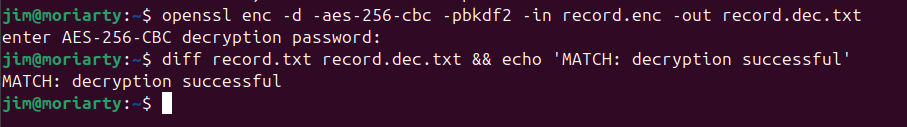
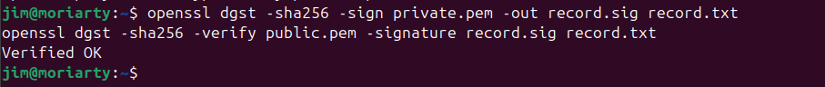
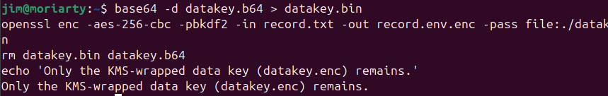
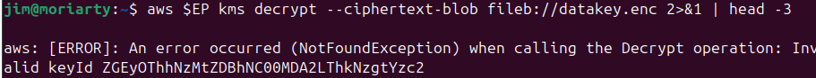
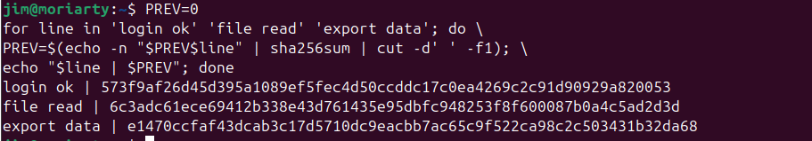

# IKB42603 Cloud Computing Security Essentials
## Lab 3 — Data Protection: Encryption & Key Management

**Name:** Jim Moriarty

---

## 1. Objective

The objective of this lab is to gain hands-on experience with the full spectrum of data protection techniques used in modern cloud environments. Across two sessions (Weeks 5–6), this lab demonstrates:

- How symmetric (AES) and asymmetric (RSA) encryption work in practice using OpenSSL.
- How data is secured in transit using TLS with a self-signed certificate served via a Docker container.
- How a cloud Key Management Service (KMS) — simulated via LocalStack — is used to manage encryption keys.
- How envelope encryption separates data keys from master keys to enable scalable, secure data protection.
- How per-tenant cryptographic isolation and cryptographic erasure provide provable data deletion.
- How hashing and hash chains protect data integrity and create tamper-evident audit logs.

---

## 2. Learning Outcomes

At the end of this lab, the student is able to:

1. **Encrypt and decrypt** data using both symmetric (AES-256-CBC) and asymmetric (RSA-2048) cryptography via OpenSSL.
2. **Protect data in transit** with TLS using a self-signed certificate and observe the difference between plaintext and encrypted traffic.
3. **Use a Key Management Service (KMS)** and implement envelope encryption to separate data keys from master keys.
4. **Apply per-tenant keys** and perform cryptographic erasure, making data provably unrecoverable without hardware-level access.
5. **Verify data integrity** with SHA-256 hashing and construct a tamper-evident hash-chained audit log.

---

## 3. Environment

| Component | Details |
|---|---|
| Operating System | Linux (Ubuntu) |
| Terminal | Bash shell |
| Encryption Tool | OpenSSL (pre-installed) |
| Container Runtime | Docker |
| KMS Simulation | LocalStack (`--endpoint-url=http://localhost:4566`) |
| AWS CLI | v2, pointed at LocalStack |
| Web Server | nginx Docker container (for TLS task) |
| Sample Data File | `record.txt` — contains a patient record: `Patient: Ahmad, Diagnosis: confidential` |

---

## 4. Step-by-Step Implementation

### Session A (Week 5) — Symmetric/Asymmetric Encryption & TLS

---

#### Task 1 — Symmetric Encryption (AES-256-CBC)

Symmetric encryption uses a single shared secret key for both encryption and decryption. This task demonstrates AES-256-CBC at rest, the same algorithm used by cloud storage services.

**Steps:**

1. Create a sample plaintext file representing a sensitive patient health record:
   ```bash
   echo 'Patient: Ahmad, Diagnosis: confidential' > record.txt
   ```

2. Encrypt the file using AES-256-CBC with PBKDF2 key derivation. A password prompt appears — the same password must be used for decryption:
   ```bash
   openssl enc -aes-256-cbc -pbkdf2 -in record.txt -out record.enc
   ```

3. Decrypt the encrypted file back to a new output file:
   ```bash
   openssl enc -d -aes-256-cbc -pbkdf2 -in record.enc -out record.dec.txt
   ```

4. Verify that the decrypted content is identical to the original by comparing both files:
   ```bash
   diff record.txt record.dec.txt && echo 'MATCH: decryption successful'
   ```

**Result:** The terminal outputs `MATCH: decryption successful`, confirming that the round-trip encryption and decryption produced an identical file.



---

#### Task 2 — Asymmetric Encryption & Digital Signatures (RSA-2048)

Asymmetric encryption uses a key pair: a public key for encryption and a private key for decryption. This is the basis of PKI and TLS. Digital signatures reverse the roles — the private key signs, and the public key verifies.

**Steps:**

1. Generate a 2048-bit RSA key pair:
   ```bash
   openssl genrsa -out private.pem 2048
   openssl rsa -in private.pem -pubout -out public.pem
   ```

2. Encrypt the patient record with the public key and decrypt it with the private key:
   ```bash
   openssl pkeyutl -encrypt -pubin -inkey public.pem -in record.txt -out record.rsa
   openssl pkeyutl -decrypt -inkey private.pem -in record.rsa -out record.rsa.txt
   ```

3. Create a SHA-256 digital signature using the private key:
   ```bash
   openssl dgst -sha256 -sign private.pem -out record.sig record.txt
   ```

4. Verify the signature using the public key:
   ```bash
   openssl dgst -sha256 -verify public.pem -signature record.sig record.txt
   ```

**Result:** The terminal outputs `Verified OK`, confirming that the signature was created by the holder of the private key and that the file has not been tampered with.



---

#### Task 3 — Encryption in Transit (TLS)

This task demonstrates how TLS protects data while it travels over a network. A self-signed certificate is generated and used to serve a file over HTTPS via an nginx Docker container.

**Steps:**

1. Generate a self-signed TLS certificate and private key valid for 7 days:
   ```bash
   openssl req -x509 -newkey rsa:2048 -keyout key.pem -out cert.pem \
   -days 7 -nodes -subj '/CN=localhost'
   ```

2. Start an nginx container to serve `record.txt` over HTTPS on port 8443:
   ```bash
   docker run --rm -d --name tls -p 8443:443 \
   -v $(pwd)/cert.pem:/etc/nginx/cert.pem \
   -v $(pwd)/key.pem:/etc/nginx/key.pem \
   -v $(pwd)/record.txt:/usr/share/nginx/html/record.txt nginx
   ```

3. Connect to the HTTPS endpoint and retrieve the file (`-k` accepts the self-signed certificate):
   ```bash
   curl -k https://localhost:8443/record.txt
   ```

**Result:** The patient record is delivered securely over TLS. The terminal shows `Patient: Ahmad, Diagnosis: confidential`, confirming the file was served and received over an encrypted channel.


> **Security Note:** Without TLS, the same data would travel in clear text over HTTP, making it readable by any on-path attacker (eavesdropping). TLS renders intercepted traffic unreadable.

*End of Session A. The TLS container was stopped (`docker stop tls`). Files `record.enc`, RSA keys, and all outputs were retained for Session B.*

---

### Session B (Week 6) — KMS, Envelope Encryption & Integrity

---

#### Task 4 — Create and Use a KMS Master Key

LocalStack was started to simulate the AWS KMS service locally. A Customer Master Key (CMK) was created for Tenant A.

**Steps:**

1. Set the LocalStack endpoint environment variable:
   ```bash
   EP='--endpoint-url=http://localhost:4566'
   ```

2. Create the Customer Master Key for Tenant A and capture the `KeyId`:
   ```bash
   aws $EP kms create-key --description 'CCSE tenant-A master key'
   KEY_A=<PASTE_KEYID>
   ```

3. Perform a direct KMS encryption of a small secret to confirm the CMK is functional:
   ```bash
   aws $EP kms encrypt --key-id $KEY_A \
   --plaintext "$(echo -n 'hello' | base64)" \
   --query CiphertextBlob --output text
   ```

**Result:** KMS returned a Base64-encoded ciphertext blob, confirming the master key was active and functional.

---

#### Task 5 — Envelope Encryption

For large data files, the KMS master key is never used directly. Instead, KMS generates a data key: a short-lived AES key used to encrypt the actual file. The data key is then wrapped (encrypted) by the master key and stored alongside the ciphertext. This is envelope encryption.

**Steps:**

1. Request a 256-bit data key from KMS (returns both a plaintext and an encrypted/wrapped copy):
   ```bash
   aws $EP kms generate-data-key --key-id $KEY_A \
   --key-spec AES_256 \
   --query '[Plaintext,CiphertextBlob]' --output text
   ```
   Save column 1 to `datakey.b64` (plaintext) and column 2 to `datakey.enc` (KMS-wrapped).

2. Decode the plaintext data key to a binary file and encrypt `record.txt` locally with it:
   ```bash
   base64 -d datakey.b64 > datakey.bin
   openssl enc -aes-256-cbc -pbkdf2 -in record.txt -out record.env.enc \
   -pass file:./datakey.bin
   ```

3. Destroy the plaintext data key from disk — only the KMS-wrapped copy should remain:
   ```bash
   rm datakey.bin datakey.b64
   echo 'Only the KMS-wrapped data key (datakey.enc) remains.'
   ```

**Result:** The plaintext key was removed from disk. Only `datakey.enc` (the KMS-wrapped key) and `record.env.enc` (the encrypted file) remain. The shell confirms: `Only the KMS-wrapped data key (datakey.enc) remains.`



---

#### Task 6 — Per-Tenant Keys & Cryptographic Erasure

A second CMK was created for Tenant B, demonstrating cryptographic isolation. Tenant A's key was then scheduled for deletion and immediately disabled. An attempt to unwrap Tenant A's data key after disabling the master key demonstrates that the data is permanently unrecoverable — cryptographic erasure.

**Steps:**

1. Create a separate master key for Tenant B:
   ```bash
   aws $EP kms create-key --description 'CCSE tenant-B master key'
   KEY_B=<PASTE_KEYID>
   ```

2. Schedule deletion of Tenant A's key with a minimum 7-day pending window:
   ```bash
   aws $EP kms schedule-key-deletion --key-id $KEY_A --pending-window-in-days 7
   ```

3. Disable Tenant A's key immediately to simulate erasure:
   ```bash
   aws $EP kms disable-key --key-id $KEY_A
   ```

4. Attempt to decrypt/unwrap Tenant A's data key — this should fail:
   ```bash
   aws $EP kms decrypt --ciphertext-blob fileb://datakey.enc 2>&1 | head -3
   ```

**Result:** The KMS operation returned an `[ERROR]: NotFoundException` with message `Invalid keyId`, confirming that the disabled/deleted master key can no longer unwrap the data key. The encrypted file `record.env.enc` is now permanently unreadable — cryptographic erasure is demonstrated.



---

#### Task 7 — Integrity & Tamper-Evidence

Encryption protects confidentiality but not integrity. SHA-256 hashing is used to fingerprint files and detect tampering. A hash chain is then constructed to build a tamper-evident log where each entry depends on the hash of all previous entries.

**Steps:**

1. Generate the SHA-256 fingerprint of the original patient record:
   ```bash
   sha256sum record.txt
   ```

2. Create a tampered copy by appending a character and compare the hashes:
   ```bash
   cp record.txt tampered.txt; echo 'x' >> tampered.txt
   sha256sum record.txt tampered.txt
   ```

3. Build a hash chain where each log entry incorporates the hash of all previous entries:
   ```bash
   PREV=0
   for line in 'login ok' 'file read' 'export data'; do \
   PREV=$(echo -n "$PREV$line" | sha256sum | cut -d' ' -f1); \
   echo "$line | $PREV"; done
   ```

**Result:** The two files produced completely different SHA-256 hashes despite only a one-character difference, demonstrating the avalanche effect. The hash chain output shows three log entries, each with a unique hash that incorporates all preceding entries — making any retroactive tampering immediately detectable.



---

## 5. Commands Used

| # | Command | Purpose |
|---|---|---|
| 1 | `openssl enc -aes-256-cbc -pbkdf2 -in record.txt -out record.enc` | Encrypt file with AES-256-CBC |
| 2 | `openssl enc -d -aes-256-cbc -pbkdf2 -in record.enc -out record.dec.txt` | Decrypt AES-encrypted file |
| 3 | `diff record.txt record.dec.txt && echo 'MATCH: decryption successful'` | Verify decryption integrity |
| 4 | `openssl genrsa -out private.pem 2048` | Generate RSA 2048-bit private key |
| 5 | `openssl rsa -in private.pem -pubout -out public.pem` | Extract RSA public key |
| 6 | `openssl pkeyutl -encrypt -pubin -inkey public.pem -in record.txt -out record.rsa` | Encrypt with RSA public key |
| 7 | `openssl pkeyutl -decrypt -inkey private.pem -in record.rsa -out record.rsa.txt` | Decrypt with RSA private key |
| 8 | `openssl dgst -sha256 -sign private.pem -out record.sig record.txt` | Sign file with private key |
| 9 | `openssl dgst -sha256 -verify public.pem -signature record.sig record.txt` | Verify digital signature |
| 10 | `openssl req -x509 -newkey rsa:2048 -keyout key.pem -out cert.pem -days 7 -nodes -subj '/CN=localhost'` | Generate self-signed TLS certificate |
| 11 | `docker run --rm -d --name tls -p 8443:443 ...` | Serve file over HTTPS with nginx |
| 12 | `curl -k https://localhost:8443/record.txt` | Retrieve file over TLS |
| 13 | `aws $EP kms create-key --description 'CCSE tenant-A master key'` | Create KMS Customer Master Key |
| 14 | `aws $EP kms encrypt --key-id $KEY_A --plaintext ...` | Encrypt small secret with KMS CMK |
| 15 | `aws $EP kms generate-data-key --key-id $KEY_A --key-spec AES_256 ...` | Generate envelope data key |
| 16 | `base64 -d datakey.b64 > datakey.bin` | Decode plaintext data key |
| 17 | `openssl enc -aes-256-cbc -pbkdf2 -in record.txt -out record.env.enc -pass file:./datakey.bin` | Encrypt file with data key (envelope) |
| 18 | `rm datakey.bin datakey.b64` | Destroy plaintext data key |
| 19 | `aws $EP kms schedule-key-deletion --key-id $KEY_A --pending-window-in-days 7` | Schedule CMK deletion |
| 20 | `aws $EP kms disable-key --key-id $KEY_A` | Disable CMK immediately |
| 21 | `aws $EP kms decrypt --ciphertext-blob fileb://datakey.enc 2>&1 \| head -3` | Attempt (failed) data key unwrap |
| 22 | `sha256sum record.txt tampered.txt` | Compare SHA-256 hashes |
| 23 | `PREV=0; for line in ...; do PREV=$(echo -n "$PREV$line" \| sha256sum \| cut -d' ' -f1); echo "$line \| $PREV"; done` | Build tamper-evident hash chain |

---

## 6. Screenshots

| # | Screenshot | Task | Description |
|---|---|---|---|
| 1 | `1.png` | Task 1 | AES-256-CBC decryption and `diff` verification showing `MATCH: decryption successful` |
| 2 | `2.png` | Task 2 | RSA digital signature creation and verification showing `Verified OK` |
| 3 | `3.png` | Task 3 | `curl -k` HTTPS output showing patient record served securely over TLS |
| 4 | `4.png` | Task 5 | Envelope encryption: data key use, local AES encryption, plaintext key destruction |
| 5 | `5.png` | Task 6 | Failed `kms decrypt` after key disabling, showing `NotFoundException` |
| 6 | `6.png` | Task 7 | Hash chain output with three tamper-evident log entries |

---

## 7. Challenges Encountered

| Challenge | Resolution |
|---|---|
| **RSA size limitation for direct encryption** — RSA-2048 can only directly encrypt data smaller than the key size (~214 bytes). Encrypting `record.txt` directly with `pkeyutl` required the file to be small enough. | Ensured `record.txt` contained only a short patient record string. In practice, hybrid encryption (RSA wraps an AES key) is used for larger files — which is exactly what envelope encryption achieves in Task 5. |
| **Self-signed certificate rejection** — `curl` by default rejects self-signed certificates with an SSL error. | Used the `-k` flag (`--insecure`) to bypass certificate validation for the lab. In production, a CA-signed certificate would be used instead. |
| **LocalStack KMS endpoint** — Standard AWS CLI commands fail because they point to real AWS, not LocalStack. | Set `EP='--endpoint-url=http://localhost:4566'` as a shell variable and prefixed every `aws` command with `$EP`. |
| **Envelope encryption two-column output** — The `generate-data-key` command returns both plaintext and ciphertext on one line, requiring manual separation. | Used `--query '[Plaintext,CiphertextBlob]' --output text` and carefully saved each column to the correct file (`datakey.b64` and `datakey.enc`). |
| **Cryptographic erasure is irreversible** — Once the master key was disabled, `datakey.enc` could no longer be unwrapped, making `record.env.enc` permanently unreadable — even in a lab context. | Retained copies of the original `record.txt` before starting the erasure task so other verification steps could still be completed. |

---

## 8. Lessons Learned

**1. Symmetric encryption is fast but has a key-distribution problem.**
AES-256-CBC encrypts and decrypts efficiently, but the shared secret key must be securely distributed out-of-band to every party that needs access. In a multi-tenant cloud environment, distributing and storing symmetric keys securely is the primary challenge — which is exactly why KMS exists.

**2. Asymmetric encryption solves key distribution but not scale.**
RSA eliminates the key-distribution problem: the public key can be freely shared, and only the private key holder can decrypt. However, RSA is computationally expensive and cannot encrypt large data directly. This is why hybrid encryption (RSA wraps an AES key) is the universal standard — seen in TLS, PGP, and envelope encryption.

**3. TLS is non-negotiable for data in transit.**
Serving `record.txt` over plain HTTP would expose patient data to any on-path attacker. TLS encrypts the entire payload, making intercepted traffic unreadable. Even a self-signed certificate (imperfect for authentication) provides full confidentiality. The lesson is that **encryption in transit should be the default**, not an afterthought.

**4. Key management is the weakest link, not the algorithm.**
AES-256 is computationally unbreakable with a good key. However, if the key is stored on the same disk as the ciphertext, lost, or shared insecurely, the algorithm's strength is irrelevant. This lab demonstrated this vividly: once `KEY_A` was disabled, `record.env.enc` became permanently unreadable — not because of any flaw in AES, but because of key management policy.

**5. Envelope encryption is the correct pattern for cloud-scale data protection.**
Encrypting large files directly with a master key is impractical and risky. Envelope encryption generates a unique data key per object, encrypts the data locally, and stores only the wrapped key. Only the small master key ever needs hardware-grade protection (e.g., an HSM). This is the architecture used by AWS S3 SSE-KMS, GCP CMEK, and Azure Key Vault.

**6. Cryptographic erasure enables provable deletion in cloud environments.**
In a cloud where data may be replicated across multiple physical disks and geographic regions, overwriting every copy is impossible to verify. By deleting the master key that wraps all data keys, every copy of the encrypted data becomes permanently unreadable — regardless of where it is stored. This provides a stronger, provable deletion guarantee than any scrubbing technique.

**7. Hashing protects integrity, not confidentiality.**
Encryption hides data; hashing detects tampering. A single-character change to `tampered.txt` produced a completely different SHA-256 hash, demonstrating the avalanche effect. Hash chains extend this property to ordered sequences of events: retroactively inserting or modifying a log entry invalidates all subsequent hashes, making the tampering immediately detectable.

---

## 9. Short-Answer Questions

**Q1. Compare symmetric and asymmetric encryption: speed, key distribution, and typical use.**

Symmetric encryption (e.g., AES) uses a single shared key for both encryption and decryption. It is extremely fast — hardware-accelerated AES can process gigabytes per second — making it ideal for encrypting large data volumes at rest or in transit. Its critical weakness is **key distribution**: both parties must securely share the secret key before any communication can begin, which is difficult to achieve over an untrusted network.

Asymmetric encryption (e.g., RSA) uses a mathematically linked key pair. The public key can be freely distributed; only the corresponding private key can decrypt. This **eliminates the key-distribution problem**: any party can encrypt a message to a recipient using their published public key without any prior secret exchange. However, RSA is orders of magnitude slower than AES and cannot directly encrypt large data (RSA-2048 is limited to ~214 bytes per operation).

In practice, the two are combined: asymmetric cryptography is used to securely exchange a symmetric session key (as in TLS), and symmetric cryptography encrypts the actual data. This hybrid approach captures the benefits of both.

---

**Q2. Why is key management described as the weakest link, not the algorithm?**

Modern symmetric algorithms like AES-256 offer a keyspace of 2²⁵⁶ possible keys. A brute-force attack on AES-256 would take longer than the estimated age of the universe, even with all the world's computing power. No practical cryptographic attack against AES-256 is known. The algorithm itself is effectively unbreakable.

The vulnerability lies not in the algorithm but in the **management of the key**. If a 256-bit AES key is:
- Stored in a plaintext file on the same server as the ciphertext,
- Hardcoded into source code committed to a public repository,
- Shared over an unencrypted channel,
- Never rotated after a suspected compromise, or
- Retained indefinitely beyond the data's useful life,

...then the encryption provides no real security. An attacker does not need to break AES; they only need to find the key. Key management — secure generation, storage, distribution, rotation, and destruction — is therefore the critical engineering challenge, not algorithm selection.

---

**Q3. Explain envelope encryption and why only the master key needs hardware-grade protection.**

Envelope encryption is a two-layer key hierarchy:

1. A **data key** (e.g., AES-256) is generated fresh for each object or data set. It encrypts the actual data locally and is then discarded from memory.
2. The data key is **wrapped** (encrypted) by a **master key** (Customer Master Key / CMK) managed by the KMS. Only the wrapped data key (`datakey.enc`) is stored alongside the ciphertext.

To decrypt, the process is reversed: the wrapped data key is sent to KMS for unwrapping, used briefly to decrypt the data, then discarded again.

Only the **master key** needs hardware-grade protection (e.g., an HSM or FIPS 140-2 Level 3 device) because it is the root of trust for the entire key hierarchy. The data keys are short-lived, unique per object, and never stored in plaintext. Even if an attacker obtains all the ciphertext and all the wrapped data keys, they are useless without the master key — which never leaves the HSM.

This design also enables efficient **key rotation**: rotating the master key only requires re-wrapping the data keys, not re-encrypting all the data.

---

**Q4. How does cryptographic erasure achieve provable deletion where overwriting cannot (in the cloud)?**

In a traditional on-premises environment, data can be erased by overwriting the disk sectors with zeros or random data. In a cloud environment, this approach is fundamentally unreliable because:
- Data is replicated across multiple disks in multiple data centres for durability.
- Snapshots and backups may exist at various points in time.
- The tenant does not control the physical media and cannot verify that every copy has been overwritten.
- Flash-based storage (SSDs, NVMe) uses wear-levelling algorithms that may retain old data in cells that are no longer logically addressed.

**Cryptographic erasure** bypasses all of these problems. If every copy of the data is encrypted with a key managed by KMS, then deleting the master key renders **all copies of the data permanently unreadable simultaneously** — regardless of how many physical copies exist or where they are stored. The ciphertext remains on disk, but without the master key (or the data keys it wrapped), it is computationally indistinguishable from random noise.

This provides a **provable, auditable** deletion guarantee: the key deletion event is logged by the KMS, and any auditor can confirm that the key no longer exists. No such guarantee is possible with physical overwriting in a cloud environment.

---

**Q5. How does a hash chain make a log tamper-evident (link to tamper-proof logs, Week 6)?**

A standard log is tamper-vulnerable: an adversary with write access to the log store can modify, delete, or insert entries without leaving any trace. A hash chain makes this impossible to conceal.

In a hash chain, each log entry's hash is computed over both the **current event** and the **hash of all previous entries** (i.e., `PREV = SHA-256(PREV_HASH + current_event)`). This creates a cryptographic dependency chain:

- Modifying any past entry changes its hash.
- That changed hash invalidates the hash of the next entry.
- The cascade continues, invalidating all subsequent entries.

The final hash of the chain is a cryptographic commitment to the **entire history** of the log. An independent verifier who holds only the current chain head hash can immediately detect any retroactive modification by recomputing the chain from the original entries.

This is the principle behind blockchain ledgers, Certificate Transparency logs, and cloud audit trails (e.g., AWS CloudTrail with log file integrity validation). In Week 6's context, a tamper-evident log chain means that even a privileged insider who gains access to the log storage cannot silently alter audit records — any modification is cryptographically detectable.

---

## References

1. UniKL MIIT — IKB42603 Cloud Computing Security Essentials, Lab 3 Manual: *Data Protection: Encryption & Key Management* (Prof. Dr. Shahrulniza Musa).
2. UniKL MIIT — Course Lecture, **Week 4: Data Protection** and **Week 9: Key Management Patterns**.
3. OpenSSL Project — *OpenSSL Documentation*. Available at: [https://www.openssl.org/docs](https://www.openssl.org/docs)
4. Amazon Web Services — *AWS Key Management Service Concepts: Envelope Encryption*. Available at: [https://docs.aws.amazon.com/kms/latest/developerguide/concepts.html](https://docs.aws.amazon.com/kms/latest/developerguide/concepts.html)
5. Cloud Security Alliance (CSA) — *Security Guidance for Critical Areas of Focus in Cloud Computing v5*, Domain 11: Data Security & Encryption. Available at: [https://cloudsecurityalliance.org/research/guidance](https://cloudsecurityalliance.org/research/guidance)
6. National Institute of Standards and Technology (NIST) — *NIST SP 800-57: Recommendation for Key Management*. Available at: [https://csrc.nist.gov/publications/detail/sp/800-57-part-1/rev-5/final](https://csrc.nist.gov/publications/detail/sp/800-57-part-1/rev-5/final)
7. LocalStack — *LocalStack Documentation: AWS KMS Emulation*. Available at: [https://docs.localstack.cloud/user-guide/aws/kms](https://docs.localstack.cloud/user-guide/aws/kms)
