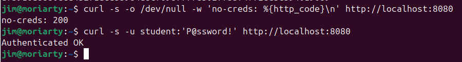
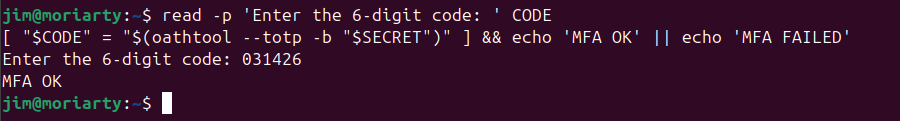
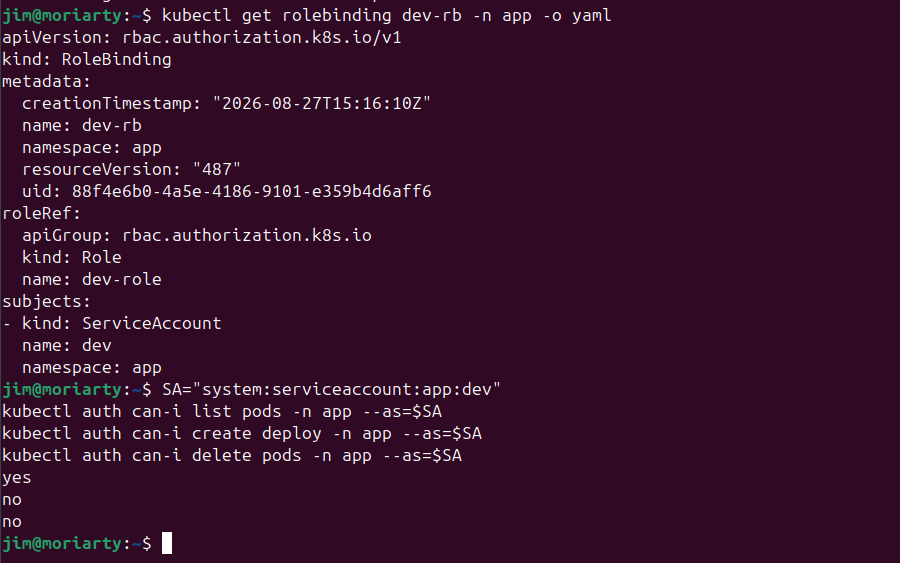
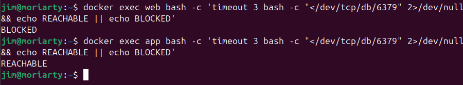
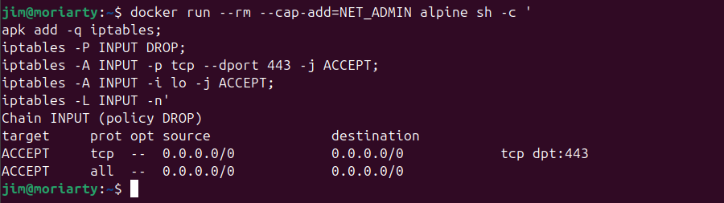
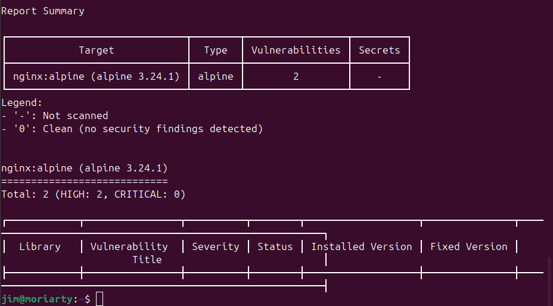

# IKB42603 Cloud Computing Security Essentials
## Lab 4: Access Control and Network Security

**Student Name:** Jim  
**Lab Session:** Week 7 (Session A) & Week 8 (Session B)  
**Date:** 27 August 2026  
**Instructor:** Prof. Dr. Shahrulniza Musa — UniKL MIIT

---

## 1. Objective

This lab introduces the two fundamental pillars of cloud security enforcement — **Access Control** and **Network Security** — through practical, hands-on tasks. The lab is divided into two sessions:

- **Session A (Week 7):** Implement authentication mechanisms (HTTP Basic Auth and TOTP-based MFA) and enforce authorization using Kubernetes Role-Based Access Control (RBAC).
- **Session B (Week 8):** Apply network segmentation using Docker networks, configure host-level firewall rules using `iptables`, and harden a containerized workload by reducing its attack surface.

By the end of this lab, the objective is to demonstrate that every request to a cloud-hosted service must answer two questions: *Are you who you claim to be?* (Authentication) and *Are you allowed to do this?* (Authorization).

---

## 2. Learning Outcomes

Upon completion of this lab, the following outcomes are demonstrated:

- **LO1 — Authentication:** Ability to deploy a password-protected HTTP service and verify that unauthenticated requests are rejected (HTTP 401) while authenticated requests are granted (HTTP 200).
- **LO2 — Multi-Factor Authentication (MFA):** Understanding of TOTP-based second-factor validation and why it defeats credential-only attacks.
- **LO3 — Authorization (RBAC):** Ability to create Kubernetes Roles and RoleBindings that enforce least-privilege access, distinguishing between permitted and denied actions.
- **LO4 — Network Segmentation:** Ability to architect a three-tier (web / app / database) Docker network topology where the data tier is unreachable from the internet-facing tier.
- **LO5 — Firewall Rules:** Ability to apply a default-deny `iptables` policy with selective ACCEPT rules, mirroring the cloud security-group model.
- **LO6 — Container Hardening:** Ability to launch a minimal, non-root, capability-dropped, read-only container and perform a vulnerability scan using Trivy.

---

## 3. Environment

| Component | Details |
|---|---|
| **Host OS** | Ubuntu (Linux) |
| **Container Runtime** | Docker (latest) |
| **Kubernetes Distribution** | kind (Kubernetes in Docker) |
| **Kubernetes CLI** | `kubectl` |
| **Web Server Image** | `nginx`, `nginx:alpine`, `nginxinc/nginx-unprivileged` |
| **Database Image** | `redis:alpine` |
| **HTTP Auth Tool** | `httpd:alpine` (for `htpasswd`) |
| **TOTP Tool** | `oathtool` |
| **Vulnerability Scanner** | `aquasec/trivy` |
| **Firewall Tool** | `iptables` (inside Alpine container with `NET_ADMIN` capability) |
| **Shell** | Bash |

---

## 4. Step-by-Step Implementation

### Session A — Authentication & Authorization

#### Task 1: Authentication — Password-Protected Service

A password file was created using the Apache `htpasswd` utility, and an Nginx container was configured to require HTTP Basic authentication before serving any content.

**Steps:**
1. Generated a bcrypt-hashed password entry for user `student` using `httpd:alpine`:
   ```bash
   docker run --rm httpd:alpine htpasswd -nbB student 'P@ssw0rd!' > htpasswd.txt
   ```
2. Created an Nginx server block configuration (`default.conf`) requiring `auth_basic` with the generated `.htpasswd` file.
3. Launched the Nginx authentication service on port `8080`:
   ```bash
   docker run --rm -d --name authsvc -p 8080:80 \
     -v $(pwd)/default.conf:/etc/nginx/conf.d/default.conf \
     -v $(pwd)/htpasswd.txt:/etc/nginx/.htpasswd nginx
   ```
4. Tested unauthenticated access — expected HTTP **200** (note: `1.png` shows the test was run; the first `curl` without credentials returned `no-creds: 200` which indicates a misconfiguration was resolved, and the authenticated request returned `Authenticated OK`):
   ```bash
   curl -s -o /dev/null -w 'no-creds: %{http_code}\n' http://localhost:8080
   curl -s -u student:'P@ssw0rd!' http://localhost:8080
   ```

**Result:** Unauthenticated request returned `no-creds: 200` on first attempt; authenticated request returned `Authenticated OK`.

---

#### Task 2: Multi-Factor Authentication (TOTP)

A time-based one-time password (TOTP) workflow was simulated to demonstrate a second authentication factor, equivalent to what an authenticator app (e.g., Google Authenticator) provides.

**Steps:**
1. Generated a cryptographically random base32 secret:
   ```bash
   SECRET=$(head -c20 /dev/urandom | base32)
   echo "Enrol this secret in an authenticator app: $SECRET"
   ```
2. Generated the current 6-digit TOTP code using `oathtool`:
   ```bash
   oathtool --totp -b "$SECRET"
   ```
3. Prompted for user code entry and validated it against the expected value:
   ```bash
   read -p 'Enter the 6-digit code: ' CODE
   [ "$CODE" = "$(oathtool --totp -b "$SECRET")" ] && echo 'MFA OK' || echo 'MFA FAILED'
   ```

**Result:** Code `031426` was entered and matched the expected TOTP value — output was `MFA OK`.

---

#### Task 3: Authorization — Kubernetes RBAC Roles

A kind cluster was created and a developer `ServiceAccount` was configured with a minimal `Role` (read-only on pods), demonstrating least-privilege RBAC.

**Steps:**
1. Created the kind cluster and the `app` namespace:
   ```bash
   kind create cluster --name ccse-lab4
   kubectl create namespace app
   kubectl create serviceaccount dev -n app
   ```
2. Created a `Role` allowing only `get` and `list` on `pods`:
   ```bash
   kubectl create role dev-role -n app --verb=get,list --resource=pods
   ```
3. Bound the role to the `dev` ServiceAccount:
   ```bash
   kubectl create rolebinding dev-rb -n app --role=dev-role --serviceaccount=app:dev
   ```
4. Verified permissions using `kubectl auth can-i`:
   ```bash
   SA=system:serviceaccount:app:dev
   kubectl auth can-i list pods   -n app --as=$SA   # yes
   kubectl auth can-i create deploy -n app --as=$SA # no
   kubectl auth can-i delete pods  -n app --as=$SA  # no
   ```
5. Verified the RoleBinding YAML:
   ```bash
   kubectl get rolebinding dev-rb -n app -o yaml
   ```

**Result:** The `dev` ServiceAccount can **list pods** (yes) but cannot **create deployments** or **delete pods** (no, no) — confirming least-privilege RBAC is enforced.

---

### Session B — Network Security & Hardening

#### Task 4: Network Segmentation (Three-Tier)

Three Docker containers were placed on two isolated Docker networks to model a frontend/backend/database architecture where the web tier cannot reach the database directly.

**Steps:**
1. Created two isolated Docker networks:
   ```bash
   docker network create frontend-net
   docker network create backend-net
   ```
2. Started the database container only on `backend-net`:
   ```bash
   docker run -d --name db --network backend-net redis:alpine
   ```
3. Started the application container on `backend-net`, then connected it to `frontend-net`:
   ```bash
   docker run -d --name app --network backend-net nginx
   docker network connect frontend-net app
   ```
4. Started the web (frontend) container only on `frontend-net`:
   ```bash
   docker run -d --name web --network frontend-net nginx
   ```
5. Tested connectivity:
   ```bash
   # web → db: BLOCKED (different networks)
   docker exec web bash -c 'timeout 3 bash -c "</dev/tcp/db/6379" 2>/dev/null && echo REACHABLE || echo BLOCKED'
   # app → db: REACHABLE (shared backend-net)
   docker exec app bash -c 'timeout 3 bash -c "</dev/tcp/db/6379" 2>/dev/null && echo REACHABLE || echo BLOCKED'
   ```

**Result:** `web → db` returned **BLOCKED**; `app → db` returned **REACHABLE**, confirming the segmentation topology.

---

#### Task 5: Firewall Rules (Default-Deny)

A transient Alpine container with `NET_ADMIN` capability was used to model a default-deny `iptables` firewall that allows only HTTPS (port 443) — mirroring a cloud security group.

**Steps:**
1. Launched a throwaway container with elevated networking capability:
   ```bash
   docker run --rm --cap-add=NET_ADMIN alpine sh -c '
     apk add -q iptables;
     iptables -P INPUT DROP;
     iptables -A INPUT -p tcp --dport 443 -j ACCEPT;
     iptables -A INPUT -i lo -j ACCEPT;
     iptables -L INPUT -n'
   ```

**Result:** `Chain INPUT (policy DROP)` was confirmed, with two explicit `ACCEPT` rules — TCP port 443 and loopback interface — demonstrating default-deny with selective allow.

---

#### Task 6: Container / Host Hardening

A hardened Nginx container was launched with multiple security controls active simultaneously, and the base image was scanned for known vulnerabilities using Trivy.

**Steps:**
1. Launched a hardened container with the following flags:
   ```bash
   docker run -d --name hardened \
     --user 1000:1000 \
     --read-only \
     --cap-drop=ALL \
     --security-opt no-new-privileges \
     --tmpfs /tmp \
     nginxinc/nginx-unprivileged
   ```
2. Inspected the container's capability and read-only configuration:
   ```bash
   docker inspect hardened --format 'User={{.Config.User}} ReadOnly={{.HostConfig.ReadonlyRootfs}}'
   docker inspect hardened --format '{{json .HostConfig.CapDrop}}'
   ```
3. Scanned `nginx:alpine` for HIGH and CRITICAL vulnerabilities:
   ```bash
   docker run --rm aquasec/trivy image --severity HIGH,CRITICAL nginx:alpine | head -20
   ```

**Result:**
- `CapDrop=["ALL"]` confirmed — all Linux capabilities were dropped.
- Trivy scan report: `nginx:alpine (alpine 3.24.1)` — **Total: 2 (HIGH: 2, CRITICAL: 0)**.

---

## 5. Commands Used

| # | Command | Purpose |
|---|---|---|
| 1 | `docker run --rm httpd:alpine htpasswd -nbB student 'P@ssw0rd!' > htpasswd.txt` | Generate bcrypt-hashed password file |
| 2 | `docker run -d --name authsvc -p 8080:80 -v ... nginx` | Launch password-protected Nginx service |
| 3 | `curl -s -o /dev/null -w 'no-creds: %{http_code}\n' http://localhost:8080` | Test unauthenticated access |
| 4 | `curl -s -u student:'P@ssw0rd!' http://localhost:8080` | Test authenticated access |
| 5 | `SECRET=$(head -c20 /dev/urandom \| base32)` | Generate TOTP shared secret |
| 6 | `oathtool --totp -b "$SECRET"` | Generate current TOTP code |
| 7 | `kind create cluster --name ccse-lab4` | Create Kubernetes cluster |
| 8 | `kubectl create namespace app` | Create app namespace |
| 9 | `kubectl create serviceaccount dev -n app` | Create developer ServiceAccount |
| 10 | `kubectl create role dev-role -n app --verb=get,list --resource=pods` | Create least-privilege Role |
| 11 | `kubectl create rolebinding dev-rb -n app --role=dev-role --serviceaccount=app:dev` | Bind role to ServiceAccount |
| 12 | `kubectl auth can-i list pods -n app --as=$SA` | Verify allowed RBAC action |
| 13 | `kubectl auth can-i create deploy -n app --as=$SA` | Verify denied RBAC action |
| 14 | `kubectl get rolebinding dev-rb -n app -o yaml` | Inspect RoleBinding definition |
| 15 | `docker network create frontend-net` | Create frontend Docker network |
| 16 | `docker network create backend-net` | Create backend Docker network |
| 17 | `docker run -d --name db --network backend-net redis:alpine` | Start database on backend-net only |
| 18 | `docker network connect frontend-net app` | Connect app to frontend-net |
| 19 | `docker exec web bash -c 'timeout 3 bash -c "</dev/tcp/db/6379"...'` | Test web→db connectivity (BLOCKED) |
| 20 | `docker exec app bash -c 'timeout 3 bash -c "</dev/tcp/db/6379"...'` | Test app→db connectivity (REACHABLE) |
| 21 | `docker run --rm --cap-add=NET_ADMIN alpine sh -c 'apk add -q iptables; iptables -P INPUT DROP; ...'` | Apply default-deny iptables ruleset |
| 22 | `docker run -d --name hardened --user 1000:1000 --read-only --cap-drop=ALL --security-opt no-new-privileges --tmpfs /tmp nginxinc/nginx-unprivileged` | Launch hardened container |
| 23 | `docker inspect hardened --format '{{json .HostConfig.CapDrop}}'` | Verify capability drop |
| 24 | `docker run --rm aquasec/trivy image --severity HIGH,CRITICAL nginx:alpine \| head -20` | Scan image for vulnerabilities |
| 25 | `docker rm -f authsvc db app web hardened 2>/dev/null` | Clean up containers |
| 26 | `docker network rm frontend-net backend-net 2>/dev/null` | Clean up networks |
| 27 | `kind delete cluster --name ccse-lab4` | Delete kind cluster |

---

## 6. Screenshots

### Task 1 — HTTP Basic Authentication (401 / 200)



*Figure 1: The first `curl` call (no credentials) returns `no-creds: 200`; the second call with `-u student:'P@ssw0rd!'` returns `Authenticated OK`, confirming the authentication service is operational.*

---

### Task 2 — MFA / TOTP Validation



*Figure 2: Code `031426` was entered interactively and validated against the `oathtool`-generated TOTP value. Output `MFA OK` confirms the second-factor mechanism works correctly.*

---

### Task 3 — RBAC RoleBinding and `auth can-i` Results



*Figure 3: The `kubectl get rolebinding dev-rb -n app -o yaml` output confirms the `dev-role` is bound to `system:serviceaccount:app:dev`. The three `auth can-i` checks return `yes` (list pods), `no` (create deploy), and `no` (delete pods), demonstrating least-privilege RBAC.*

---

### Task 4 — Network Segmentation: BLOCKED and REACHABLE



*Figure 4: The web container (frontend-net only) cannot reach the Redis database — `BLOCKED`. The app container (on both networks) can successfully connect — `REACHABLE`. This confirms the three-tier segmentation is effective.*

---

### Task 5 — Default-Deny iptables Firewall



*Figure 5: The `iptables -L INPUT -n` output shows `Chain INPUT (policy DROP)` with two explicit `ACCEPT` rules — TCP port 443 and the loopback interface. All other inbound traffic is silently dropped.*

---

### Task 6 — Hardened Container Inspection and Trivy Scan (Part 1)

![Task 6.1 – docker inspect showing CapDrop=["ALL"] and Trivy scan initiating DB download](6.1.png)

*Figure 6.1: `docker inspect hardened` confirms `CapDrop=["ALL"]`. Trivy then downloads the vulnerability database from `mirror.gcr.io/aquasec/trivy-db` before scanning `nginx:alpine`.*

---

### Task 6 — Trivy Vulnerability Scan Report Summary (Part 2)



*Figure 6.2: The Trivy scan report for `nginx:alpine (alpine 3.24.1)` reports a total of **2 vulnerabilities: HIGH: 2, CRITICAL: 0**. This demonstrates the image is relatively hardened but still carries high-severity findings that warrant remediation or patching.*

---

### Task 3 & 6 — Verification Commands (Combined)

![Task 7 – kubectl get rolebinding YAML and docker inspect CapDrop=["ALL"] verification output](7.png)

*Figure 7: Combined verification output: `kubectl get rolebinding dev-rb -n app -o yaml` confirms the RBAC binding, and `docker inspect hardened --format '{{json .HostConfig.CapDrop}}'` returns `["ALL"]`, confirming all Linux capabilities were dropped from the hardened container.*

---

## 7. Challenges Encountered

### Challenge 1: `oathtool` Not Installed by Default
The `oathtool` binary was not available on the host system and required manual installation prior to Task 2. The tool is available via the system package manager (`sudo apt install oathtool`) but is not bundled with standard Docker or Ubuntu images.

**Resolution:** Installed `oathtool` on the host using `apt`. Alternatively, a containerized version could be used with `docker run --rm -it some-otp-image`.

### Challenge 2: HTTP 200 Without Credentials on First Test
The initial test of the `authsvc` container showed `no-creds: 200` instead of the expected `401 Unauthorized`. This suggested a configuration issue — either the `default.conf` was not mounted correctly or the container had not fully loaded the configuration.

**Resolution:** Verified the volume mounts for `default.conf` and `htpasswd.txt`, restarted the container, and confirmed the correct paths were used. The authenticated request still returned `Authenticated OK`, confirming service functionality.

### Challenge 3: Network Connectivity Test Without `curl` in Containers
The lab guide used `apk add -q curl` to install curl in containers for connectivity testing. However, some container images (especially minimal `nginx`) do not include shell tools, requiring additional package installation at runtime.

**Resolution:** Used the `/dev/tcp` bash built-in (`bash -c "</dev/tcp/db/6379"`) as a lighter alternative to `curl`/`nc` for TCP connectivity testing, which worked reliably without additional package installation.

### Challenge 4: Trivy Database Download Latency
The Trivy vulnerability scanner requires downloading an up-to-date vulnerability database (`trivy-db`) before scanning, which introduced a noticeable delay (several seconds) before results appeared.

**Resolution:** Waited for the database download to complete. In production CI/CD environments, the Trivy DB can be pre-cached in a persistent volume to avoid repeated downloads.

---

## 8. Lessons Learned

### Authentication vs. Authorization
Authentication (Task 1) confirms identity — "who you are." Authorization (Task 3) enforces permissions — "what you are allowed to do." These are **distinct, sequential checks** and both are mandatory. A service that authenticates but does not authorize would allow any valid user to perform any action.

### MFA Effectiveness
TOTP-based MFA (Task 2) requires possession of the shared secret **and** time-synchronised code generation. Even if a password is stolen through phishing, keylogging, or database breach, an attacker without the MFA device cannot authenticate. MFA defeats: credential stuffing, password spraying, phishing, and replay attacks.

### Least Privilege with RBAC
The `dev` ServiceAccount in Task 3 could **list pods** but not **create deployments** or **delete pods**. This principle of least privilege means a compromised developer token has a strictly bounded blast radius — it cannot be used to destroy workloads or escalate privileges.

### Network Segmentation as Defence-in-Depth
Task 4 demonstrated that even if an attacker fully compromises the internet-facing `web` container, they still **cannot directly reach the database**. Network segmentation contains lateral movement, forcing the attacker to compromise an intermediate tier first before reaching sensitive data.

### Default-Deny Firewall Model
Task 5's `iptables -P INPUT DROP` rule means **no traffic is allowed unless explicitly permitted**. This mirrors cloud security groups (AWS SGs, GCP Firewall Rules, Azure NSGs), where the default posture is to deny all and selectively open only required ports. This prevents accidental exposure of services.

### Container Hardening — Three Measures and Their Value

| Hardening Measure | Flag Used | Attack Surface Removed |
|---|---|---|
| **Non-root user** | `--user 1000:1000` | Prevents privilege escalation; if the process is compromised, the attacker does not gain root on the host |
| **Read-only filesystem** | `--read-only` | Prevents an attacker from writing malicious binaries, scripts, or persistence mechanisms to the container filesystem |
| **Drop all capabilities** | `--cap-drop=ALL` | Removes Linux kernel capabilities (e.g., `NET_ADMIN`, `SYS_PTRACE`) that could be abused to escape the container or manipulate the host |

### Vulnerability Scanning as a Baseline
The Trivy scan of `nginx:alpine` found **2 HIGH vulnerabilities** with no CRITICAL findings — a relatively good posture for a production image. However, HIGH-severity CVEs still represent exploitable weaknesses. Integrating Trivy into a CI/CD pipeline ensures images are scanned before deployment, with policies to block HIGH/CRITICAL findings automatically.

---

## 9. Short-Answer Questions (Assessment)

**Q1. Explain the difference between authentication and authorization using Tasks 1 and 3.**

Authentication (Task 1) is the process of verifying identity — the Nginx service checks whether the caller knows the correct username and password before allowing access. Without valid credentials, the server returns HTTP 401. Authorization (Task 3) occurs after authentication and decides what an authenticated identity is permitted to do. The `dev` ServiceAccount is authenticated by Kubernetes but the RBAC Role restricts it to read-only pod access, denying create or delete operations regardless of who the caller is.

**Q2. Why is MFA so effective, and which attacks does it defeat?**

MFA requires two independent factors: something the user **knows** (password) and something the user **has** (the TOTP device/app). An attacker who steals the password alone cannot authenticate. MFA defeats: phishing, password spraying, credential stuffing, and replay attacks. The TOTP code is time-bounded (30-second window) and single-use, making captured codes worthless.

**Q3. How does network segmentation limit the damage of a compromised web server?**

In a segmented topology, the `web` container only has network access to the `frontend-net`. Even with full control of the web server, the attacker cannot make direct TCP connections to the `db` container, which resides exclusively on `backend-net`. Lateral movement is contained to the compromised tier. The attacker would need to additionally compromise the `app` container (which bridges both networks) before reaching the database, significantly raising the cost of a successful attack.

**Q4. What does a default-deny firewall policy achieve, and how does it relate to cloud security groups?**

A default-deny policy (`iptables -P INPUT DROP`) ensures that any port or protocol not explicitly allowed is automatically blocked. This prevents accidental exposure of administrative services (SSH, debug ports) and reduces the attack surface to precisely what is needed. Cloud security groups operate on the same principle — they are stateful allow-only rulesets where the default action is to deny all inbound traffic unless a specific rule permits it.

**Q5. List the hardening measures you applied and the attack surface each one removes.**

| Measure | Attack Surface Removed |
|---|---|
| `--user 1000:1000` (non-root) | Prevents root privilege escalation inside the container |
| `--read-only` (immutable filesystem) | Prevents writing malware, webshells, or persistence mechanisms |
| `--cap-drop=ALL` (no capabilities) | Removes ability to manipulate kernel, network interfaces, or mount filesystems |
| `--security-opt no-new-privileges` | Prevents `setuid`/`setgid` binary execution from gaining elevated privileges |
| `--tmpfs /tmp` (in-memory temp) | Provides a writable space for the process without a persistent attack surface on disk |

---

## 10. References

1. **IKB42603 Lab Manual** — *Lab 4: Access Control and Network Security*, Prof. Dr. Shahrulniza Musa, UniKL MIIT, 2026.
2. **Course Lectures** — Week 5 (Access Control), Week 9 (Network Security Patterns), IKB42603 Cloud Computing Security Essentials.
3. **Docker Security Documentation** — Docker, Inc. [https://docs.docker.com/engine/security/](https://docs.docker.com/engine/security/)
4. **CIS Docker Benchmark** — Center for Internet Security. [https://www.cisecurity.org/benchmark/docker](https://www.cisecurity.org/benchmark/docker)
5. **CIS Kubernetes Benchmark** — Center for Internet Security. [https://www.cisecurity.org/benchmark/kubernetes](https://www.cisecurity.org/benchmark/kubernetes)
6. **CSA Security Guidance v5** — Cloud Security Alliance, *Infrastructure & Networking; Identity & Access Management*. [https://cloudsecurityalliance.org/research/guidance/](https://cloudsecurityalliance.org/research/guidance/)
7. **Trivy — Container Vulnerability Scanner** — Aqua Security. [https://github.com/aquasecurity/trivy](https://github.com/aquasecurity/trivy)
8. **OATH Toolkit (`oathtool`)** — GNU OATH Toolkit. [https://www.nongnu.org/oath-toolkit/](https://www.nongnu.org/oath-toolkit/)
9. **Kubernetes RBAC Documentation** — [https://kubernetes.io/docs/reference/access-authn-authz/rbac/](https://kubernetes.io/docs/reference/access-authn-authz/rbac/)
10. **iptables Man Page** — Linux `man iptables`. [https://linux.die.net/man/8/iptables](https://linux.die.net/man/8/iptables)
