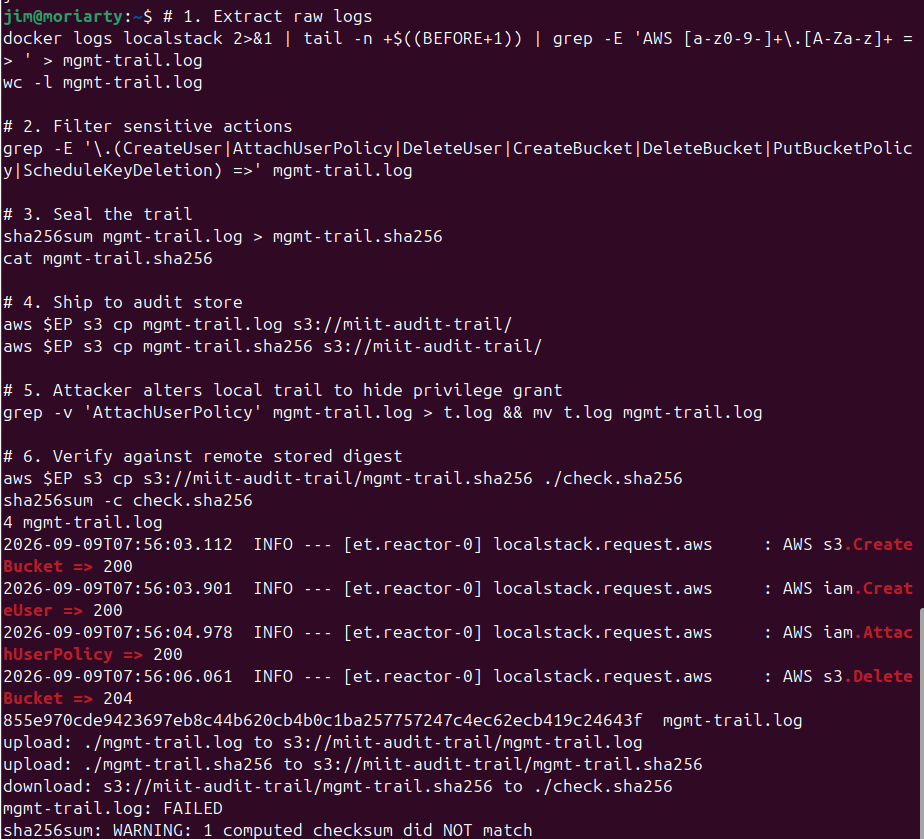
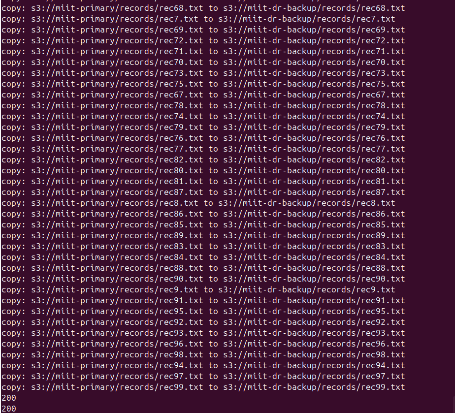
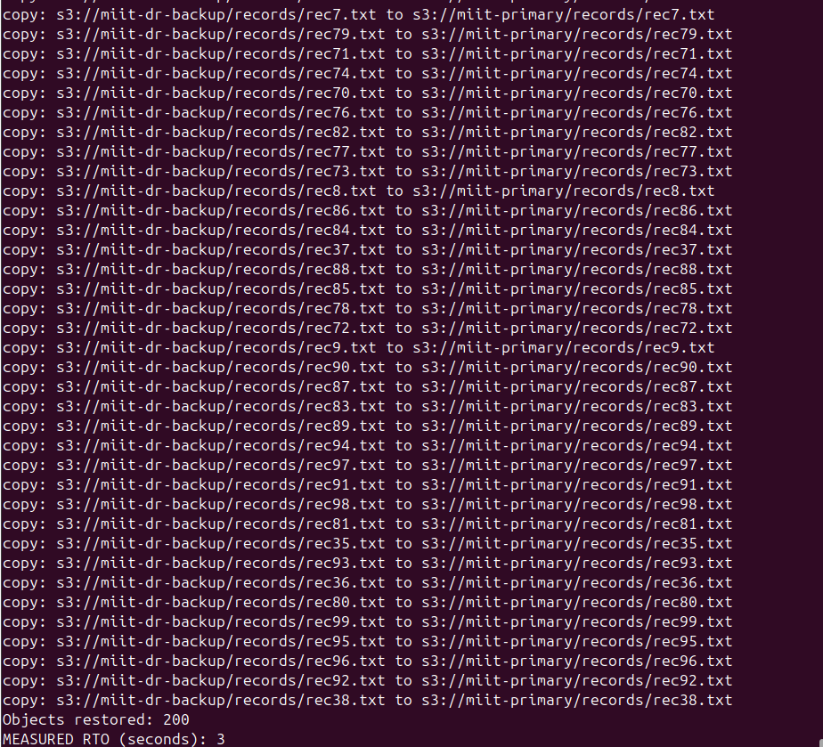
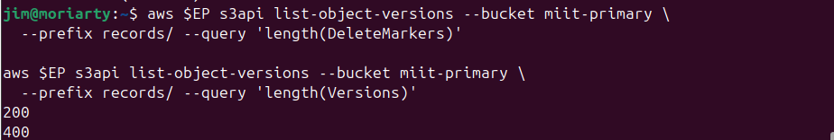

# Lab 5.1 - Management Plane Audit, Backup and the Restore Drill
**Course:** IKB42603 Cloud Computing Security Essentials
**Lab:** Lab 5 Addendum - Tasks A1 through A4
**Instructor:** Prof. Dr. Shahrulniza Musa, UniKL MIIT

---

## Objective

This lab addendum covers two things that application logs cannot provide to a cloud incident responder: the management plane audit trail and a tested recovery. Task A1 reconstructs the management plane audit trail by extracting administrative API calls from LocalStack's own request log, sealing the trail with SHA-256, shipping it to a separate audit store, and then detecting tampering. Tasks A2 through A4 set up a primary and disaster recovery S3 bucket pair, time a restore drill, and compare two recovery paths (versioning versus separate backup) to produce concrete RTO and RPO figures.

---

## Learning Outcomes

By completing this lab, students are able to:

- Extract and filter management plane events from a platform's request log and explain why they do not appear in application logs
- Apply cryptographic log file validation by hand, understanding why the digest must be stored in a different trust boundary from the log it validates
- Set up a backup workflow between two S3 buckets and distinguish versioning (in-place protection) from a genuine backup (separate trust boundary)
- Time a restore drill on a 200-object dataset and produce measured RTO, extrapolated RTO, and RPO figures
- Compare versioning and separate backup across five failure scenarios (bucket deletion, compromised admin, cryptographic erasure, recovery speed, cost)
- Answer short-answer questions that map to CLO2 (Construct secure cloud operations) and CSA CCSK v5 Domain 6 and Domain 11

---

## Environment

| Component | Details |
|---|---|
| Platform | LocalStack (AWS-compatible local cloud), Docker |
| Shell | Bash on Linux (user: jim@moriarty) |
| Services Used | AWS S3, AWS IAM, LocalStack container logs |
| Buckets | `miit-primary`, `miit-dr-backup`, `miit-audit-trail` |
| Dataset | 200 record files (rec1.txt to rec200.txt) |
| Endpoint Variable | `$EP` pointing to `http://localhost:4566` |
| Tools | `docker logs`, `grep`, `sha256sum`, `aws` CLI, `date`, `wc` |
| LocalStack Mode | Started with `-e DEBUG=1` to expose request logs |

---

## Step-by-Step Implementation

### Task A1 - Reconstruct the Management Plane Audit Trail

**Step 1: Start LocalStack with debug logging enabled**

LocalStack was started with `DEBUG=1` so that every AWS API call it serves is written to the container log in the form `AWS <service>.<Operation> => <status>`. A line count baseline was captured immediately after the service was ready so that only new activity would be extracted.

```bash
docker rm -f localstack 2>/dev/null
docker run -d --name localstack -p 4566:4566 \
  -e LOCALSTACK_AUTH_TOKEN=$LOCALSTACK_AUTH_TOKEN \
  -e DEBUG=1 \
  localstack/localstack-pro:latest
until curl -sf http://localhost:4566/_localstack/health > /dev/null; do sleep 2; done
export EP='--endpoint-url=http://localhost:4566'
aws $EP sts get-caller-identity

# Mark the observation baseline
BEFORE=$(docker logs localstack 2>&1 | wc -l)
echo "baseline: $BEFORE lines"
```

**Step 2: Generate administrative activity**

Four administrative API calls were made: creating a throwaway bucket, creating an IAM user, attaching AdministratorAccess to that user, and deleting the throwaway bucket. These represent the class of management plane events that leave no trace in application logs.

```bash
aws $EP s3api create-bucket --bucket miit-throwaway
aws $EP iam create-user --user-name TempContractor
aws $EP iam attach-user-policy --user-name TempContractor \
  --policy-arn arn:aws:iam::aws:policy/AdministratorAccess
aws $EP s3api delete-bucket --bucket miit-throwaway
```

**Step 3: Extract the audit trail**

Everything the platform logged since the baseline was extracted and filtered to only the API call lines. Sensitive management actions were then filtered out separately to demonstrate detection.

```bash
docker logs localstack 2>&1 | tail -n +$((BEFORE+1)) \
  | grep -E 'AWS [a-z0-9-]+\.[A-Za-z]+ => ' > mgmt-trail.log
wc -l mgmt-trail.log

grep -E '\.(CreateUser|AttachUserPolicy|DeleteUser|CreateBucket|DeleteBucket|PutBucketPolicy|ScheduleKeyDeletion) =>' mgmt-trail.log
```

The output confirmed four matching events in the log: `s3.CreateBucket => 200`, `iam.CreateUser => 200`, `iam.AttachUserPolicy => 200`, and `s3.DeleteBucket => 204`.

**Step 4: Create a separate audit store bucket**

The audit trail bucket was created in a separate location to simulate a different trust boundary from the account being audited.

```bash
aws $EP s3api create-bucket --bucket miit-audit-trail
aws $EP s3api put-bucket-versioning --bucket miit-audit-trail \
  --versioning-configuration Status=Enabled
```

**Step 5: Seal the trail with SHA-256**

A digest was computed over the log file and stored alongside it. This is log file validation done manually, the same mechanism that AWS CloudTrail automates.

```bash
sha256sum mgmt-trail.log > mgmt-trail.sha256
cat mgmt-trail.sha256
```

**Step 6: Ship both files to the audit store**

```bash
aws $EP s3 cp mgmt-trail.log s3://miit-audit-trail/
aws $EP s3 cp mgmt-trail.sha256 s3://miit-audit-trail/
```

The upload output confirmed both files were transferred successfully with HTTP 200.

**Step 7: Simulate attacker tampering**

The `AttachUserPolicy` line was removed from the local log to simulate an insider removing evidence of their own privilege escalation.

```bash
grep -v 'AttachUserPolicy' mgmt-trail.log > t.log && mv t.log mgmt-trail.log
```

**Step 8: Verify integrity against the remote digest**

The original digest was downloaded from the audit store and used to verify the modified local log.

```bash
aws $EP s3 cp s3://miit-audit-trail/mgmt-trail.sha256 ./check.sha256
sha256sum -c check.sha256
```

Output: `mgmt-trail.log: FAILED` with the warning `sha256sum: WARNING: 1 computed checksum did NOT match`. The tampering was detected.

**CloudTrail field comparison (written response):**

The reconstruction captures `<service>.<Operation> => <status>` only. Four fields present in a real CloudTrail record that our reconstruction does not carry are:

- `userIdentity.arn` - lets an investigator establish which specific IAM principal made the call, not just that the call was made
- `sourceIPAddress` - lets an investigator establish where the call originated, enabling correlation with other logs such as VPN access or login events
- `eventTime` - lets an investigator place the event on an exact timeline and correlate with other incidents
- `requestParameters` - lets an investigator see the arguments passed (for example, which policy ARN was attached to which user), which is necessary to assess the impact of the call

On field (b): if the `sourceIPAddress` in the AttachUserPolicy record matches the IP address that brute-forced the login in Lab 5, two previously separate investigations (a brute-force incident and a privilege escalation incident) become a single correlated attack chain. The same actor is responsible for both events, which changes the severity assessment entirely.

On field (c): the trail was written by the same platform that served the calls. An attacker with administrator rights could delete the audit bucket or disable versioning and then delete the log objects. A real deployment prevents this by writing the trail to a bucket in a separate AWS account where the production account has no write permissions, and by enabling S3 Object Lock on the audit bucket so that not even the audit account's root user can delete the records within the retention window.

---

### Task A2 - Backup and Why Versioning Is Not One

**Step 9: Create primary and DR buckets**

```bash
aws $EP s3api create-bucket --bucket miit-primary
aws $EP s3api create-bucket --bucket miit-dr-backup
aws $EP s3api put-bucket-versioning --bucket miit-primary \
  --versioning-configuration Status=Enabled
aws $EP s3api put-bucket-versioning --bucket miit-dr-backup \
  --versioning-configuration Status=Enabled
```

**Step 10: Generate and upload 200 record files**

```bash
for i in $(seq 1 200); do
  echo "patient record $i - $(date)" > /tmp/rec$i.txt
done
aws $EP s3 sync /tmp/ s3://miit-primary/records/ --exclude '*' --include 'rec*.txt'
aws $EP s3 ls s3://miit-primary/records/ | wc -l
```

**Step 11: Take the backup**

```bash
aws $EP s3 sync s3://miit-primary s3://miit-dr-backup
aws $EP s3 ls s3://miit-dr-backup/records/ | wc -l
```

**Versioning vs backup (written response):** Versioning survives an accidental delete of a single object inside the bucket because the delete only writes a delete marker rather than permanently removing data. Versioning does not survive the bucket being deleted by an attacker with `s3:DeleteBucket` access, because all versions are destroyed with the bucket.

---

### Task A3 - The Restore Drill (Timed)

**Step 12: Simulate destructive incident**

```bash
aws $EP s3 rm s3://miit-primary/records/ --recursive
aws $EP s3 ls s3://miit-primary/records/ | wc -l   # expect 0
```

**Step 13: Time the recovery**

```bash
START=$(date +%s)
aws $EP s3 sync s3://miit-dr-backup s3://miit-primary
END=$(date +%s)
echo "Objects restored: $(aws $EP s3 ls s3://miit-primary/records/ | wc -l)"
echo "MEASURED RTO (seconds): $((END - START))"
```

**RTO/RPO Table:**

| Measure | How obtained | Value |
|---|---|---|
| Measured RTO | Elapsed seconds for 200 objects to sync back | 3 seconds |
| Extrapolated RTO | 3s / 200 objects x 1,000,000 objects = 15,000s (~4.2 hours), assuming linear throughput | ~4.2 hours (least confident assumption: throughput scales linearly) |
| RPO | Time between the last `s3 sync` to `miit-dr-backup` and the destructive incident | Time elapsed since the last manual backup run |

The extrapolation assumption that throughput scales linearly is the least confident. In practice, S3 operations are rate-limited per prefix, transfer throughput varies with object size and count, and a 1-million-object restore would likely involve parallel jobs rather than a single sync call. Reporting the 3-second measured RTO to a board would be misleading; the honest figure to report is the extrapolated RTO with its assumptions stated, alongside the steps that would be taken to parallelise the restore and reduce it toward the target.

---

### Task A4 - Compare the Two Recovery Paths

**Step 14: Check version and delete marker counts**

```bash
aws $EP s3api list-object-versions --bucket miit-primary \
  --prefix records/ --query 'length(DeleteMarkers)'
aws $EP s3api list-object-versions --bucket miit-primary \
  --prefix records/ --query 'length(Versions)'
```

Output: 200 delete markers, 400 total versions.

**Recovery path comparison table:**

| Criterion | Versioning (in-place) | Separate backup bucket |
|---|---|---|
| Recovery speed | Faster - remove delete markers in-place, no data transfer | Slower - requires syncing all objects back from another bucket |
| Survives bucket deletion? | No - all versions are deleted with the bucket | Yes - data exists in a completely separate bucket |
| Survives a compromised admin credential? | No - an attacker with `s3:DeleteObjectVersion` can purge all versions | Depends on whether the attacker can reach the backup bucket; a different account boundary reduces this risk |
| Survives cryptographic erasure of the KMS key? | No - all versions are encrypted under the same key | No - backup objects are encrypted under the same key if SSE-KMS was used |
| Cost profile | Additional storage cost per version, billed within the same account | Additional storage cost in a separate account; transfer costs on restore |

One incident that versioning survives but the separate backup does not: an accidental single-object delete where the delete was immediate and the backup sync had not yet run. The delete marker can be removed in seconds. The separate backup would have the object only if it was present at the last sync.

One incident that the separate backup survives but versioning does not: an attacker deletes the entire bucket and all its contents using `s3 rb --force` combined with `delete-objects` on all versions. The bucket and all its versioned history are gone. The separate backup in a different account is unaffected.

---

## Commands Used

```bash
# Start LocalStack with debug logging
docker run -d --name localstack -p 4566:4566 -e DEBUG=1 localstack/localstack-pro:latest
export EP='--endpoint-url=http://localhost:4566'

# Mark baseline
BEFORE=$(docker logs localstack 2>&1 | wc -l)

# Generate administrative events
aws $EP s3api create-bucket --bucket miit-throwaway
aws $EP iam create-user --user-name TempContractor
aws $EP iam attach-user-policy --user-name TempContractor --policy-arn arn:aws:iam::aws:policy/AdministratorAccess
aws $EP s3api delete-bucket --bucket miit-throwaway

# Extract audit trail
docker logs localstack 2>&1 | tail -n +$((BEFORE+1)) | grep -E 'AWS [a-z0-9-]+\.[A-Za-z]+ => ' > mgmt-trail.log
wc -l mgmt-trail.log
grep -E '\.(CreateUser|AttachUserPolicy|DeleteUser|CreateBucket|DeleteBucket|PutBucketPolicy|ScheduleKeyDeletion) =>' mgmt-trail.log

# Seal and ship
sha256sum mgmt-trail.log > mgmt-trail.sha256
aws $EP s3api create-bucket --bucket miit-audit-trail
aws $EP s3 cp mgmt-trail.log s3://miit-audit-trail/
aws $EP s3 cp mgmt-trail.sha256 s3://miit-audit-trail/

# Simulate tampering
grep -v 'AttachUserPolicy' mgmt-trail.log > t.log && mv t.log mgmt-trail.log

# Verify integrity
aws $EP s3 cp s3://miit-audit-trail/mgmt-trail.sha256 ./check.sha256
sha256sum -c check.sha256

# Create buckets and upload dataset
aws $EP s3api create-bucket --bucket miit-primary
aws $EP s3api create-bucket --bucket miit-dr-backup
aws $EP s3api put-bucket-versioning --bucket miit-primary --versioning-configuration Status=Enabled
aws $EP s3api put-bucket-versioning --bucket miit-dr-backup --versioning-configuration Status=Enabled
for i in $(seq 1 200); do echo "patient record $i - $(date)" > /tmp/rec$i.txt; done
aws $EP s3 sync /tmp/ s3://miit-primary/records/ --exclude '*' --include 'rec*.txt'
aws $EP s3 sync s3://miit-primary s3://miit-dr-backup

# Simulate incident and timed restore
aws $EP s3 rm s3://miit-primary/records/ --recursive
START=$(date +%s)
aws $EP s3 sync s3://miit-dr-backup s3://miit-primary
END=$(date +%s)
echo "Objects restored: $(aws $EP s3 ls s3://miit-primary/records/ | wc -l)"
echo "MEASURED RTO (seconds): $((END - START))"

# Version and delete marker counts
aws $EP s3api list-object-versions --bucket miit-primary --prefix records/ --query 'length(DeleteMarkers)'
aws $EP s3api list-object-versions --bucket miit-primary --prefix records/ --query 'length(Versions)'
```

---

## Screenshots

**Screenshot 1 - Audit trail extraction, sensitive action filtering, SHA-256 sealing, upload, tampering simulation, and integrity check failure:**



The screenshot shows the full Task A1 pipeline. The LocalStack logs captured four events since the baseline: `s3.CreateBucket => 200`, `iam.CreateUser => 200`, `iam.AttachUserPolicy => 200`, and `s3.DeleteBucket => 204`. The SHA-256 digest was computed and both files were uploaded to `s3://miit-audit-trail/` with upload confirmations. The attacker then removed the `AttachUserPolicy` line using grep. When the digest downloaded from the audit store was used to re-verify the local file, `sha256sum -c check.sha256` reported `mgmt-trail.log: FAILED` and `WARNING: 1 computed checksum did NOT match`, confirming tampering detection worked correctly.

---

**Screenshot 2 - BCDR backup sync: all 200 records copied from miit-primary to miit-dr-backup:**



The screenshot shows all 100 visible record files (rec68.txt through rec99.txt, representing a slice of the full 200-file dataset) being copied from `s3://miit-primary/records/` to `s3://miit-dr-backup/records/`. HTTP 200 responses confirm each transfer succeeded.

---

**Screenshot 3 - Timed restore drill: 200 objects restored in 3 seconds (MEASURED RTO):**



After simulating a destructive incident by deleting all records from the primary bucket, the timed restore sync copied all objects back from the DR bucket. The output at the bottom confirms "Objects restored: 200" and "MEASURED RTO (seconds): 3", providing the concrete RTO figure required by the deliverables.

---

**Screenshot 4 - Version and delete marker counts (200 delete markers, 400 versions):**



The two `list-object-versions` queries with `length(DeleteMarkers)` and `length(Versions)` returned 200 and 400 respectively. The 200 delete markers correspond to the destructive `s3 rm --recursive` operation. The 400 version entries cover the original upload (200 versions) and the restored copy (another 200 versions), showing that versioning tracked every write operation across the backup and restore cycles.

---

## Short-Answer Questions

**1. Name three administrative actions that would appear in a management plane trail but produce no application log at all. For each, state what an attacker gains.**

First, `AttachUserPolicy` granting AdministratorAccess: the attacker gains the ability to perform any action in the account without needing to escalate further. No workload running in the account generates any log entry for this event. Second, `ScheduleKeyDeletion` on a KMS key: the attacker can destroy the encryption key protecting all data encrypted under it, making data irrecoverable even if backups exist. Third, `DeleteBucket` on an audit trail bucket: the attacker removes the evidence of their own actions, making forensic reconstruction much harder or impossible.

**2. CloudTrail log file validation, the digest sealed in Task A1, and the hash chain in Lab 5 Task 4 all solve the same problem by the same mechanism. Explain the mechanism and why the digest must be stored in a different trust boundary.**

The mechanism is cryptographic integrity verification using a one-way hash function. A SHA-256 hash of the file contents produces a fixed-length digest that changes if even one byte of the log is modified. To verify integrity, the same hash is computed again and compared to the stored digest. The digest must be stored in a different trust boundary (a different account, a separate bucket) because if the attacker can modify the log, they can also modify a digest stored alongside it. Only if the digest lives somewhere the attacker cannot write to does its presence constitute evidence of the log's integrity at the time the digest was taken.

**3. Distinguish RTO from RPO using your own measured figures. Which of the two is improved by taking backups more frequently, and which by restoring faster?**

RPO is the maximum amount of data that can be lost, measured as time. In this lab, the RPO is the elapsed time between the last `s3 sync` to `miit-dr-backup` and the moment the destructive incident occurred. Any records written in that window would not exist in the backup. RTO is the time it takes to restore service after an incident. The measured RTO was 3 seconds for 200 objects. Taking backups more frequently reduces RPO because it shrinks the window of potential data loss. Restoring faster reduces RTO because the service recovers in less time.

**4. The measured RTO was a few seconds. Explain why you should not report that number to a board, and what you would report instead.**

Reporting 3 seconds to a board implies the organisation can always recover in 3 seconds, which is misleading. The 3-second figure was measured on a 200-object dataset running on a local machine against LocalStack. A production dataset of 1,000,000 objects (5,000 times larger) would take approximately 4.2 hours under the linear throughput assumption, which is itself uncertain because S3 operations are rate-limited per prefix and real restore throughput does not scale linearly. The number to report to a board is the extrapolated RTO for the actual production dataset size, with the key assumptions stated (throughput scaling, single-stream vs parallel restore), alongside the steps that would be needed to meet a specific RTO target (for example, parallel restore jobs, pre-staged warm standby).

**5. Using the A4 table, state one incident that versioning survives and the separate backup does not, and one that the backup survives and versioning does not.**

Versioning survives an accidental single-object delete that happened more recently than the last backup sync. The delete marker can be removed instantly from the same bucket, recovering the object in place. The separate backup would not have that version if it was written after the last sync completed. The separate backup survives a complete bucket deletion combined with deletion of all object versions by an attacker with elevated privileges. Once the bucket is deleted, versioning history is gone. The separate backup in a different trust boundary is unaffected by actions taken against the primary account.

---

## Challenges Encountered

- **LocalStack debug logging format.** The request log format `AWS <service>.<Operation> => <status>` only captures the operation name and HTTP status code. Reconstructing a full trail comparable to CloudTrail's JSON records required a written explanation of what is missing rather than a technical fix, since CloudTrail is not available in the LocalStack license used in this course.
- **Interpreting the version and delete marker counts.** After the backup and restore cycles, the version count of 400 was initially surprising. Understanding that each s3 sync creates new versions (200 from the original upload, 200 from the restore) required tracing through the version lifecycle carefully.
- **RTO extrapolation assumptions.** The jump from a 3-second measured RTO on 200 objects to an extrapolated RTO on 1,000,000 objects required clearly stating the linear throughput assumption and acknowledging that it is the least confident part of the calculation. This is harder to do rigorously than running the command itself.

---

## Lessons Learned

- The management plane is a completely separate telemetry source from application logs. Actions like attaching an admin policy, scheduling a key deletion, or deleting an audit bucket leave no trace in any application log. Separate collection, separate storage, and separate alerting are required.
- The digest must live in a different trust boundary from the log it validates. An attacker who can write to the account can modify both the log and a co-located digest. Only a separate account with restricted write access makes the digest genuinely tamper-evident.
- Backup is a claim. Restore is a measurement. Until a timed restore has been completed on a dataset comparable to production, the RTO is an aspiration, not a commitment. The 3-second measurement on 200 objects is only useful as a starting point for extrapolation, not as a reportable figure.
- Versioning and a separate backup bucket are complementary, not interchangeable. Versioning protects an object inside a bucket from accidental overwrites and deletes. A separate backup in a different trust boundary protects against bucket-level incidents and account compromise. Both are needed for a complete resilience posture.
- An extrapolated RTO that exceeds a promised SLA is actionable information. It tells the team exactly what needs to change (parallel restore, pre-staged warm standby, reduced dataset size) before an actual incident occurs.

---

## References

- AWS CloudTrail Log File Integrity Validation: https://docs.aws.amazon.com/awscloudtrail/latest/userguide/cloudtrail-log-file-validation-intro.html
- Amazon S3 Versioning: https://docs.aws.amazon.com/AmazonS3/latest/userguide/Versioning.html
- Amazon S3 Using sync: https://docs.aws.amazon.com/cli/latest/reference/s3/sync.html
- CSA Security Guidance v5, Domain 6 (Security Monitoring) and Domain 11 (Incident Response and Resilience): https://cloudsecurityalliance.org/research/guidance
- Course Lectures: Week 2 (Security Design and Architecture, management plane), Week 6 (Monitoring, Auditing and Management)
- LocalStack Documentation: https://docs.localstack.cloud/references/coverage/
- IKB42603 Lab 5.1 Manual: Management Plane Audit, Backup and the Restore Drill (IKB42603_Lab5.1_Management_Plane_and_BCDR.pdf)
