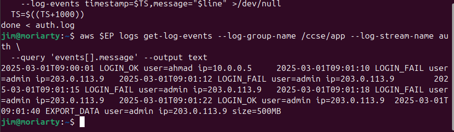
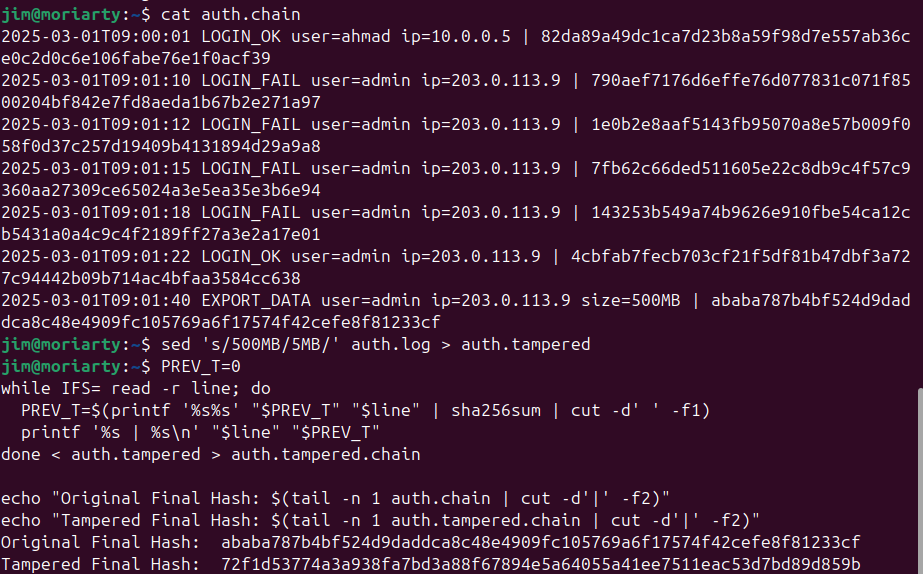
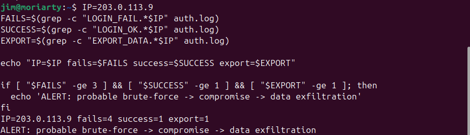
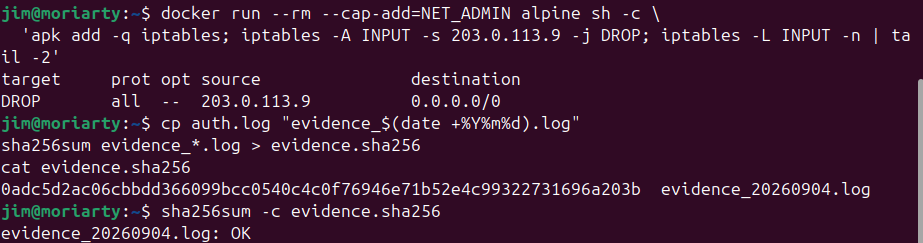
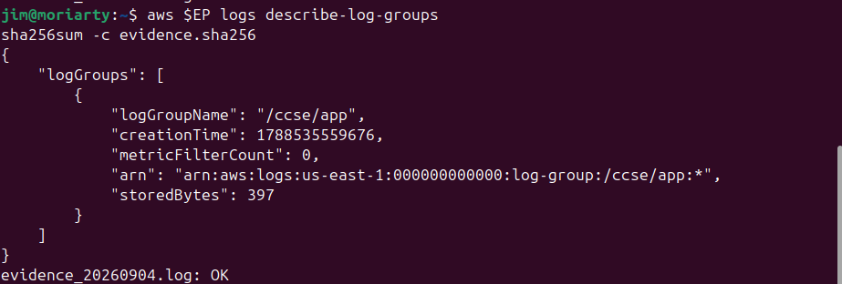

# IKB42603 Cloud Computing Security Essentials
## Lab 5: Monitoring, Logging and Incident Detection

**Name:** Jim Moriarty

---

## Objective

This lab is about understanding how security monitoring actually works in practice. The goal was to build a simple logging pipeline from scratch — generate logs, ship them to a central store, make them tamper-proof, and then use them to detect and respond to a simulated attack. The scenario we worked with was a brute-force login attempt that eventually succeeded and led to data being stolen. It sounds dramatic, but it's the kind of thing that happens to real systems, and this lab showed why logs are the first thing security teams reach for when something goes wrong.

---

## Learning Outcomes

By the end of this lab, I was able to:

1. Generate application logs and centralise them into AWS CloudWatch Logs using LocalStack.
2. Query those logs to find suspicious activity — specifically, repeated failed login attempts from the same IP.
3. Build a hash-chained log that can detect tampering even if someone only changes a small detail.
4. Write a correlation script that spots a multi-stage attack pattern that no single log line would reveal on its own.
5. Walk through the basic steps of incident response: contain, collect evidence, and document.
6. Explain the difference between a log (a permanent record) and an event (a real-time trigger).

---

## Environment

| Component | Details |
|---|---|
| **Operating System** | Ubuntu Linux (hostname: `moriarty`) |
| **Container Runtime** | Docker |
| **Cloud Simulation** | LocalStack — runs AWS services locally on port `4566` |
| **AWS CLI** | AWS CLI v2, with endpoint aliased as `EP='--endpoint-url=http://localhost:4566'` |
| **Shell Tools** | `bash`, `grep`, `awk`, `sha256sum`, `sed`, `printf`, `sort`, `uniq` |
| **AWS Service** | CloudWatch Logs — log group `/ccse/app`, log stream `auth` |

LocalStack was used throughout because it lets us work with real AWS CLI commands without needing an actual AWS account or spending money. It made the lab much more realistic than just reading theory.

---

## Step-by-Step Implementation

### Session A (Week 9) — Logging & Centralisation

---

#### Setup — Getting LocalStack Running

Before anything else, I started LocalStack in a Docker container so we'd have a local CloudWatch endpoint to work with. Then I created the log group and log stream that would store all the authentication events.

```bash
docker run -d --name localstack -p 4566:4566 localstack/localstack
EP='--endpoint-url=http://localhost:4566'
aws $EP logs create-log-group --log-group-name /ccse/app
aws $EP logs create-log-stream --log-group-name /ccse/app --log-stream-name auth
```

Setting the `EP` alias at the start saved a lot of typing — I just had to remember to use `$EP` in every command so requests went to LocalStack instead of real AWS.

---

#### Task 1 — Generate Application Logs

I created a fake authentication log called `auth.log` to simulate what a real app might produce. The scenario built into the log is pretty telling when you see it all together: a legitimate user (`ahmad`) logs in fine, then someone from an external IP (`203.0.113.9`) fails four times in a row, eventually gets in, and immediately exports 500 MB of data.

```bash
cat > auth.log <<'EOF'
2025-03-01T09:00:01 LOGIN_OK   user=ahmad ip=10.0.0.5
2025-03-01T09:01:10 LOGIN_FAIL user=admin ip=203.0.113.9
2025-03-01T09:01:12 LOGIN_FAIL user=admin ip=203.0.113.9
2025-03-01T09:01:15 LOGIN_FAIL user=admin ip=203.0.113.9
2025-03-01T09:01:18 LOGIN_FAIL user=admin ip=203.0.113.9
2025-03-01T09:01:22 LOGIN_OK   user=admin ip=203.0.113.9
2025-03-01T09:01:40 EXPORT_DATA user=admin ip=203.0.113.9 size=500MB
EOF
```

It's only 7 lines, but the whole attack story is in there — brute-force, compromise, and exfiltration — all within 100 seconds.

---

#### Task 2 — Centralise Logs (Ship to CloudWatch)

Once the log existed locally, the next step was to centralise it. In a real system you wouldn't leave logs sitting on one server — if an attacker gains access they can just delete the file. Shipping logs to a separate service like CloudWatch means they survive even if the host is compromised.

I looped through each line of `auth.log` and pushed it to CloudWatch with `put-log-events`, giving each line an incrementing millisecond timestamp so the ordering was preserved.

```bash
TS=$(date +%s000)
while IFS= read -r line; do
  aws $EP logs put-log-events \
    --log-group-name /ccse/app --log-stream-name auth \
    --log-events timestamp=$TS,message="$line" >/dev/null
  TS=$((TS+1000))
done < auth.log

aws $EP logs get-log-events \
  --log-group-name /ccse/app --log-stream-name auth \
  --query 'events[].message' --output text
```

**Output (Screenshot 1):**
```
2025-03-01T09:00:01 LOGIN_OK user=ahmad ip=10.0.0.5
2025-03-01T09:01:10 LOGIN_FAIL user=admin ip=203.0.113.9
2025-03-01T09:01:12 LOGIN_FAIL user=admin ip=203.0.113.9
2025-03-01T09:01:15 LOGIN_FAIL user=admin ip=203.0.113.9
2025-03-01T09:01:18 LOGIN_FAIL user=admin ip=203.0.113.9
2025-03-01T09:01:22 LOGIN_OK user=admin ip=203.0.113.9
2025-03-01T09:01:40 EXPORT_DATA user=admin ip=203.0.113.9 size=500MB
```

All 7 events came back correctly from CloudWatch, which confirmed the pipeline was working.

---

#### Task 3 — Query for Security-Relevant Activity

Now that the logs were centralised, I ran a quick pipeline to check how many failed logins came from each IP:

```bash
grep LOGIN_FAIL auth.log | awk '{print $4, $5}' | sort | uniq -c
```

**Output (Screenshot 2):**
```
4 ip=203.0.113.9
```

Four failures, all from the same external IP. That's a pretty obvious signal when you're looking at it — but without this query, you'd have to read through every line manually. The key point here is the difference between a log (the raw records) and an event (an automated alert that would fire when this threshold is hit). The log is there for after-the-fact investigation; an event would catch it in real time.

---

### Session B (Week 10) — Tamper-Proofing, Detection & Response

---

#### Task 4 — Tamper-Proof (Hash-Chained) Logs

This was the most interesting task conceptually. The idea is simple: if an attacker breaks into a system and wants to cover their tracks, their first move is usually to edit or delete the log file. A hash chain stops this from being undetectable.

The way it works: for each line, I concatenated it with the hash from the previous line, then hashed the result. That means every line "knows about" all the lines before it. Change anything — even a single character — and the chain breaks.

```bash
PREV=0
while IFS= read -r line; do
  PREV=$(printf '%s%s' "$PREV" "$line" | sha256sum | cut -d' ' -f1)
  printf '%s | %s\n' "$line" "$PREV"
done < auth.log > auth.chain
cat auth.chain
```

**Hash chain output (Screenshot 3):**
```
2025-03-01T09:00:01 LOGIN_OK user=ahmad ip=10.0.0.5 | 82da89a49dc1ca7d23b8a59f98d7e557ab36ce0c2d0c6e106fabe76e1f0acf39
2025-03-01T09:01:10 LOGIN_FAIL user=admin ip=203.0.113.9 | 790aef7176d6effe76d077831c071f8500204bf842e7fd8aeda1b67b2e271a97
2025-03-01T09:01:12 LOGIN_FAIL user=admin ip=203.0.113.9 | 1e0b2e8aaf5143fb95070a8e57b009f058f0d37c257d19409b4131894d29a9a8
2025-03-01T09:01:15 LOGIN_FAIL user=admin ip=203.0.113.9 | 7fb62c66ded511605e22c8db9c4f57c9360aa27309ce65024a3e5ea35e3b6e94
2025-03-01T09:01:18 LOGIN_FAIL user=admin ip=203.0.113.9 | 143253b549a74b9626e910fbe54ca12cb5431a0a4c9c4f2189ff27a3e2a17e01
2025-03-01T09:01:22 LOGIN_OK user=admin ip=203.0.113.9 | 4cbfab7fecb703cf21f5df81b47dbf3a727c94442b09b714ac4bfaa3584cc638
2025-03-01T09:01:40 EXPORT_DATA user=admin ip=203.0.113.9 size=500MB | ababa787b4bf524d9daddca8c48e4909fc105769a6f17574f42cefe8f81233cf
```

To prove it actually works, I tampered with the log by changing `500MB` to `5MB` — the kind of sneaky edit an attacker might make to hide how much data was stolen — then rebuilt the chain and compared the final hashes:

```bash
sed 's/500MB/5MB/' auth.log > auth.tampered

PREV_T=0
while IFS= read -r line; do
  PREV_T=$(printf '%s%s' "$PREV_T" "$line" | sha256sum | cut -d' ' -f1)
  printf '%s | %s\n' "$line" "$PREV_T"
done < auth.tampered > auth.tampered.chain

echo "Original Final Hash: $(tail -n 1 auth.chain | cut -d'|' -f2)"
echo "Tampered Final Hash: $(tail -n 1 auth.tampered.chain | cut -d'|' -f2)"
```

**Output (Screenshot 3):**
```
Original Final Hash:  ababa787b4bf524d9daddca8c48e4909fc105769a6f17574f42cefe8f81233cf
Tampered Final Hash:  72f1d53774a3a938fa7bd3a88f67894e5a64055a41ee7511eac53d7bd89d859b
```

The hashes are completely different. That three-character change (`500` → `5`) was caught immediately. The hash chain works.

---

#### Task 5 — Detect the Incident (Correlation)

Here's where it gets interesting from a security operations perspective. None of the log lines on their own would raise an alarm — failed logins happen, successful logins are normal, and data exports are part of everyday business. But combined, from the same IP, in sequence, within minutes — it tells a very specific story.

I wrote a short script that counts each type of event for the suspect IP and flags the pattern:

```bash
IP=203.0.113.9
FAILS=$(grep -c "LOGIN_FAIL.*$IP" auth.log)
SUCCESS=$(grep -c "LOGIN_OK.*$IP" auth.log)
EXPORT=$(grep -c "EXPORT_DATA.*$IP" auth.log)

echo "IP=$IP fails=$FAILS success=$SUCCESS export=$EXPORT"

if [ "$FAILS" -ge 3 ] && [ "$SUCCESS" -ge 1 ] && [ "$EXPORT" -ge 1 ]; then
  echo 'ALERT: probable brute-force -> compromise -> data exfiltration'
fi
```

**Output (Screenshot 4):**
```
IP=203.0.113.9 fails=4 success=1 export=1
ALERT: probable brute-force -> compromise -> data exfiltration
```

This is essentially what a SIEM does at scale — it watches for patterns across thousands of log lines and raises an alert when the combination matches a known attack signature.

---

#### Task 6 — Incident Response

With the incident confirmed, the response kicked in. The three steps were: contain the attacker, collect evidence, and verify everything is intact.

**Step 1 — Contain:** Block the attacker's IP with an `iptables` rule. Since we're working in a lab environment, this was modelled inside a Docker container with `NET_ADMIN` capabilities:

```bash
docker run --rm --cap-add=NET_ADMIN alpine sh -c \
  'apk add -q iptables; iptables -A INPUT -s 203.0.113.9 -j DROP; iptables -L INPUT -n | tail -2'
```

**Output (Screenshot 5):**
```
target     prot opt source               destination
DROP       all  --  203.0.113.9          0.0.0.0/0
```

The DROP rule is in place — `203.0.113.9` is now blocked.

**Step 2 — Collect evidence:** Copy the log to a timestamped, immutable evidence file and record its SHA-256 hash immediately, before anything else changes:

```bash
cp auth.log "evidence_$(date +%Y%m%d).log"
sha256sum evidence_*.log > evidence.sha256
cat evidence.sha256
```

**Output (Screenshot 5):**
```
0adc5d2ac06cbbdd366099bcc0540c4c0f76946e71b52e4c99322731696a203b  evidence_20260904.log
```

**Step 3 — Verify:** Confirm the log group is still intact in CloudWatch and that the evidence file hasn't been modified:

```bash
aws $EP logs describe-log-groups
sha256sum -c evidence.sha256
```

**Output (Screenshot 6):**
```json
{
    "logGroups": [
        {
            "logGroupName": "/ccse/app",
            "creationTime": 1788535559676,
            "metricFilterCount": 0,
            "arn": "arn:aws:logs:us-east-1:000000000000:log-group:/ccse/app:*",
            "storedBytes": 397
        }
    ]
}
```
```
evidence_20260904.log: OK
```

Everything checks out. The log group is intact, and the evidence file is verified unchanged.

---

## Commands Used

| Task | Command | Purpose |
|---|---|---|
| Setup | `docker run -d --name localstack -p 4566:4566 localstack/localstack` | Start LocalStack container |
| Setup | `aws $EP logs create-log-group --log-group-name /ccse/app` | Create CloudWatch log group |
| Setup | `aws $EP logs create-log-stream ... --log-stream-name auth` | Create CloudWatch log stream |
| Task 1 | `cat > auth.log <<'EOF' ... EOF` | Generate the synthetic auth log |
| Task 2 | `aws $EP logs put-log-events ...` | Push each log line to CloudWatch |
| Task 2 | `aws $EP logs get-log-events ... --query 'events[].message'` | Read events back from CloudWatch |
| Task 3 | `grep LOGIN_FAIL auth.log \| awk '{print $4,$5}' \| sort \| uniq -c` | Count failed logins by IP |
| Task 4 | `sha256sum` in a `while` loop | Build the SHA-256 hash chain |
| Task 4 | `sed 's/500MB/5MB/' auth.log > auth.tampered` | Simulate log tampering |
| Task 5 | `grep -c "LOGIN_FAIL.*$IP" auth.log` | Count attack indicators per IP |
| Task 6 | `docker run --rm --cap-add=NET_ADMIN alpine ...` | Block the attacker IP via iptables |
| Task 6 | `cp auth.log evidence_$(date +%Y%m%d).log` | Create timestamped evidence copy |
| Task 6 | `sha256sum evidence_*.log > evidence.sha256` | Hash the evidence file |
| Verify | `aws $EP logs describe-log-groups` | Confirm log group exists |
| Verify | `sha256sum -c evidence.sha256` | Verify evidence hasn't been modified |
| Cleanup | `docker stop localstack && docker rm localstack` | Tear down LocalStack |

---

## Screenshots

### Screenshot 1 — Task 2: Logs Read Back from CloudWatch

After pushing all 7 lines to CloudWatch with `put-log-events`, the `get-log-events` command retrieved them all correctly — confirming that centralisation worked as expected.



---

### Screenshot 2 — Task 3: Failed Login Count by IP

The one-liner pipeline immediately surfaced the key finding: 4 failed attempts, all from `203.0.113.9`.


---

### Screenshot 3 — Task 4: Hash Chain and Tamper Proof

The full `auth.chain` shows each line paired with its cumulative SHA-256. After faking a one-word edit in the log, the final hash changed completely — the chain is broken and the tampering is detected.



---

### Screenshot 4 — Task 5: Correlation Alert

The script puts together all three signals — 4 failures, 1 success, 1 export — and fires the alert. No single line would have triggered this; it's the pattern that matters.



---

### Screenshot 5 — Task 6: Containment and Evidence Collection

The `iptables DROP` rule confirms the attacker is blocked. Below that, the SHA-256 hash of the evidence file is recorded and immediately verified as `OK`.



---

### Screenshot 6 — Verification: Log Group and Evidence Integrity

The CloudWatch log group `/ccse/app` is confirmed with 397 stored bytes. The `sha256sum -c` check passes, meaning the evidence file is exactly as collected.



---

## Incident Report

### Detection
Starting from `09:01:10` on 2025-03-01, the centralised log recorded four rapid `LOGIN_FAIL` events aimed at the `admin` account — all from the same external IP, `203.0.113.9`, within a 10-second window. After those failures, the same IP logged in successfully at `09:01:22`, then at `09:01:40` exported 500 MB of data. When the correlation script ran across these three signals (`fails=4`, `success=1`, `export=1`), it immediately flagged it: **probable brute-force → compromise → data exfiltration**.

### Analysis
Looking at the log sequence, the pattern is pretty clear in hindsight. The attacker most likely ran an automated credential-stuffing or brute-force tool — four attempts in 12 seconds is faster than a human typing. Once they got in, the 500 MB export happening less than 20 seconds later suggests they knew exactly what they were after. The entire attack window was under two minutes. The `auth.chain` file — with its final hash `ababa787b4bf524d9daddca8c48e4909fc105769a6f17574f42cefe8f81233cf` — confirms the log record is authentic and unchanged.

### Containment
An `iptables DROP` rule was applied for `203.0.113.9`, blocking all incoming traffic from that IP. This was done inside an ephemeral Alpine container (with `NET_ADMIN`) to model the containment action without modifying the host system directly.

### Evidence & Integrity

| Evidence File | SHA-256 Hash | Status |
|---|---|---|
| `evidence_20260904.log` | `0adc5d2ac06cbbdd366099bcc0540c4c0f76946e71b52e4c99322731696a203b` | `OK` |

The tamper test also confirmed the hash chain works as expected: changing `500MB` to `5MB` shifted the final hash from `ababa787...` to `72f1d537...`, making the modification impossible to hide.

### Lesson Learned
The biggest takeaway here is that logs need to be treated as evidence from the moment they're written — not as an afterthought. Keeping them local is a liability. Shipping them to a centralised, append-only store (like CloudWatch) and protecting them with a hash chain means that even if the host is fully compromised, the audit trail stays intact and trustworthy.

---

## Short-Answer Questions

**Q1. What is the difference between a log and an event? Give an example of each from this lab.**

A log is a permanent, written record — it just sits there until someone reads it. For example, the line `2025-03-01T09:01:10 LOGIN_FAIL user=admin ip=203.0.113.9` in `auth.log` is a log entry. It records what happened, but it doesn't *do* anything by itself. An event is a real-time trigger that fires when a condition is met. In Task 5, when the correlation script counted `fails=4`, `success=1`, and `export=1` from the same IP, it emitted `ALERT: probable brute-force → compromise → data exfiltration` — that's an event. The log is the raw evidence; the event is the alarm.

**Q2. Why must audit logs be tamper-proof, and how does a hash chain achieve this?**

Because if logs can be edited, they can't be trusted — and an attacker's first instinct after a breach is often to clean up the evidence. If I can just open `auth.log` and delete the lines showing my IP, there's nothing left to investigate. A hash chain makes that impossible to do silently. Every line's hash depends on the line before it, so changing anything — even one character — produces a different hash for that line, which then propagates all the way to the final hash. In our test, changing `500MB` to `5MB` shifted the final hash from `ababa787...` to `72f1d537...`. Anyone comparing those hashes instantly knows the log was touched.

**Q3. How did correlation detect an incident that no single log line revealed?**

On its own, a failed login could just be a mistyped password. A successful login is completely normal. A data export is routine business activity. None of those lines, in isolation, tells you anything alarming. But the correlation script asked a different question: for IP `203.0.113.9` specifically, did we see multiple failures *and* a success *and* an export, all close together? When all three conditions were true, the pattern matched a known attack chain. That's exactly what a SIEM does at scale — it looks for combinations of events that individually mean nothing but together mean something serious.

**Q4. List the incident-response steps you performed and the goal of each.**

| Step | Action | Goal |
|---|---|---|
| Contain | `iptables DROP` rule for `203.0.113.9` | Stop the attacker from doing more damage |
| Collect Evidence | `cp auth.log evidence_20260904.log` | Freeze the original log before anything changes it |
| Hash Evidence | `sha256sum evidence_*.log > evidence.sha256` | Prove the evidence is unaltered if questioned later |
| Verify | `sha256sum -c evidence.sha256` → `OK` | Confirm integrity before handing it off for analysis |
| Document | This incident report | Create a record that explains what happened and what was done about it |

**Q5. How do the same logs serve both security monitoring and compliance evidence?**

During an active incident, logs are used in near real-time — you're running queries, looking for patterns, trying to understand what's happening right now (Tasks 3 and 5). That's the monitoring side. After the fact, the same logs become compliance evidence: they show auditors that access was logged, that suspicious activity was detected, that someone responded, and that the response was documented. Frameworks like ISO 27001, PCI-DSS, and GDPR all require this kind of audit trail. The hash chain we built makes those logs admissible — you can prove they haven't been touched since the incident. The CloudWatch centralisation makes them available even if the original server is gone. Both properties matter equally for monitoring and compliance.

---

## Challenges Encountered

**LocalStack endpoint configuration:** Every single AWS CLI command needs `--endpoint-url=http://localhost:4566` or it tries to reach real AWS and fails with auth errors. I got caught by this early on and solved it by setting `EP='--endpoint-url=http://localhost:4566'` right at the start and using `$EP` everywhere.

**Timestamp ordering in CloudWatch:** CloudWatch Logs enforces that events are pushed in ascending timestamp order. I ran into this when testing — if timestamps aren't sequential, the API rejects the call. The fix was to initialise a millisecond-precision timestamp from `date +%s000` and increment it by 1000 for each line.

**Docker permissions for iptables:** Running `iptables` inside a regular container fails silently because the container doesn't have network admin capabilities. Adding `--cap-add=NET_ADMIN` to the `docker run` command and using Alpine (which supports `apk add iptables`) resolved this.

**Hash chain verification approach:** My first instinct for tamper detection was to do a line-by-line comparison between `auth.chain` and `auth.tampered.chain`. That actually works, but the better approach — and the one that mirrors real-world use — is to just compare the final hash. If the final hashes match, the entire chain is intact. If they differ, something somewhere was changed, even if you can't immediately tell where.

---

## Lessons Learned

1. **You genuinely cannot secure what you cannot see.** Before this lab, that phrase felt like a slogan. After building the logging pipeline from scratch and then watching the correlation script catch an attack that no individual log line revealed, it made sense in a concrete way.

2. **Centralising logs is about survivability, not convenience.** If logs only exist on the host that was compromised, an attacker can delete them. Shipping to CloudWatch (or any separate, append-only store) means the evidence outlives the attack.

3. **Hash chains turn soft evidence into hard evidence.** A text file is easy to dismiss — "you could have edited that." A hash chain makes that argument impossible, which is why the same principle is used in blockchain and certificate transparency. Knowing the math behind it makes the trust more meaningful.

4. **Pattern detection beats individual-line review.** The brute-force pattern only became visible when I looked at failure count, success count, and export count for the same IP together. That's the entire value proposition of a SIEM — turning raw logs into structured detection logic.

5. **In incident response, collect first, contain second.** It's tempting to block the attacker immediately, but if you take containment actions before hashing the evidence, you risk changing system state in ways that undermine the forensic record. The order matters.

6. **LocalStack made this real.** Using a local AWS emulator meant I was running genuine AWS CLI commands against a genuine service API, just without the cost or credentials. It's a great way to practice cloud security skills without any of the usual friction.

---

## References

1. **Course Lecture Notes** — IKB42603 Cloud Computing Security Essentials, Week 6: Monitoring, Auditing & Management; Weeks 10–11: Compliance Evidence. UniKL MIIT, Prof. Dr. Shahrulniza Musa.

2. **Amazon CloudWatch Logs Documentation** — Concepts, log groups, log streams, and event ingestion.  
   https://docs.aws.amazon.com/AmazonCloudWatch/latest/logs

3. **OWASP Logging Cheat Sheet** — Best practices for application logging, log formats, and log integrity.  
   https://cheatsheetseries.owasp.org/cheatsheets/Logging_Cheat_Sheet.html

4. **CSA Security Guidance v5** — Security Monitoring domain. Cloud Security Alliance.  
   https://cloudsecurityalliance.org/research/guidance

5. **LocalStack Documentation** — Local AWS cloud stack for development and testing.  
   https://docs.localstack.cloud

6. **NIST SP 800-92** — *Guide to Computer Security Log Management*. National Institute of Standards and Technology.  
   https://csrc.nist.gov/publications/detail/sp/800-92/final

7. **SANS Institute** — *Incident Handler's Handbook*. SANS Reading Room.  
   https://www.sans.org/white-papers/33901/
