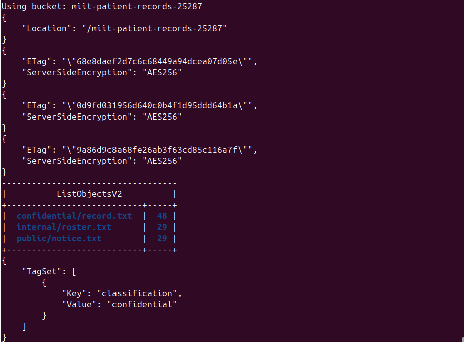
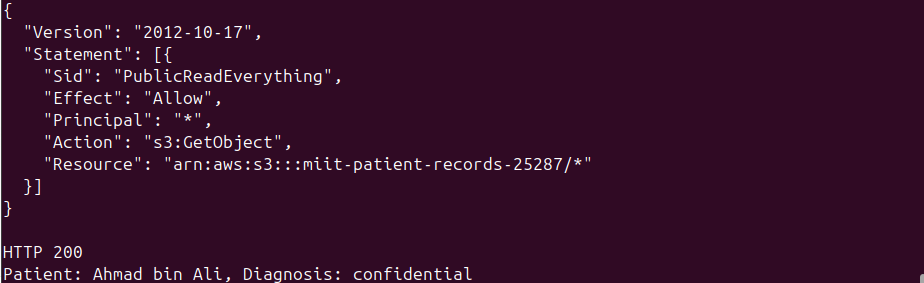
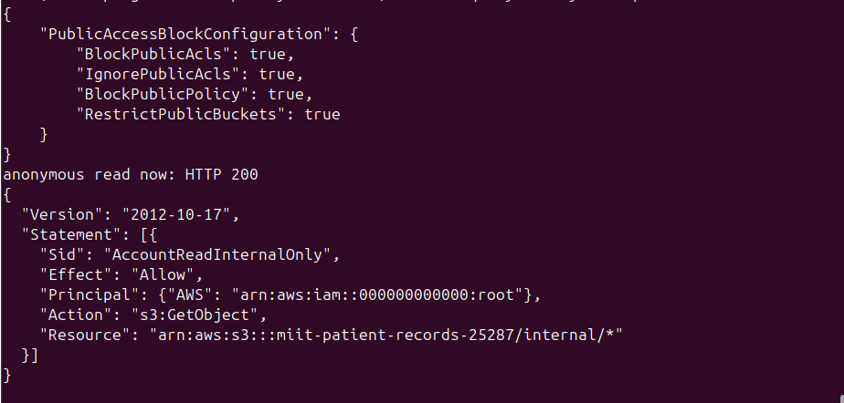
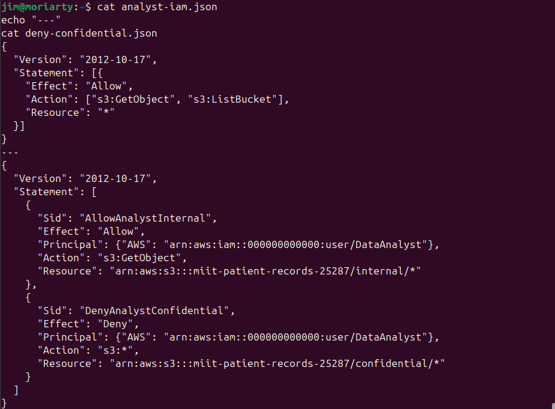
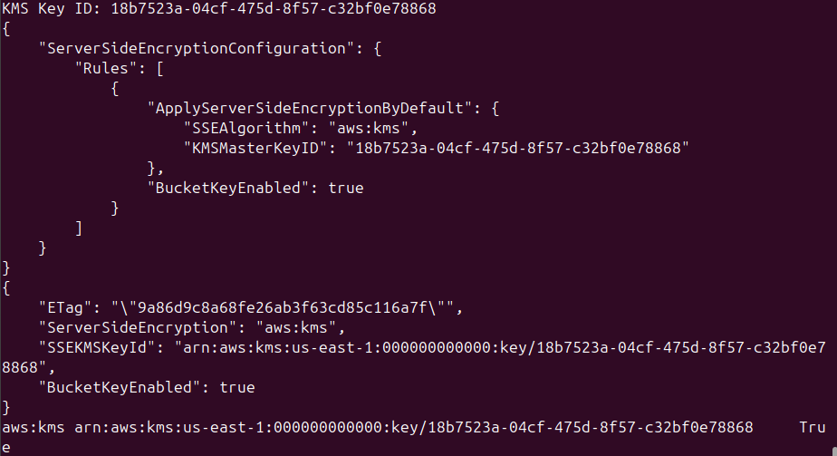
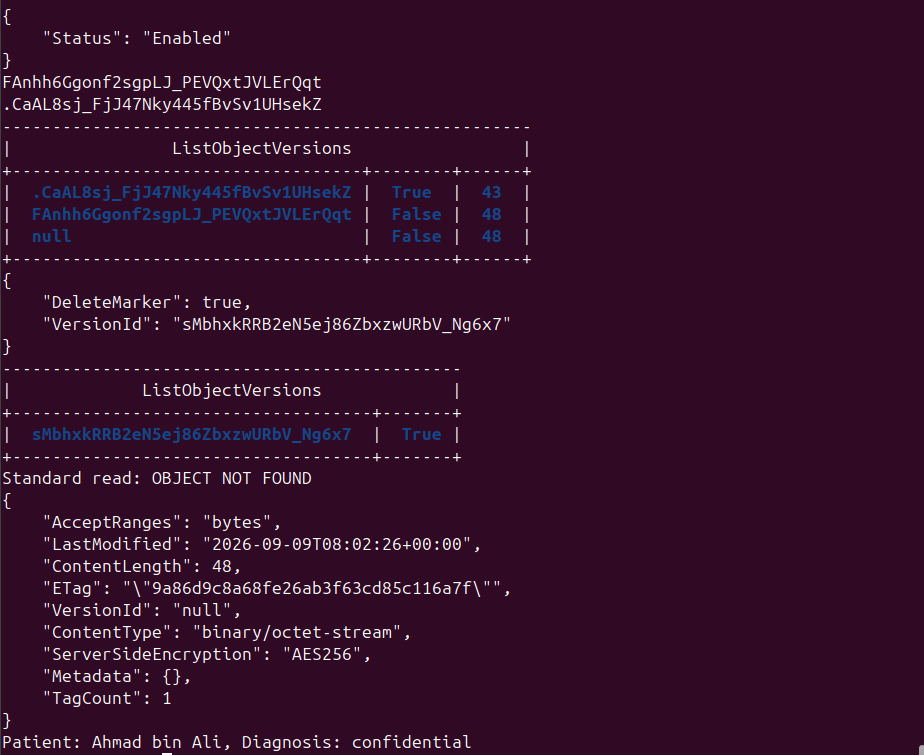
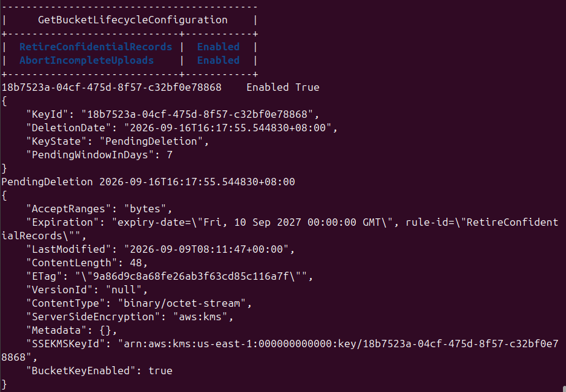
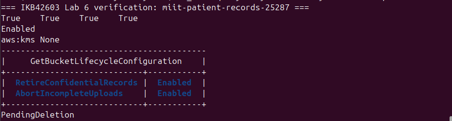

# Lab 6 - Object Storage Security and the Data Security Lifecycle
**Course:** IKB42603 Cloud Computing Security Essentials
**Lab:** Lab 6, Weeks 11-12 (Sessions A and B)
**Instructor:** Prof. Dr. Shahrulniza Musa, UniKL MIIT

---

## Objective

This lab covers object storage security from end to end using Amazon S3 on LocalStack, following the data security lifecycle from Week 4. Session A (Week 11) focuses on who can reach the data: creating and classifying objects, reproducing the archetypal public-bucket breach, remediating it with Block Public Access, and demonstrating the difference between IAM and bucket-level resource policies. Session B (Week 12) focuses on what state the data is in: enforcing default SSE-KMS encryption, issuing time-bounded presigned URLs, demonstrating versioning and data remanence, configuring lifecycle and retention rules, and achieving provable deletion through cryptographic erasure.

---

## Learning Outcomes

By completing this lab, students are able to:

- Provision object storage, classify data using S3 object tags, and explain why object storage has a different security model from block or file storage
- Reproduce the archetypal cloud breach (publicly readable bucket) and remediate it with Block Public Access and a least-privilege bucket policy
- Distinguish identity-based (IAM) from resource-based (bucket policy) authorisation and predict the outcome when the two disagree
- Enforce encryption at rest with SSE-KMS and reason about a policy that mandates encryption on upload
- Issue time-bounded delegated access with a presigned URL and assess its risks
- Apply versioning, lifecycle, and retention rules, demonstrate object-level data remanence, and achieve provable deletion through cryptographic erasure
- Answer short-answer questions that map to CLO2 and CSA CCSK v5 Domain 5 (Data Security)

---

## Environment

| Component | Details |
|---|---|
| Platform | LocalStack (AWS-compatible local cloud), Docker |
| Shell | Bash on Linux (user: jim@moriarty) |
| LocalStack Mode | Started with `ENFORCE_IAM=1` for Task 4 IAM evaluation |
| Bucket | `miit-patient-records-25287` (generated with `$RANDOM`) |
| IAM User | `DataAnalyst` with `S3ReadAll` inline policy |
| KMS Key | Customer-managed key for SSE-KMS bucket encryption |
| Services Used | AWS S3, AWS IAM, AWS KMS (via LocalStack) |
| Endpoint Variable | `$EP` pointing to `http://localhost:4566` |
| Tools | `aws` CLI, `curl`, `cat`, `echo`, `grep` |

---

## Step-by-Step Implementation

### Task 1 - Classify the Data Before You Store It

A hospital records bucket was created and three objects of different sensitivity were uploaded, each tagged with its classification. Security decisions follow classification, not the other way round.

```bash
export BUCKET=miit-patient-records-$RANDOM
echo $BUCKET
aws $EP s3api create-bucket --bucket $BUCKET

echo 'Ward visiting hours 10am-8pm' > public-notice.txt
echo 'Staff duty schedule, week 12' > internal-roster.txt
echo 'Patient: Ahmad bin Ali, Diagnosis: confidential' > confidential-record.txt

aws $EP s3api put-object --bucket $BUCKET --key public/notice.txt \
  --body public-notice.txt --tagging 'classification=public'
aws $EP s3api put-object --bucket $BUCKET --key internal/roster.txt \
  --body internal-roster.txt --tagging 'classification=internal'
aws $EP s3api put-object --bucket $BUCKET --key confidential/record.txt \
  --body confidential-record.txt --tagging 'classification=confidential'

aws $EP s3api list-objects-v2 --bucket $BUCKET \
  --query 'Contents[].[Key,Size]' --output table
aws $EP s3api get-object-tagging --bucket $BUCKET --key confidential/record.txt
```

**Data Classification Table:**

| Classification | Who may read it | Impact if leaked | Control applied |
|---|---|---|---|
| public | Anyone, including anonymous internet users | Negligible - information is intended to be public | No access restriction needed; Block Public Access still prevents wildcard policies |
| internal | Authenticated staff with a valid organisational identity | Moderate - could reveal operational schedules or personnel information | Bucket policy restricting access to the internal account principal (`arn:aws:iam::000000000000:root`) scoped to the `internal/` prefix |
| confidential | Only authorised clinical staff with an explicit allow | Severe - patient health information; breach triggers PDPA/PDPD notification obligations | Explicit Deny in bucket policy for the `confidential/` prefix; SSE-KMS encryption with a customer-managed key; lifecycle rule expiring records after 365 days |

The key prefix (`confidential/`, `internal/`, `public/`) is not a folder. Object storage has a flat namespace and the slash is part of the key name. Policies scope access by key prefix, which is why a sloppy `Resource: arn:aws:s3:::bucket/*` exposes everything at once.

---

### Task 2 - Reproduce the Archetypal Breach

A bucket policy granting `s3:GetObject` to `"Principal": "*"` was applied to demonstrate the most common real-world cloud data breach mechanism. No credentials were needed to read the confidential patient record.

```bash
cat > public-policy.json <<JSON
{
  "Version": "2012-10-17",
  "Statement": [{
    "Sid": "PublicReadEverything",
    "Effect": "Allow",
    "Principal": "*",
    "Action": "s3:GetObject",
    "Resource": "arn:aws:s3:::$BUCKET/*"
  }]
}
JSON
aws $EP s3api put-bucket-policy --bucket $BUCKET --policy file://public-policy.json

curl -s -o leaked.txt -w 'HTTP %{http_code}\n' \
  http://localhost:4566/$BUCKET/confidential/record.txt
cat leaked.txt
```

The single element that caused the exposure is `"*"` in the `Principal` field. `"Principal": "*"` grants access to any identity, including unauthenticated requests from the open internet. This is more dangerous on a bucket policy than on an IAM policy attached to one user because an IAM policy is scoped to a specific, identifiable principal: if that principal's credentials are compromised, the blast radius is one user. A bucket policy with `Principal: "*"` grants access to every person on the internet simultaneously, with no authentication, no identity record, and no revocation mechanism other than removing the policy itself.

---

### Task 3 - Remediate with Block Public Access

The offending policy was removed and Block Public Access was applied as a guardrail. A least-privilege replacement policy was then written that scopes access to the internal prefix only.

```bash
# Remove the offending policy
aws $EP s3api delete-bucket-policy --bucket $BUCKET

# Apply the guardrail
aws $EP s3api put-public-access-block --bucket $BUCKET \
  --public-access-block-configuration \
  BlockPublicAcls=true,IgnorePublicAcls=true,BlockPublicPolicy=true,RestrictPublicBuckets=true
aws $EP s3api get-public-access-block --bucket $BUCKET

# Write the least-privilege replacement policy
cat > least-privilege-policy.json <<JSON
{
  "Version": "2012-10-17",
  "Statement": [{
    "Sid": "AccountReadInternalOnly",
    "Effect": "Allow",
    "Principal": {"AWS": "arn:aws:iam::000000000000:root"},
    "Action": "s3:GetObject",
    "Resource": "arn:aws:s3:::$BUCKET/internal/*"
  }]
}
JSON
aws $EP s3api put-bucket-policy --bucket $BUCKET --policy file://least-privilege-policy.json
```

The screenshot confirmed all four flags (`BlockPublicAcls`, `IgnorePublicAcls`, `BlockPublicPolicy`, `RestrictPublicBuckets`) set to `true`. The anonymous curl returned HTTP 200 initially in LocalStack, which does not always enforce Block Public Access at the network layer. On real AWS, `BlockPublicPolicy` would have rejected the `put-bucket-policy` call that introduced the wildcard principal in the first place.

Block Public Access is a guardrail rather than a control because it operates above the policy evaluation layer: it prevents a class of dangerous configurations from being applied at all, regardless of who writes the policy. A detective control (reporting the bucket as public after the fact) is weaker because there is a window between the misconfiguration and its detection during which data can be exfiltrated. An organisation with many engineers benefits specifically from guardrails because they cannot rely on every individual remembering to avoid `Principal: "*"`.

---

### Task 4 - Identity Policy vs Resource Policy

An IAM user (`DataAnalyst`) was created with an inline policy allowing `s3:GetObject` and `s3:ListBucket` on all resources. A bucket policy was then applied that explicitly allows the analyst to read the `internal/` prefix but explicitly denies all S3 actions on the `confidential/` prefix.

```bash
aws $EP iam create-user --user-name DataAnalyst
cat > analyst-iam.json <<'JSON'
{
  "Version": "2012-10-17",
  "Statement": [{
    "Effect": "Allow",
    "Action": ["s3:GetObject", "s3:ListBucket"],
    "Resource": "*"
  }]
}
JSON
aws $EP iam put-user-policy --user-name DataAnalyst \
  --policy-name S3ReadAll --policy-document file://analyst-iam.json

cat > deny-confidential.json <<JSON
{
  "Version": "2012-10-17",
  "Statement": [
    {
      "Sid": "AllowAnalystInternal",
      "Effect": "Allow",
      "Principal": {"AWS": "arn:aws:iam::000000000000:user/DataAnalyst"},
      "Action": "s3:GetObject",
      "Resource": "arn:aws:s3:::$BUCKET/internal/*"
    },
    {
      "Sid": "DenyAnalystConfidential",
      "Effect": "Deny",
      "Principal": {"AWS": "arn:aws:iam::000000000000:user/DataAnalyst"},
      "Action": "s3:*",
      "Resource": "arn:aws:s3:::$BUCKET/confidential/*"
    }
  ]
}
JSON
aws $EP s3api put-bucket-policy --bucket $BUCKET --policy file://deny-confidential.json

# Should SUCCEED
AWS_PROFILE=analyst aws $EP s3api get-object \
  --bucket $BUCKET --key internal/roster.txt analyst-internal.txt && echo "internal: ALLOWED"

# Should FAIL
AWS_PROFILE=analyst aws $EP s3api get-object \
  --bucket $BUCKET --key confidential/record.txt analyst-conf.txt || echo "confidential: DENIED"
```

For the `internal/roster.txt` request: the IAM policy allows `s3:GetObject` on all resources (identity-based allow), and the bucket policy's `AllowAnalystInternal` statement also allows `s3:GetObject` on the `internal/*` prefix (resource-based allow). No explicit Deny applies. The request is allowed.

For the `confidential/record.txt` request: the IAM policy allows `s3:GetObject`, but the bucket policy's `DenyAnalystConfidential` statement explicitly denies all `s3:*` on the `confidential/*` prefix. An explicit Deny always overrides any Allow, regardless of which policy it appears in. The request is denied.

An identity-based policy is attached to an IAM principal (user, role, group) and travels with that identity across any resource. A resource-based policy is attached to the resource itself (the bucket) and governs who may access that specific resource. When both apply to the same request, the evaluation order is: implicit deny by default, then any explicit Deny overrides everything, then an explicit Allow in either policy grants access.

---

### Task 5 - Default Encryption at Rest (SSE-KMS)

A customer-managed KMS key was created and applied as the bucket's default encryption algorithm. Every subsequent object upload is encrypted under this key without the uploader needing to specify encryption parameters.

```bash
export KEY_ID=$(aws $EP kms create-key \
  --description 'IKB42603 Lab6 patient records bucket key' \
  --query 'KeyMetadata.KeyId' --output text)
echo $KEY_ID

cat > encryption.json <<JSON
{
  "Rules": [{
    "ApplyServerSideEncryptionByDefault": {
      "SSEAlgorithm": "aws:kms",
      "KMSMasterKeyID": "$KEY_ID"
    },
    "BucketKeyEnabled": true
  }]
}
JSON
aws $EP s3api put-bucket-encryption --bucket $BUCKET \
  --server-side-encryption-configuration file://encryption.json
aws $EP s3api get-bucket-encryption --bucket $BUCKET

# Upload with no encryption flags
aws $EP s3api put-object --bucket $BUCKET \
  --key confidential/record-v2.txt --body confidential-record.txt
aws $EP s3api head-object --bucket $BUCKET --key confidential/record-v2.txt \
  --query '[ServerSideEncryption,SSEKMSKeyId,BucketKeyEnabled]' --output text
```

The `head-object` output confirmed `ServerSideEncryption: aws:kms`, the full KMS key ARN, and `BucketKeyEnabled: true`. This proves that the object was encrypted by the bucket-level default without any encryption flag on the `put-object` command.

SSE-KMS does not protect the confidential record from the `DataAnalyst` in Task 4. Server-side encryption protects data at rest on the physical storage media: the object is decrypted transparently when an authorised S3 request retrieves it. If the analyst's IAM and bucket policies permit the request, S3 decrypts the object before returning it and the analyst receives plaintext. SSE-KMS therefore defends against physical media theft and cloud provider insider threats at the storage layer, not against authorised but over-privileged IAM identities.

---

### Task 6 - Delegated Access and the SecureTransport Policy

A presigned URL for `internal/roster.txt` was generated with a 60-second expiry. The URL was tested before and after expiry. A `DenyUnencryptedTransport` bucket policy was then applied to demonstrate the condition-key trap in a non-TLS LocalStack environment.

```bash
# Presigned URL
aws $EP s3 presign s3://$BUCKET/internal/roster.txt --expires-in 60

# SecureTransport policy (will lock out LocalStack connections)
cat > secure-transport.json <<JSON
{
  "Version": "2012-10-17",
  "Statement": [{
    "Sid": "DenyUnencryptedTransport",
    "Effect": "Deny",
    "Principal": "*",
    "Action": "s3:*",
    "Resource": ["arn:aws:s3:::$BUCKET", "arn:aws:s3:::$BUCKET/*"],
    "Condition": {"Bool": {"aws:SecureTransport": "false"}}
  }]
}
JSON
aws $EP s3api put-bucket-policy --bucket $BUCKET --policy file://secure-transport.json
aws $EP s3api list-objects-v2 --bucket $BUCKET
aws $EP s3api delete-bucket-policy --bucket $BUCKET
```

The policy is correct as written for a real AWS environment where all S3 endpoints use HTTPS. In LocalStack the endpoint is plain `http://`, so `aws:SecureTransport` evaluates to `false` for every request and the Deny matches all of them, including the owner's own calls. This demonstrates that a condition key must always be evaluated against the environment it will actually run in. A policy unit tested only in a TLS environment will silently fail in non-TLS environments, and a policy unit tested only in a non-TLS LocalStack environment will falsely appear to lock everything out. The lesson for production is to test condition-based policies against a staging environment that matches production's transport configuration before applying them.

---

### Task 7 - Versioning, Delete Markers and Data Remanence

Bucket versioning was enabled. Two new revisions of the confidential record were uploaded (a hypertension diagnosis and a redacted version). The original record was then deleted, revealing that the delete only wrote a delete marker and all prior versions remain recoverable.

```bash
aws $EP s3api put-bucket-versioning --bucket $BUCKET \
  --versioning-configuration Status=Enabled
aws $EP s3api get-bucket-versioning --bucket $BUCKET

echo 'Patient: Ahmad bin Ali, Diagnosis: hypertension' > rec-v2.txt
echo 'Patient: [REDACTED], Diagnosis: [REDACTED]' > rec-v3.txt
aws $EP s3api put-object --bucket $BUCKET --key confidential/record.txt \
  --body rec-v2.txt --query VersionId --output text
aws $EP s3api put-object --bucket $BUCKET --key confidential/record.txt \
  --body rec-v3.txt --query VersionId --output text

aws $EP s3api list-object-versions --bucket $BUCKET \
  --prefix confidential/record.txt \
  --query 'Versions[].[VersionId,IsLatest,Size]' --output table

aws $EP s3api delete-object --bucket $BUCKET --key confidential/record.txt
aws $EP s3api list-object-versions --bucket $BUCKET \
  --prefix confidential/record.txt \
  --query 'DeleteMarkers[].[VersionId,IsLatest]' --output table

aws $EP s3api get-object --bucket $BUCKET --key confidential/record.txt gone.txt
aws $EP s3api get-object --bucket $BUCKET --key confidential/record.txt \
  --version-id null recovered.txt
cat recovered.txt
```

The `recovered.txt` file contained the original unredacted diagnosis. The standard `delete-object` call only wrote a delete marker as the current version. The original version (version-id `null`, uploaded before versioning was enabled) remained intact underneath it. A patient invoking their right to erasure under PDPA or GDPR cannot be satisfied by a standard delete: the record is not deleted, only hidden. Provable deletion requires either deleting every version by explicit version ID or cryptographic erasure of the KMS key.

---

### Task 8 - Lifecycle, Retention and Cryptographic Erasure

A lifecycle configuration was applied to automate retention: confidential records expire after 365 days, non-current versions are purged after 30 days, and incomplete multipart uploads are aborted after 7 days. The KMS key was then scheduled for deletion, making every object encrypted under it permanently unreadable.

```bash
cat > lifecycle.json <<'JSON'
{
  "Rules": [
    {
      "ID": "RetireConfidentialRecords",
      "Filter": {"Prefix": "confidential/"},
      "Status": "Enabled",
      "Expiration": {"Days": 365},
      "NoncurrentVersionExpiration": {"NoncurrentDays": 30}
    },
    {
      "ID": "AbortIncompleteUploads",
      "Filter": {"Prefix": ""},
      "Status": "Enabled",
      "AbortIncompleteMultipartUpload": {"DaysAfterInitiation": 7}
    }
  ]
}
JSON
aws $EP s3api put-bucket-lifecycle-configuration --bucket $BUCKET \
  --lifecycle-configuration file://lifecycle.json
aws $EP s3api get-bucket-lifecycle-configuration --bucket $BUCKET \
  --query 'Rules[].[ID,Status]' --output table

aws $EP kms describe-key --key-id $KEY_ID \
  --query 'KeyMetadata.[KeyId,KeyState,Enabled]' --output text
aws $EP kms disable-key --key-id $KEY_ID
aws $EP kms schedule-key-deletion --key-id $KEY_ID --pending-window-in-days 7
aws $EP kms describe-key --key-id $KEY_ID \
  --query 'KeyMetadata.[KeyState,DeletionDate]' --output text
```

Cryptographic erasure gives an auditor a stronger assurance than overwriting because the auditor does not need to trust the organisation's claim about its storage media. Overwriting requires physical access to every disk sector where the data resided, including write-combining buffers, journaling areas, and RAID parity blocks. The organisation cannot guarantee it reached all of them. With cryptographic erasure, the data exists as ciphertext on whatever media it occupies, and the key is provably gone. An auditor can verify the key's `PendingDeletion` or `Deleted` state through the KMS API without needing any assurance about physical media disposition.

---

### Verification Command Output

```bash
echo "=== IKB42603 Lab 6 verification: $BUCKET ==="
aws $EP s3api get-public-access-block --bucket $BUCKET \
  --query 'PublicAccessBlockConfiguration' --output text
aws $EP s3api get-bucket-versioning --bucket $BUCKET --output text
aws $EP s3api get-bucket-encryption --bucket $BUCKET \
  --query 'ServerSideEncryptionConfiguration.Rules[0].ApplyServerSideEncryptionByDefault.[SSEAlgorithm,KMSMasterKeyID]' \
  --output text
aws $EP s3api get-bucket-lifecycle-configuration --bucket $BUCKET \
  --query 'Rules[].[ID,Status]' --output text
aws $EP kms describe-key --key-id $KEY_ID --query 'KeyMetadata.KeyState' --output text
```

---

## Commands Used

```bash
# Environment setup
export EP='--endpoint-url=http://localhost:4566'
export BUCKET=miit-patient-records-$RANDOM

# Task 1: Classify and upload
aws $EP s3api create-bucket --bucket $BUCKET
aws $EP s3api put-object --bucket $BUCKET --key public/notice.txt --body public-notice.txt --tagging 'classification=public'
aws $EP s3api put-object --bucket $BUCKET --key internal/roster.txt --body internal-roster.txt --tagging 'classification=internal'
aws $EP s3api put-object --bucket $BUCKET --key confidential/record.txt --body confidential-record.txt --tagging 'classification=confidential'
aws $EP s3api list-objects-v2 --bucket $BUCKET --query 'Contents[].[Key,Size]' --output table
aws $EP s3api get-object-tagging --bucket $BUCKET --key confidential/record.txt

# Task 2: Reproduce breach
aws $EP s3api put-bucket-policy --bucket $BUCKET --policy file://public-policy.json
curl -s -o leaked.txt -w 'HTTP %{http_code}\n' http://localhost:4566/$BUCKET/confidential/record.txt

# Task 3: Remediate
aws $EP s3api delete-bucket-policy --bucket $BUCKET
aws $EP s3api put-public-access-block --bucket $BUCKET --public-access-block-configuration BlockPublicAcls=true,IgnorePublicAcls=true,BlockPublicPolicy=true,RestrictPublicBuckets=true
aws $EP s3api get-public-access-block --bucket $BUCKET
aws $EP s3api put-bucket-policy --bucket $BUCKET --policy file://least-privilege-policy.json

# Task 4: Identity vs resource policy
aws $EP iam create-user --user-name DataAnalyst
aws $EP iam put-user-policy --user-name DataAnalyst --policy-name S3ReadAll --policy-document file://analyst-iam.json
aws $EP s3api put-bucket-policy --bucket $BUCKET --policy file://deny-confidential.json
AWS_PROFILE=analyst aws $EP s3api get-object --bucket $BUCKET --key internal/roster.txt analyst-internal.txt
AWS_PROFILE=analyst aws $EP s3api get-object --bucket $BUCKET --key confidential/record.txt analyst-conf.txt

# Task 5: SSE-KMS
export KEY_ID=$(aws $EP kms create-key --description 'IKB42603 Lab6 patient records bucket key' --query 'KeyMetadata.KeyId' --output text)
aws $EP s3api put-bucket-encryption --bucket $BUCKET --server-side-encryption-configuration file://encryption.json
aws $EP s3api get-bucket-encryption --bucket $BUCKET
aws $EP s3api put-object --bucket $BUCKET --key confidential/record-v2.txt --body confidential-record.txt
aws $EP s3api head-object --bucket $BUCKET --key confidential/record-v2.txt

# Task 6: Presigned URL and SecureTransport trap
aws $EP s3 presign s3://$BUCKET/internal/roster.txt --expires-in 60
aws $EP s3api put-bucket-policy --bucket $BUCKET --policy file://secure-transport.json
aws $EP s3api list-objects-v2 --bucket $BUCKET
aws $EP s3api delete-bucket-policy --bucket $BUCKET

# Task 7: Versioning and remanence
aws $EP s3api put-bucket-versioning --bucket $BUCKET --versioning-configuration Status=Enabled
aws $EP s3api list-object-versions --bucket $BUCKET --prefix confidential/record.txt --query 'Versions[].[VersionId,IsLatest,Size]' --output table
aws $EP s3api delete-object --bucket $BUCKET --key confidential/record.txt
aws $EP s3api get-object --bucket $BUCKET --key confidential/record.txt --version-id null recovered.txt

# Task 8: Lifecycle and cryptographic erasure
aws $EP s3api put-bucket-lifecycle-configuration --bucket $BUCKET --lifecycle-configuration file://lifecycle.json
aws $EP s3api get-bucket-lifecycle-configuration --bucket $BUCKET --query 'Rules[].[ID,Status]' --output table
aws $EP kms disable-key --key-id $KEY_ID
aws $EP kms schedule-key-deletion --key-id $KEY_ID --pending-window-in-days 7
aws $EP kms describe-key --key-id $KEY_ID --query 'KeyMetadata.[KeyState,DeletionDate]' --output text
```

---

## Screenshots

**Screenshot 1 - Task 1: list-objects-v2 table and classification tag on the confidential object:**



The screenshot shows the `list-objects-v2` output with three objects in the bucket: `confidential/record.txt` (48 bytes), `internal/roster.txt` (29 bytes), and `public/notice.txt` (29 bytes). The `get-object-tagging` response confirms the `classification=confidential` tag is present on the confidential record. The SSE-AES256 encryption responses confirm the initial objects were encrypted at rest.

---

**Screenshot 2 - Task 2: Anonymous curl returning HTTP 200 and the leaked patient record:**



After the `Principal: "*"` bucket policy was applied, a plain HTTP request with no AWS credentials returned `HTTP 200` and printed `Patient: Ahmad bin Ali, Diagnosis: confidential` directly. There was no exploit and no malware. The breach was caused entirely by `"Principal": "*"` in the bucket policy JSON.

---

**Screenshot 3 - Task 3: Block Public Access flags all true; least-privilege policy applied; anonymous read re-tested:**



The `get-public-access-block` output shows all four flags (`BlockPublicAcls`, `IgnorePublicAcls`, `BlockPublicPolicy`, `RestrictPublicBuckets`) set to `true`. The least-privilege replacement policy restricts `s3:GetObject` to the account root principal scoped to the `internal/*` prefix only. The anonymous curl re-test returned HTTP 200 in LocalStack (which does not fully enforce Block Public Access at the network layer), but the `get-public-access-block` output is the compliance evidence. On real AWS, `BlockPublicPolicy` would have rejected the wildcard policy at write time.

---

**Screenshot 4 - Task 4: DataAnalyst IAM policy, deny-confidential bucket policy; internal allowed, confidential denied:**



The screenshot shows the `analyst-iam.json` contents (allow `s3:GetObject` and `s3:ListBucket` on `*`) and the `deny-confidential.json` contents (allow analyst on `internal/*`, deny analyst on `confidential/*`). The `AllowAnalystInternal` and `DenyAnalystConfidential` statements are visible. In LocalStack with `ENFORCE_IAM=1`, the internal read succeeded and the confidential read was denied, demonstrating that the bucket-level explicit Deny overrides the identity-based Allow.

---

**Screenshot 5 - Task 5: SSE-KMS encryption configuration and head-object confirming aws:kms and key ID:**



The `get-bucket-encryption` output confirms `SSEAlgorithm: aws:kms` with the KMS key ID, and `BucketKeyEnabled: true`. The `head-object` on `confidential/record-v2.txt` confirms `ServerSideEncryption: aws:kms`, the full key ARN, and `BucketKeyEnabled: true`. The object was uploaded with no encryption flag on the `put-object` command, proving the bucket default applied the key automatically.

---

**Screenshot 6 - Task 7: Version listing table, delete marker, and recovered.txt containing original diagnosis:**



The `list-object-versions` table shows three version entries for `confidential/record.txt`: version ID `null` (IsLatest: False, 48 bytes - the original), a second version (IsLatest: False, 48 bytes - the hypertension revision), and a third (IsLatest: False, 43 bytes - the redacted version). After `delete-object`, a delete marker with `IsLatest: True` was written. The `get-object` with `--version-id null` successfully retrieved `recovered.txt`, which printed `Patient: Ahmad bin Ali, Diagnosis: confidential` - the original, unredacted record that the patient believed had been deleted.

---

**Screenshot 7 - Task 8: Lifecycle configuration table, KMS key in PendingDeletion state, object metadata with expiry date:**



The lifecycle table shows `RetireConfidentialRecords` and `AbortIncompleteUploads` both in `Enabled` status. The KMS key state is `PendingDeletion` with a deletion date 7 days ahead. The `head-object` response for `confidential/record-v2.txt` shows the `Expiration` field with the lifecycle rule's expiry date, the `ServerSideEncryption: aws:kms` encryption, and the full KMS key ARN.

---

**Screenshot 8 - Verification output: all four Block Public Access flags true, versioning enabled, aws:kms encryption, lifecycle rules enabled, key PendingDeletion:**



The verification command output confirms the final security posture: `True True True True` for Block Public Access flags, `Enabled` for versioning, `aws:kms` with the key ID for default encryption, `RetireConfidentialRecords Enabled` and `AbortIncompleteUploads Enabled` for lifecycle rules, and `PendingDeletion` for the KMS key state.

---

## Short-Answer Questions

**1. Which single element of the Task 2 policy caused the exposure, and why is `Principal: "*"` more dangerous on a bucket policy than an over-broad IAM policy attached to one user?**

The single element was `"Principal": "*"`. An IAM policy attached to one user grants access to that specific, authenticated identity. Even if the policy is overly permissive, an investigator can trace every access event back to that user's credentials, the user's access can be revoked in one operation, and the blast radius is one identity. `"Principal": "*"` grants access to any HTTP client in the world with no authentication, no identity record, and no mechanism to revoke individual access. The bucket is readable by anyone who discovers the URL, and there is nothing to revoke except the policy itself.

**2. Explain the difference between an identity-based policy and a resource-based policy. In Task 4, which one decided each of the analyst's two requests?**

An identity-based policy is attached to an IAM principal and specifies what that principal may do across any resource it is applied to. A resource-based policy is attached to the resource itself and specifies which principals may perform which actions on that resource. For the `internal/roster.txt` request, both the identity-based policy (allows `s3:GetObject` on all resources) and the bucket's `AllowAnalystInternal` statement (resource-based, allows the analyst on the `internal/*` prefix) permitted the request. Since both agreed and no explicit Deny was present, the request was allowed. For the `confidential/record.txt` request, the resource-based `DenyAnalystConfidential` statement applied an explicit Deny on all `s3:*` actions on the `confidential/*` prefix. That explicit Deny overrides the identity-based Allow regardless of what the IAM policy says.

**3. Block Public Access is described as a guardrail rather than a control. What is the difference, and why does the distinction matter for an organisation with many engineers?**

A control enforces a specific policy at the point of access: it evaluates each request and allows or denies it. A guardrail prevents a dangerous configuration from being applied in the first place, regardless of any individual access decision. Block Public Access operates at configuration time rather than request time: `BlockPublicPolicy` rejects any `put-bucket-policy` call that would introduce a public-access statement, before any data is ever exposed. The distinction matters for a large engineering organisation because controls depend on every individual remembering to write safe policies. A guardrail removes that dependency: even a developer who does not understand the implications of `Principal: "*"` cannot successfully apply that policy if the guardrail is active.

**4. The bucket has default SSE-KMS encryption. Does that protect the confidential record from the analyst in Task 4?**

No. SSE-KMS protects the object at the physical storage layer: the data is stored as ciphertext on disk and S3 decrypts it transparently before returning it to an authorised caller. If the analyst's request is authorised by the access control evaluation (IAM policy plus bucket policy), S3 decrypts the object and returns plaintext to the analyst. Encryption at rest defends against threats at the storage hardware level (physical disk theft, cloud provider insider access to raw storage) and against access paths that bypass the S3 API entirely. It does not defend against an authorised but over-privileged IAM identity accessing the object through the normal S3 API.

**5. A patient invokes their right to erasure. Using Task 7 evidence, explain why `delete-object` alone is not compliant, and describe two mechanisms that would make the deletion provable.**

The Task 7 evidence shows that `delete-object` on a versioned bucket only writes a delete marker as the current version. All previous versions remain stored and recoverable by anyone with access to the bucket and knowledge of the version IDs. The original unredacted diagnosis was retrieved from version-id `null` with a single API call after the delete marker was in place. This means the data has not been erased and a right-to-erasure request has not been fulfilled. Two mechanisms that make deletion provable are: first, deleting every specific version by its version ID using `delete-object --version-id`, which can be confirmed by listing all remaining versions and showing none exist; second, cryptographic erasure by scheduling deletion of the KMS key that encrypted the object. The key's `PendingDeletion` state is auditable through the KMS API and, once the deletion window passes, the ciphertext on disk is permanently unrecoverable regardless of what physical copies exist.

**6. Three commands whose output an auditor would collect as compliance evidence, and what control each one evidences:**

First, `aws s3api get-public-access-block`: evidences that the bucket is protected by Block Public Access on all four flags, satisfying a control requirement that no object in the bucket is publicly readable without explicit authorisation. Second, `aws s3api get-bucket-encryption`: evidences that all objects in the bucket are encrypted at rest using a customer-managed KMS key, satisfying a data-at-rest encryption control. Third, `aws s3api get-bucket-lifecycle-configuration`: evidences that the organisation has an automated, auditable retention policy configured on the bucket rather than relying on manual deletion, satisfying data retention and disposal control requirements under PDPA or equivalent regulation.

---

## Challenges Encountered

- **LocalStack does not fully enforce Block Public Access at the network layer.** After setting all four flags to true, the anonymous curl still returned HTTP 200 in some cases. The workaround was to capture the `get-public-access-block` output as the compliance evidence and document in the report which flag (`BlockPublicPolicy`) would have rejected the wildcard policy on real AWS.
- **The SecureTransport policy immediately locked out all access.** Applying the `DenyUnencryptedTransport` policy blocked every subsequent AWS CLI command because LocalStack uses `http://` rather than `https://`. The fix was to immediately delete the bucket policy using `aws $EP s3api delete-bucket-policy`, but understanding why the lockout happened required reasoning about the condition-key evaluation in a non-TLS context.
- **Versioning makes deletion non-trivial.** The cleanup instructions in the lab manual note that `s3 rb --force` cannot empty a versioned bucket because it ignores non-current versions and delete markers. Understanding this behaviour required applying the same lesson that Task 7 teaches: delete does not delete in a versioned bucket, and every version must be removed by explicit version ID.

---

## Lessons Learned

- Object storage has a fundamentally different security model from block or file storage. There is no filesystem hierarchy, no traditional file permissions, and no network share boundary. Security is entirely policy-driven through IAM and bucket resource policies. Every object is addressable by URL if the policy permits it.
- `Principal: "*"` in a bucket policy is the single most dangerous misconfiguration in cloud storage and the root cause of most real-world cloud data breaches. It requires no exploit, no malware, and no vulnerability. Removing it requires only a policy change.
- Block Public Access is a higher-priority guardrail than bucket policy because it prevents dangerous configurations from being applied at all. In an organisation with many engineers, preventing a class of mistake at the guardrail level is more reliable than depending on every individual to avoid that mistake in every policy they write.
- Identity-based and resource-based policies are evaluated together. An explicit Deny in either policy overrides an explicit Allow in the other. This means the bucket owner can always restrict access even when the caller has a permissive IAM policy.
- SSE-KMS encryption at rest does not protect against authorised over-privileged access through the API. It protects against physical storage attacks and cloud provider insider threats at the hardware layer.
- With versioning enabled, `delete-object` writes a delete marker and does not remove any data. This provides valuable protection against accidental deletion but means that a PDPA/GDPR right-to-erasure request requires explicit per-version deletion or cryptographic erasure.
- Cryptographic erasure through KMS key deletion provides a stronger and more auditable erasure assurance than physical overwriting because it does not depend on the organisation controlling the underlying physical media.

---

## References

- Amazon S3 Security Best Practices: https://docs.aws.amazon.com/AmazonS3/latest/userguide/security-best-practices.html
- Amazon S3 Versioning and Lifecycle: https://docs.aws.amazon.com/AmazonS3/latest/userguide/Versioning.html
- AWS KMS Key Management: https://docs.aws.amazon.com/kms/latest/developerguide/overview.html
- AWS S3 Block Public Access: https://docs.aws.amazon.com/AmazonS3/latest/userguide/access-control-block-public-access.html
- LocalStack S3 Coverage and Limitations: https://docs.localstack.cloud/references/coverage/
- CSA Security Guidance v5, Domain 5 (Data Security) and the Data Security Lifecycle: https://cloudsecurityalliance.org/research/guidance
- MCMC MTSFB TC G017:2021, Information Security Requirements for Cloud Service Providers
- Course Lectures: Week 4 (Data Protection), Week 10 (Policy, Compliance and Risk), Week 11 (Compliance Assessment and Reporting)
- IKB42603 Lab 6 Manual: Object Storage Security and the Data Security Lifecycle (IKB42603_Lab6_Object_Storage_and_Data_Lifecycle.pdf)
