# IKB42603 Cloud Computing Security Essentials
## Practical Assessment

---

## Setup

Confirm cluster context, identity, and LocalStack ready before starting.

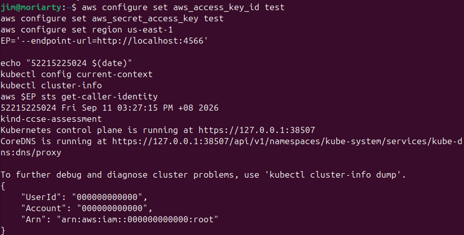

---

## Question 1 - Cross-Tenant Secret Isolation

**Total: 15 marks**

### Scenario

The Finance and HR applications share one Kubernetes cluster. Each application stores sensitive configuration as Kubernetes Secrets. Finance must be able to read its own Secrets but must have no access to HR Secrets at all.

### Required Evidence

**Screenshot 1** - get Secrets in finance = yes, and get Secrets in hr = no, for the same identity.

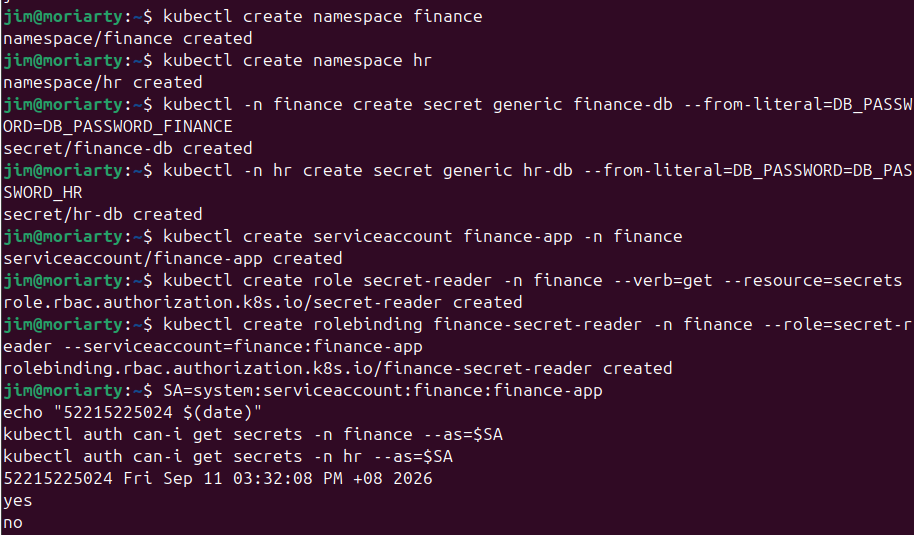

**Screenshot 2** - list Secrets and delete Secrets in finance both = no, together with one impersonated read of the finance Secret by name that succeeds, and one of the hr Secret that is refused.

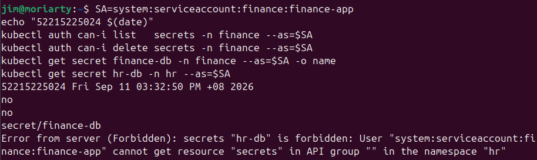

### Technical Analysis

I used three Kubernetes resources: a **ServiceAccount**, a **Role**, and a **RoleBinding**. The Role was created inside the `finance` namespace and only allows `get` on `secrets`. The RoleBinding links that Role to the `finance-app` ServiceAccount.

The key thing is that a Role only applies within the namespace it was created in. So even though both Finance and HR share the same cluster, the `finance-app` identity has no Role or RoleBinding in the `hr` namespace at all. The API server checks permissions per namespace, and because nothing grants access there, every request to `hr` is denied automatically.

---

## Question 2 - Resource Isolation: Protecting Against the Noisy Neighbour

**Total: 15 marks**

### Scenario

A shared Kubernetes cluster hosts multiple student workloads. The `student-app` namespace must be prevented from consuming more than its fair share of cluster resources.

### Required Evidence

**Evidence 1** - The active resource control, showing the namespace, the Pod ceiling, the CPU request ceiling, the memory request ceiling, and current usage against each.

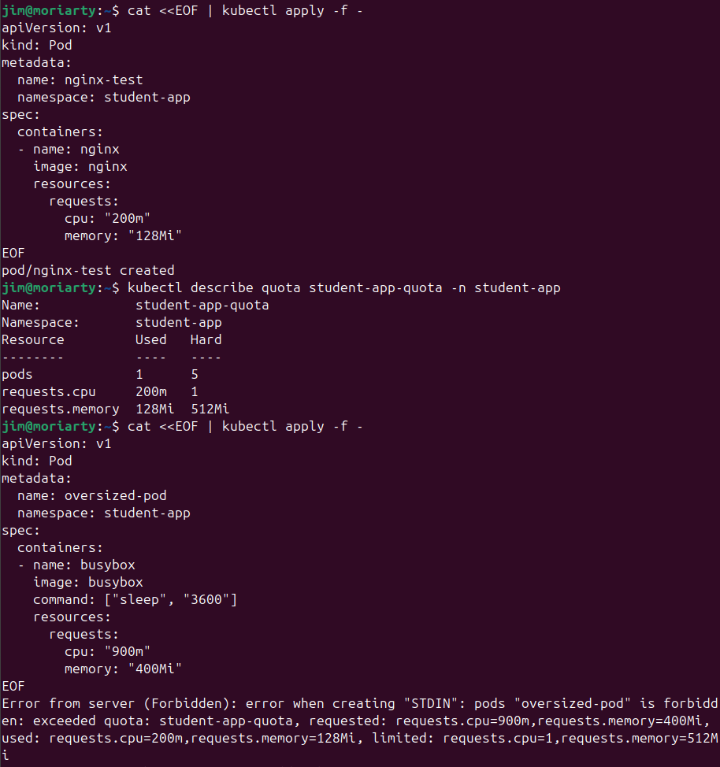

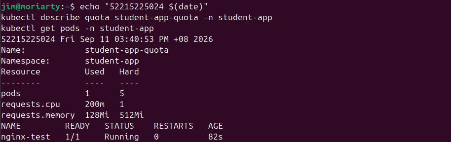

**Evidence 2** - A workload creation rejected with an "exceeded quota" message, together with the state that makes it meaningful.

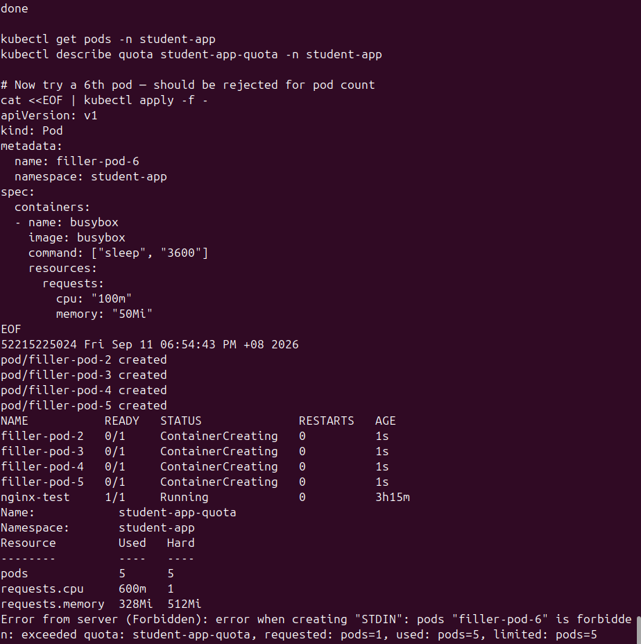

### Technical Analysis

The noisy-neighbour problem is when one workload on a shared system uses too much CPU or memory, causing other workloads to slow down or fail. In a multi-tenant Kubernetes cluster this is a real risk because by default there are no limits on how much a namespace can consume.

I fixed this using a **ResourceQuota** on the `student-app` namespace, setting hard limits of 5 pods, 1 CPU, and 512 MiB of memory. When any new pod would push usage past those limits, the API server rejects it immediately before it even gets scheduled. This gives every tenant a guaranteed share of resources and stops any one namespace from starving the others.

---

## Question 3 - Object Storage: Public Exposure and Data Remanence

**Total: 20 marks**

### Scenario

Patient records are held in an S3 bucket alongside public notices. A misconfigured bucket policy exposes all objects publicly. The task is to reproduce the breach, remediate it, and demonstrate data remanence behaviour.

---

### Part A - Create, Classify, and Reproduce the Archetypal Breach (6 marks)

**Setup** - Bucket and three objects created with Classification tags.

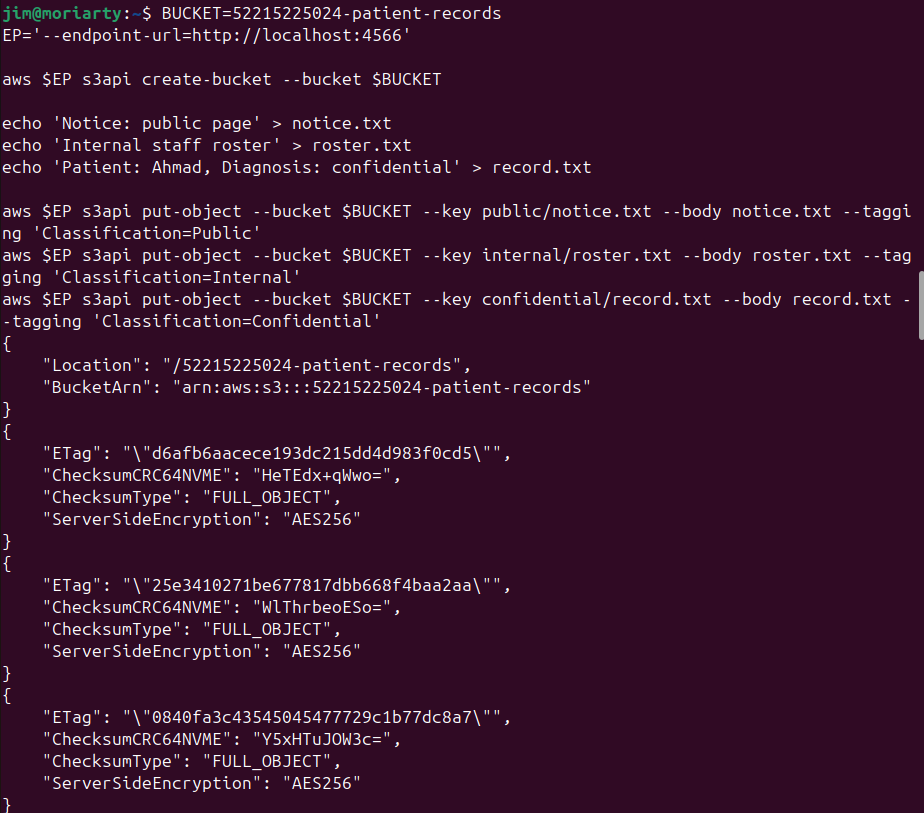

**Tag Verification** - Confirm tags from the API.

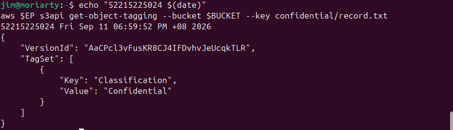

**Evidence 1** - The anonymous request returning HTTP 200 and the patient record printed in the terminal, together with the bucket policy that caused it.

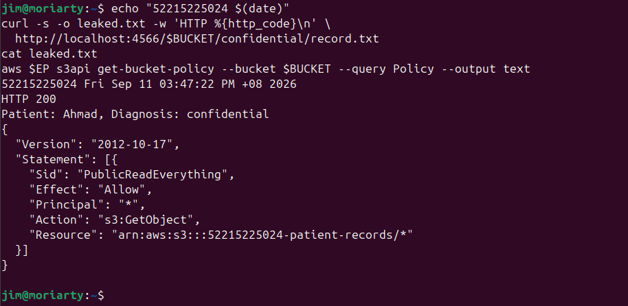

**Short Analysis**

The offending word is `"*"` in the `Principal` field. Setting principal to a wildcard means anyone on the internet, including unauthenticated users, is allowed to read the bucket. The mechanism that was misused is the **S3 Bucket Policy**.

---

### Part B - Remediate and Install a Guardrail (7 marks)

**Evidence 2** - The get-public-access-block output showing all four flags true, and the least-privilege policy read back from the bucket.

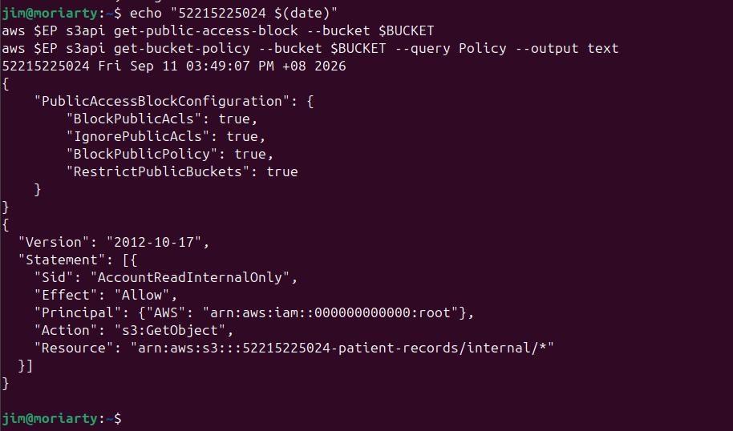

**Evidence 3** - The re-applied public policy attempt and the re-run anonymous read, whatever their outcome.

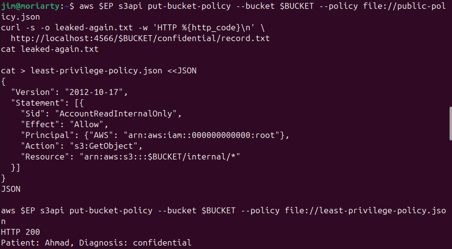

> **Note:** LocalStack Community stores the Block Public Access configuration faithfully but does not enforce it. The re-applied policy may succeed and the anonymous read may still return HTTP 200 on this simulator. This is a known LocalStack limitation and does not affect the mark for this step.

**Written Answer**

The flag that would have blocked the policy on real AWS is **BlockPublicPolicy**. It rejects any `put-bucket-policy` call that contains a public principal before the policy is even saved. LocalStack did not enforce this, but I captured the outcome honestly.

A preventative control is stronger than a detective one because it stops the problem before it happens. A detective control like a Config rule only alerts after the misconfiguration is already live, meaning the data is already exposed during that gap. Prevention eliminates that window completely, which matters especially for sensitive patient data.

---

### Part C - Data Remanence: What "Delete" Really Means (7 marks)

**Evidence 4a** - Overwrite creating two versions.

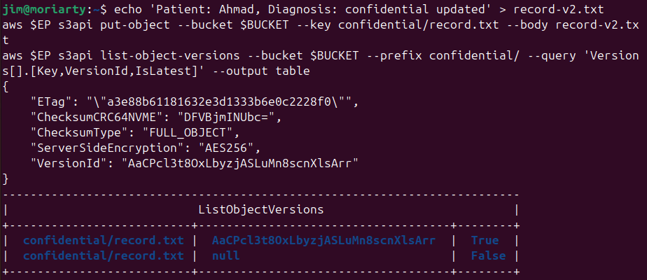

**Evidence 4b** - Versioning enabled confirmed.

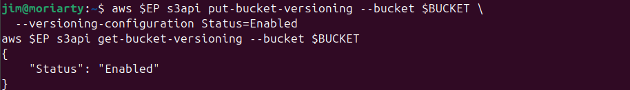

**Evidence 4c** - Ordinary get-object fails, versioned recovery succeeds.

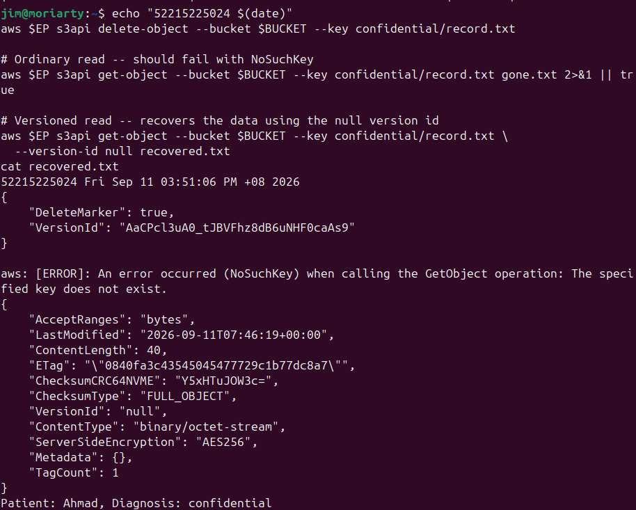

**Evidence 5** - Version list before and after permanent deletion, with delete marker visible.

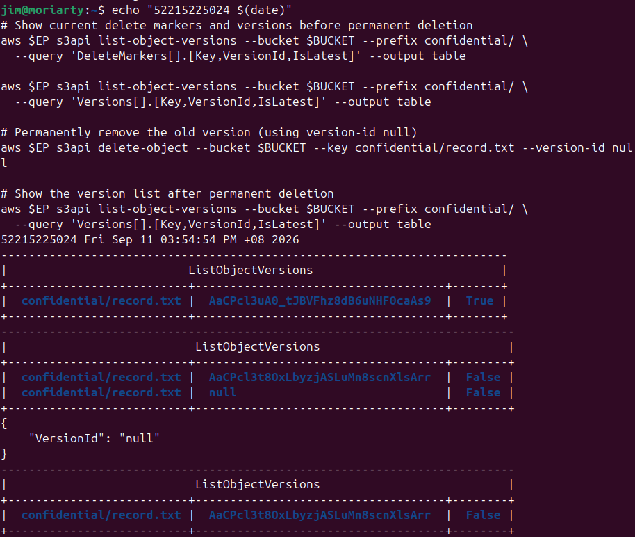

**Analysis**

When versioning is on, a plain `delete-object` call does not remove anything. It just places a **delete marker** on the key, which makes normal `get-object` requests return a `NoSuchKey` error. All previous versions are still there and can be retrieved using their `VersionId`.

This is a serious issue for a company that promised a patient their record was deleted. The data is still fully recoverable. To actually erase it, every version needs to be permanently deleted one by one using `delete-object --version-id`. A plain delete is not enough.

---

## Question 4 - Key Management: Envelope Encryption and Cryptographic Erasure

**Total: 15 marks**

### Scenario

The company holds one encrypted archive per tenant. Legal has asked whether a tenant's archive can be made provably unrecoverable without deleting the ciphertext from the storage layer.

### Required Evidence

**Evidence 1** - The KeyId, the encrypted archive and wrapped data key on disk, with no plaintext key remaining.

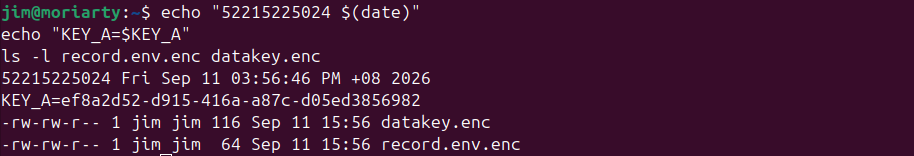

**Evidence 2** - The MATCH confirmation proving the round trip works.

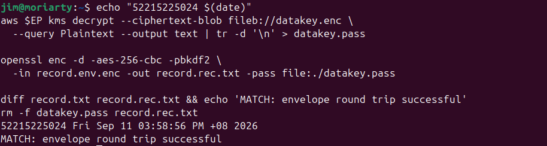

**Evidence 3** - The key state showing PendingDeletion and the KMSInvalidStateException on the unwrap attempt.

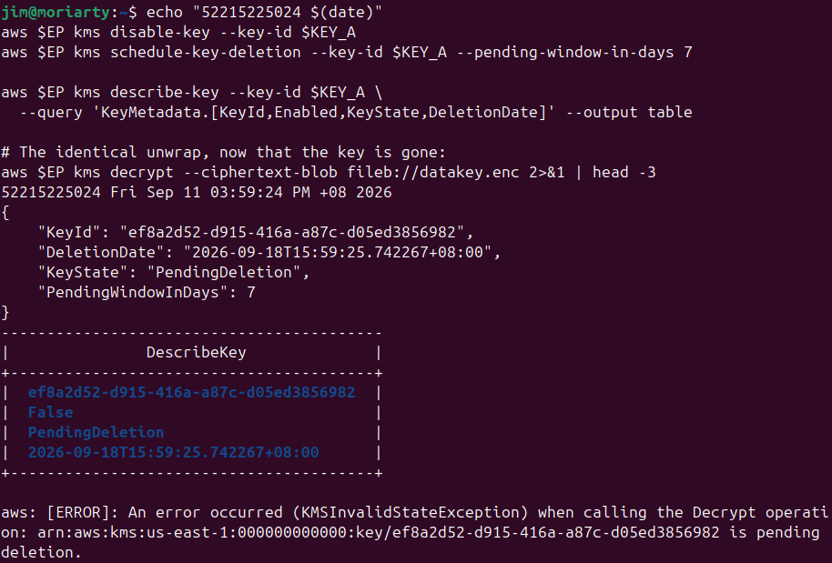

### Technical Analysis

**1. Envelope Encryption**

Envelope encryption means instead of encrypting data directly with the master key, you generate a short-lived **data key**, use it to encrypt the data locally, then encrypt the data key itself with the master key. The plaintext data key is immediately destroyed.

Only the master key needs hardware-grade protection because it is the only key that can unlock everything else. Even if someone gets hold of the encrypted archive and the wrapped data key, they cannot do anything without the master key. You only need to protect one small key regardless of how large the data is.

**2. Cryptographic Erasure**

In a shared cloud you cannot physically overwrite or destroy storage. Cryptographic erasure solves this by deleting the master key instead. Without the master key, the wrapped data key cannot be decrypted. Without the data key, the encrypted archive is just meaningless ciphertext forever, even if every byte of it still exists on disk. Deleting the key is provable through the KMS API, which is equivalent to destroying the data.

**3. When Cryptographic Erasure Fails**

Cryptographic erasure would fail if someone had kept a plaintext copy of the data key before it was destroyed. If the plaintext key was backed up somewhere, an attacker could use it directly with OpenSSL to decrypt the archive without needing KMS at all. Deleting the master key would have zero effect in that case, which is why destroying the plaintext key immediately after use is a critical step in the process.

---

*End of Report*
